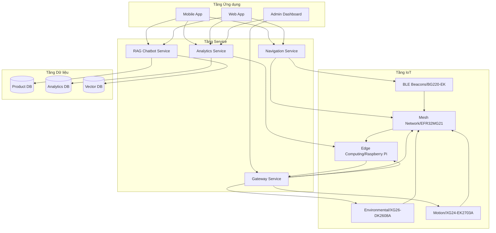
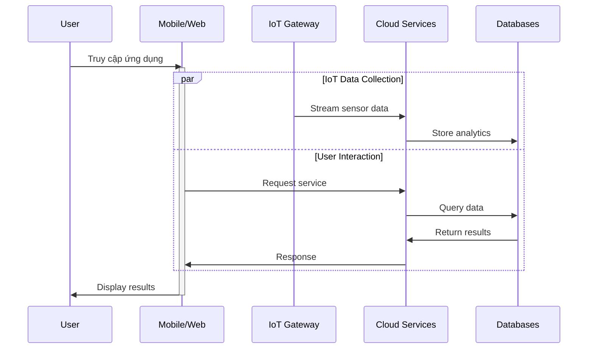
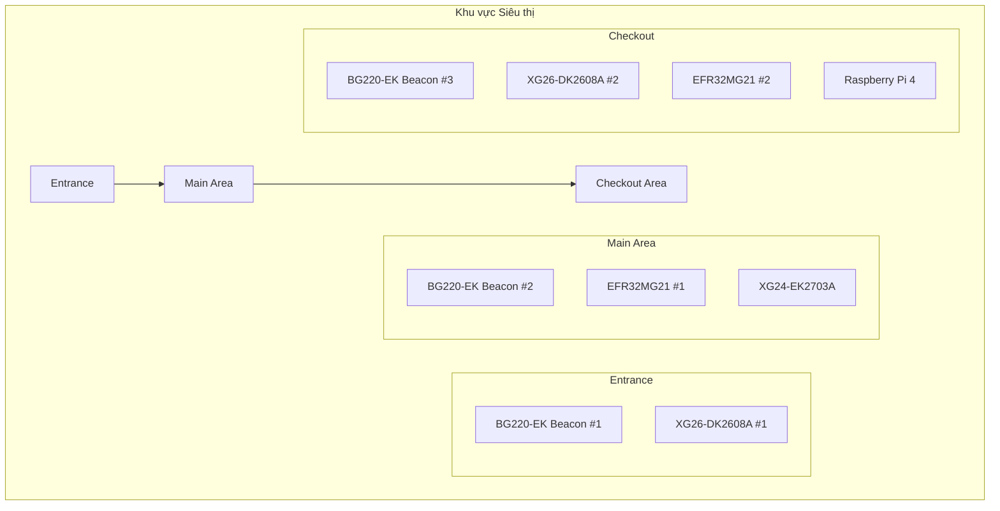
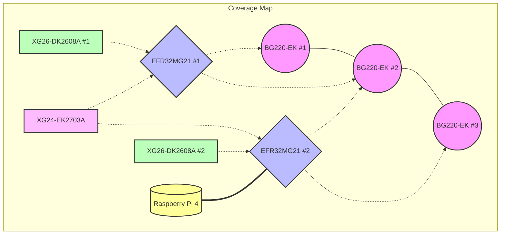
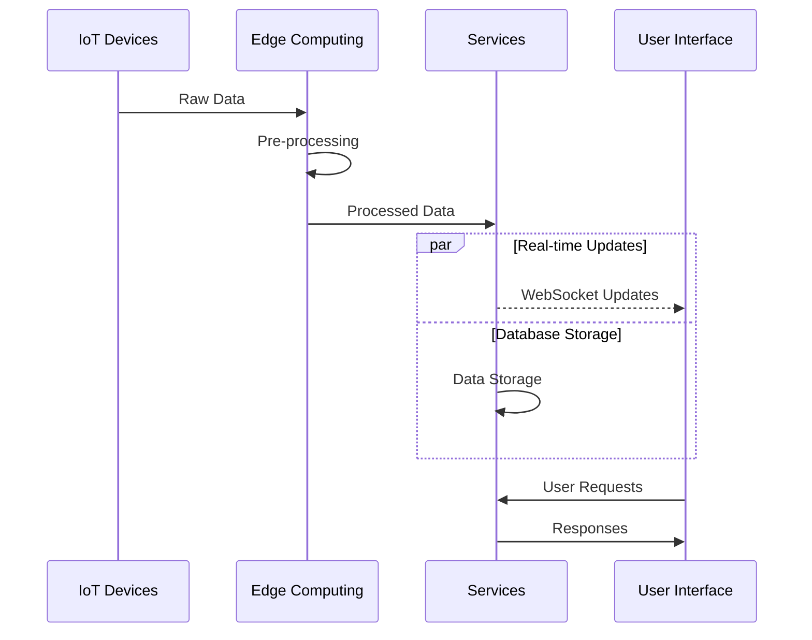
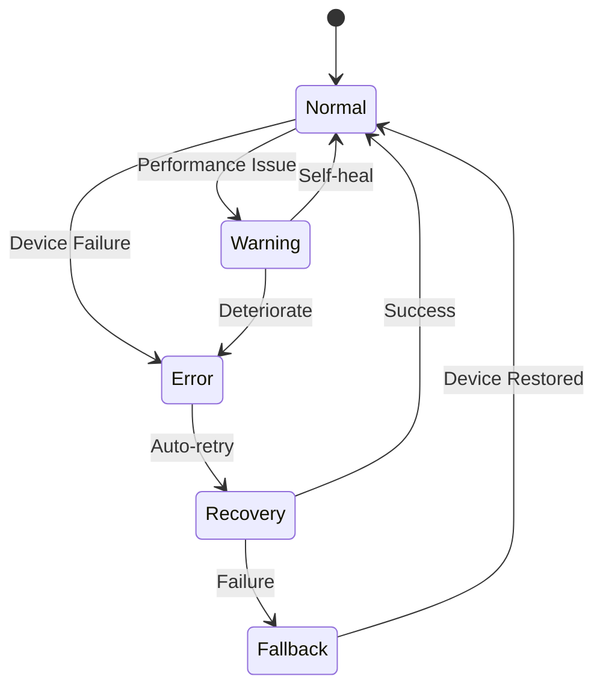
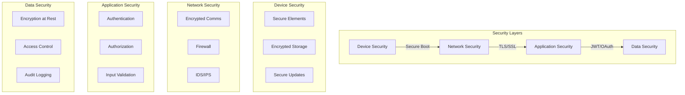
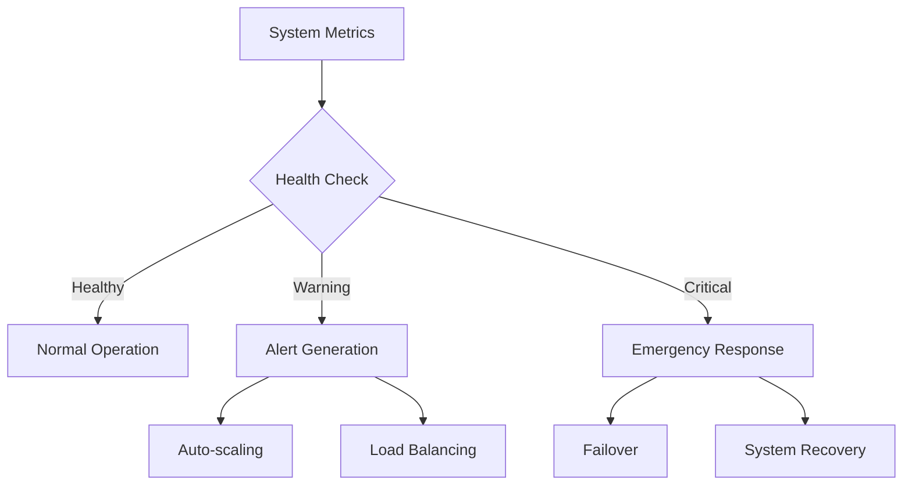
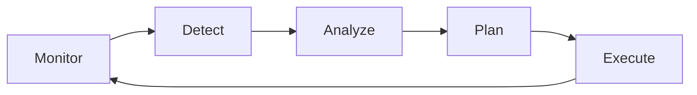

# Tổng quan Hệ thống IoT-AI Retail Assistant

## 1. Kiến trúc Tổng thể
Diagram này mô tả một kiến trúc hệ thống IoT với ba tầng chính: Tầng ứng dụng, Tầng dịch vụ, và Tầng IoT. Dưới đây là phân tích kỹ thuật chi tiết từng tầng và cách chúng tương tác.

1. Tầng ứng dụng (User Interface Layer)

Tầng này là giao diện người dùng cuối, nơi người dùng tương tác với hệ thống. Nó bao gồm:

Mobile App:

Ứng dụng di động, có thể được phát triển trên iOS hoặc Android.

Chức năng: Hiển thị dữ liệu IoT (như thông tin môi trường, vị trí), gửi yêu cầu (ví dụ: hỏi chatbot), và nhận thông báo.

Kết nối: Giao tiếp với tầng dịch vụ qua API (REST hoặc WebSocket).

Web App:

Ứng dụng web, chạy trên trình duyệt.

Chức năng: Tương tự Mobile App nhưng tối ưu cho màn hình lớn hơn, phù hợp với người dùng trên máy tính.

Kết nối: Cũng sử dụng API để giao tiếp với tầng dịch vụ.

Admin Dashboard:

Bảng điều khiển dành cho quản trị viên.
Chức năng: Quản lý hệ thống (xem dữ liệu IoT, cấu hình thiết bị, phân tích hiệu suất), giám sát trạng thái thiết bị IoT, và truy cập báo cáo phân tích.

Kết nối: Truy cập tầng dịch vụ để lấy dữ liệu và gửi lệnh quản trị.

Luồng dữ liệu: Tầng ứng dụng gửi yêu cầu đến tầng dịch vụ (ví dụ: truy vấn chatbot, yêu cầu phân tích dữ liệu) và nhận kết quả trả về để hiển thị.

2. Service Layer

Đây là tầng trung gian, xử lý logic nghiệp vụ và kết nối các tầng khác. Nó bao gồm các dịch vụ:
RAG Chatbot Service:
Dịch vụ chatbot sử dụng mô hình Retrieval-Augmented Generation (RAG).
Chức năng: Trả lời câu hỏi người dùng bằng cách truy xuất thông tin từ Vector DB (dữ liệu dạng vector, thường dùng cho tìm kiếm ngữ nghĩa) và kết hợp với mô hình ngôn ngữ để sinh câu trả lời tự nhiên.

Ví dụ: Người dùng hỏi "Món hàng này còn không", chatbot lấy dữ liệu từ Vector DB và trả lời dựa trên thông tin trong kho.

Analytics Service:
Chức năng: Xử lý dữ liệu từ Analytics DB và dữ liệu thời gian thực từ tầng IoT để tạo báo cáo, biểu đồ, hoặc dự đoán.
Ví dụ: Phân tích xu hướng mua hàng trong khoảng thời gian 2 tháng gần nhất để biết mặt hàng nào bán chạy.
Navigation Service:
Dịch vụ điều hướng, có thể hỗ trợ định vị (indoor navigation).

Chức năng: Sử dụng dữ liệu từ BLE Beacons (ở tầng IoT) để xác định vị trí người dùng và cung cấp hướng dẫn di chuyển.
Ví dụ: Hỗ trợ người dùng tìm đường trong một tòa nhà lớn dựa trên tín hiệu BLE.

Kết nối với tầng dữ liệu:

Các dịch vụ này truy xuất dữ liệu từ Product DB (thông tin sản phẩm), Analytics DB (dữ liệu phân tích), và Vector DB (dữ liệu vector cho AI).

Chúng cũng gửi dữ liệu đã xử lý (như kết quả phân tích) trở lại các cơ sở dữ liệu này.

Kết nối với tầng IoT:

Tầng dịch vụ nhận dữ liệu thời gian thực từ tầng IoT qua Gateway và gửi lệnh điều khiển (nếu cần) đến các thiết bị IoT.

3. Tầng dữ liệu (Data Layer)

Tầng này lưu trữ dữ liệu cần thiết cho hệ thống, bao gồm:

Product DB:

Cơ sở dữ liệu quan hệ (SQL), lưu thông tin sản phẩm.

Ví dụ: Danh sách thiết bị IoT, thông số kỹ thuật, hoặc thông tin cấu hình.
Analytics DB:
Cơ sở dữ liệu phân tích, có thể là SQL hoặc NoSQL (như MongoDB).
Lưu trữ dữ liệu lịch sử từ tầng IoT (như nhiệt độ, chuyển động) và kết quả phân tích từ Analytics Service.
Vector DB:
Cơ sở dữ liệu vector (như Pinecone, Weaviate), lưu trữ dữ liệu dạng vector.
Dùng cho các tác vụ AI như tìm kiếm ngữ nghĩa hoặc hỗ trợ chatbot (RAG Chatbot Service).
Ví dụ: Lưu trữ embedding của dữ liệu IoT để chatbot truy vấn nhanh.

Quản lý dữ liệu:
Dữ liệu từ tầng IoT được gửi lên qua Gateway, sau đó được xử lý bởi tầng dịch vụ và lưu vào các cơ sở dữ liệu này.
Tầng dịch vụ truy xuất dữ liệu từ đây để phục vụ tầng ứng dụng.

4. Tầng IoT (IoT Layer)

Tầng này bao gồm các thiết bị IoT, giao thức kết nối, và thiết bị tính toán tại chỗ. Cụ thể:
BLE Beacons (BGG220-EK):

Thiết bị phát tín hiệu Bluetooth Low Energy (BLE), mã sản phẩm BGG220-EK.
Chức năng: Phát tín hiệu để định vị trong không gian nhỏ (indoor positioning).
Ứng dụng: Hỗ trợ Navigation Service xác định vị trí người dùng.

Mesh Network (EFR32MG21):

Mạng lưới (mesh network) sử dụng chip EFR32MG21 của Silicon Labs.

Chức năng: Kết nối nhiều thiết bị IoT trong một mạng lưới, đảm bảo độ tin cậy và mở rộng phạm vi kết nối.
Ví dụ: Các cảm biến môi trường và chuyển động kết nối với nhau qua mesh network, gửi dữ liệu đến Gateway.
Computing (Raspberry Pi):
Raspberry Pi là thiết bị tính toán tại chỗ (edge computing).
Chức năng: Xử lý dữ liệu cục bộ từ các cảm biến để giảm tải cho hệ thống trung tâm, gửi dữ liệu đã xử lý lên Gateway.
Gateway:
Cổng kết nối giữa tầng IoT và tầng dịch vụ.
Chức năng: Thu thập dữ liệu từ các thiết bị IoT (qua BLE hoặc mesh network) và gửi lên tầng dịch vụ qua giao thức như MQTT hoặc HTTP.
Cũng nhận lệnh từ tầng dịch vụ để điều khiển thiết bị IoT.
Environmental (X026-DK2608A):
Cảm biến môi trường, mã sản phẩm X026-DK2608A.
Chức năng: Đo các thông số như nhiệt độ, độ ẩm, ánh sáng, hoặc chất lượng không khí.
Dữ liệu từ cảm biến này được gửi qua mesh network hoặc Raspberry Pi đến Gateway.
Motion:
Cảm biến chuyển động.
Chức năng: Phát hiện chuyển động trong khu vực được giám sát.
Ứng dụng: Kích hoạt cảnh báo (qua Admin Dashboard) hoặc ghi lại dữ liệu chuyển động để phân tích.
5. Luồng dữ liệu
Thu thập dữ liệu:
Các cảm biến (Environmental, Motion) và BLE Beacons thu thập dữ liệu.
Dữ liệu được gửi qua Mesh Network (EFR32MG21) hoặc xử lý cục bộ bởi Raspberry Pi, sau đó chuyển đến Gateway.
Xử lý và lưu trữ:
Gateway gửi dữ liệu lên tầng dịch vụ.
Analytics Service xử lý dữ liệu và lưu vào Analytics DB.
RAG Chatbot Service sử dụng Vector DB để trả lời truy vấn.
Navigation Service dùng dữ liệu từ BLE Beacons để hỗ trợ điều hướng.
Hiển thị và tương tác:
Tầng ứng dụng (Mobile App, Web App, Admin Dashboard) lấy dữ liệu từ tầng dịch vụ để hiển thị cho người dùng.
Người dùng gửi yêu cầu (như hỏi chatbot hoặc xem báo cáo) ngược lại qua tầng ứng dụng.

## 2. Luồng Dữ liệu Tổng thể

## 3. Phân bố Thiết bị

### 3.1 Sơ đồ Phân bố Vật lý

### 3.2 Vùng Phủ Sóng

## 4. Tích hợp Module

### 4.1 Communication Flow

### 4.2 Error Handling

## 5. Security Architecture

## 6. Monitoring & Maintenance

### 6.1 System Health Monitoring

### 6.2 Maintenance Workflow

