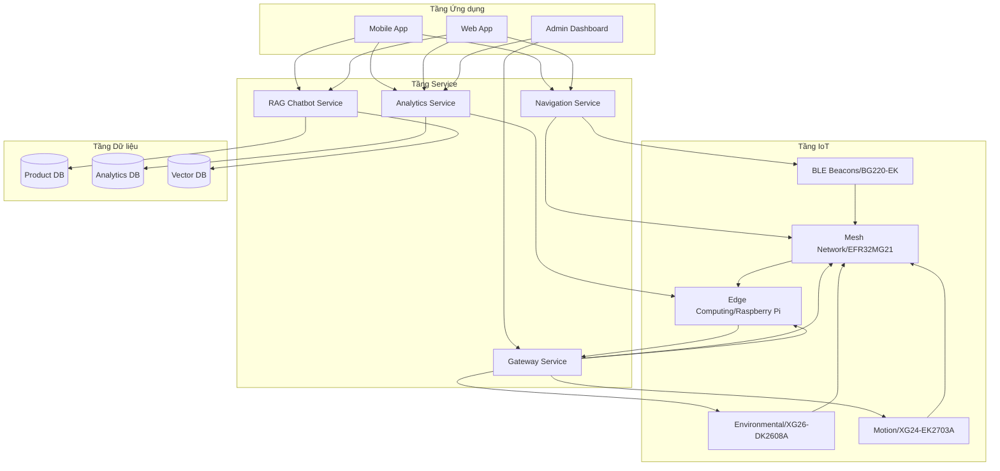
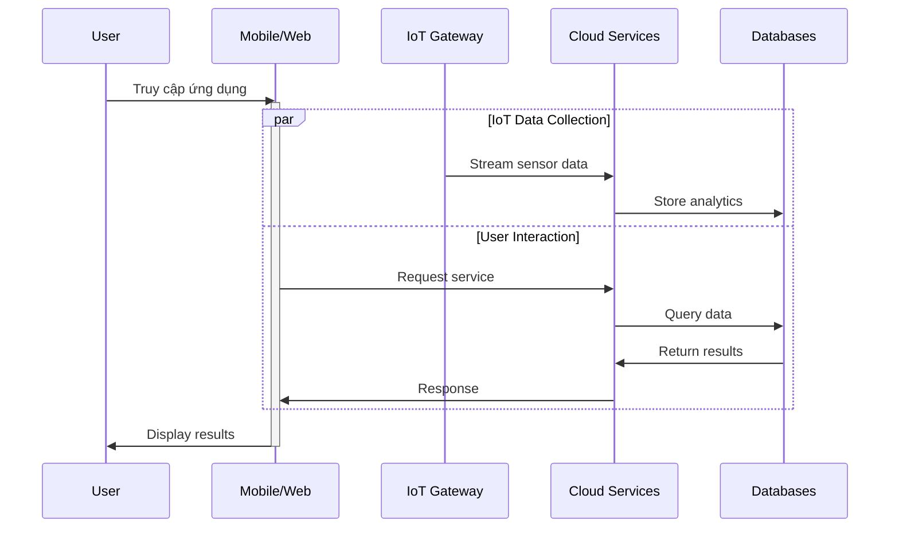
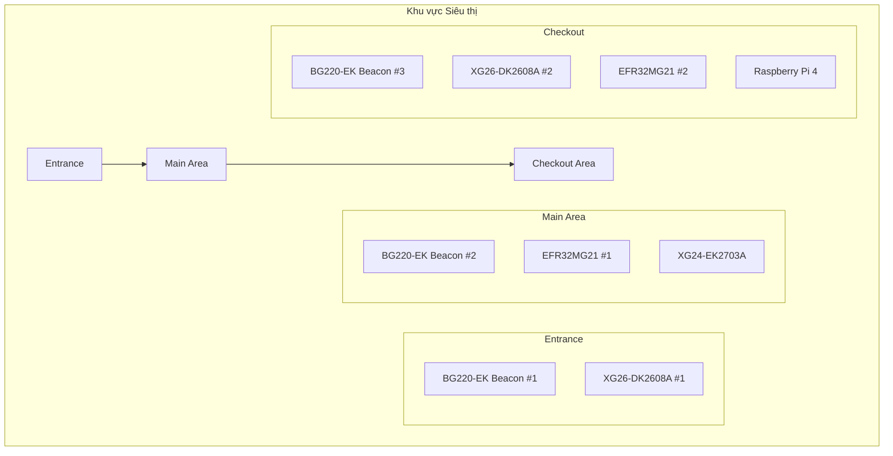
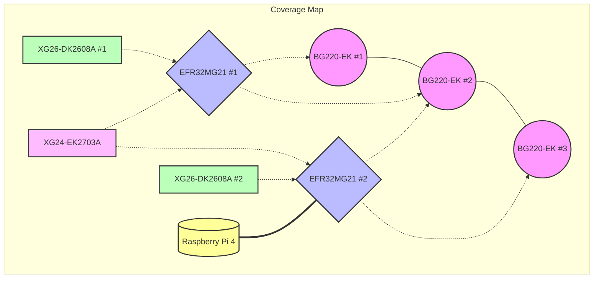
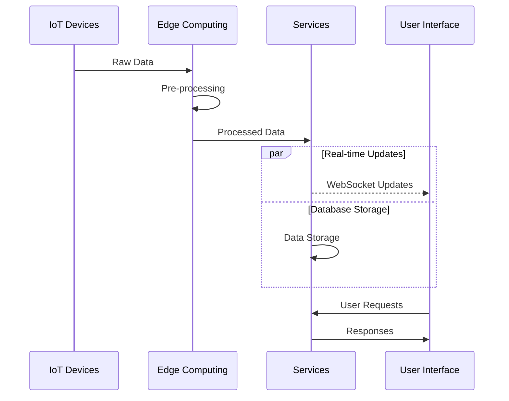
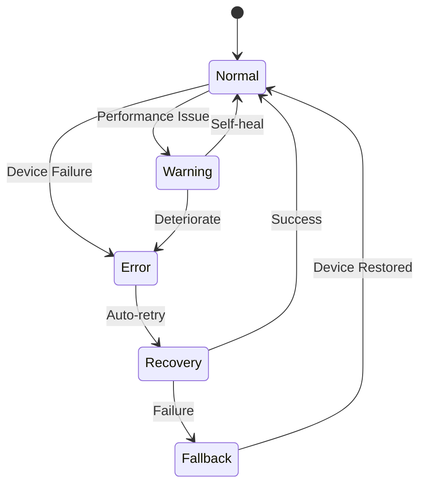
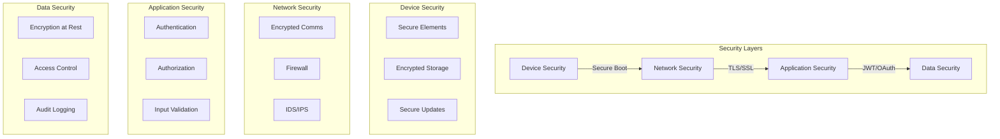
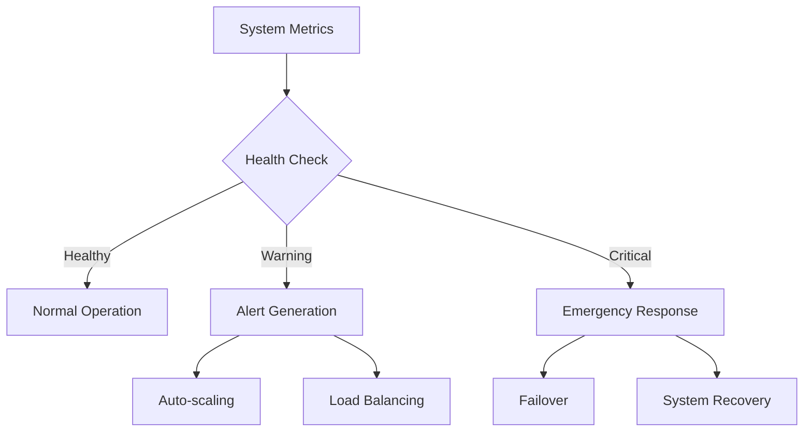
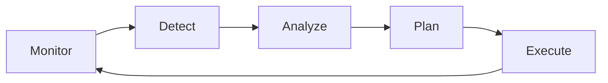

# Tổng quan Hệ thống IoT-AI Retail Assistant

## 1. Kiến trúc Tổng thể
Diagram này mô tả một kiến trúc hệ thống IoT với ba tầng chính: Tầng ứng dụng, Tầng dịch vụ, và Tầng IoT. Dưới đây là phân tích kỹ thuật chi tiết từng tầng và cách chúng tương tác.

1. Tầng ứng dụng (User Interface Layer)

Tầng này là giao diện người dùng cuối, nơi người dùng tương tác với hệ thống. Nó bao gồm:

Mobile App:

Ứng dụng di động, có thể được phát triển trên iOS hoặc Android.

Chức năng: Hiển thị dữ liệu IoT (như thông tin môi trường, vị trí), gửi yêu cầu (ví dụ: hỏi chatbot), và nhận thông báo.

Kết nối: Giao tiếp với tầng dịch vụ qua API (REST hoặc WebSocket).

Web App:

Ứng dụng web, chạy trên trình duyệt.

Chức năng: Tương tự Mobile App nhưng tối ưu cho màn hình lớn hơn, phù hợp với người dùng trên máy tính.

Kết nối: Cũng sử dụng API để giao tiếp với tầng dịch vụ.

Admin Dashboard:

Bảng điều khiển dành cho quản trị viên.
Chức năng: Quản lý hệ thống (xem dữ liệu IoT, cấu hình thiết bị, phân tích hiệu suất), giám sát trạng thái thiết bị IoT, và truy cập báo cáo phân tích.

Kết nối: Truy cập tầng dịch vụ để lấy dữ liệu và gửi lệnh quản trị.

Luồng dữ liệu: Tầng ứng dụng gửi yêu cầu đến tầng dịch vụ (ví dụ: truy vấn chatbot, yêu cầu phân tích dữ liệu) và nhận kết quả trả về để hiển thị.

2. Service Layer

Đây là tầng trung gian, xử lý logic nghiệp vụ và kết nối các tầng khác. Nó bao gồm các dịch vụ:
RAG Chatbot Service:
Dịch vụ chatbot sử dụng mô hình Retrieval-Augmented Generation (RAG).
Chức năng: Trả lời câu hỏi người dùng bằng cách truy xuất thông tin từ Vector DB (dữ liệu dạng vector, thường dùng cho tìm kiếm ngữ nghĩa) và kết hợp với mô hình ngôn ngữ để sinh câu trả lời tự nhiên.

Ví dụ: Người dùng hỏi "Món hàng này còn không", chatbot lấy dữ liệu từ Vector DB và trả lời dựa trên thông tin trong kho.

Analytics Service:

Chức năng: Xử lý dữ liệu từ Analytics DB và dữ liệu thời gian thực từ tầng IoT để tạo báo cáo, biểu đồ, hoặc dự đoán.

Ví dụ: Phân tích xu hướng mua hàng trong khoảng thời gian 2 tháng gần nhất để biết mặt hàng nào bán chạy.

Navigation Service:

Dịch vụ điều hướng, có thể hỗ trợ định vị (indoor navigation).

Chức năng: Sử dụng dữ liệu từ BLE Beacons (ở tầng IoT) để xác định vị trí người dùng và cung cấp hướng dẫn di chuyển.
Ví dụ: Hỗ trợ người dùng tìm đường trong một tòa nhà lớn dựa trên tín hiệu BLE.

Kết nối với tầng dữ liệu:

Các dịch vụ này truy xuất dữ liệu từ Product DB (thông tin sản phẩm), Analytics DB (dữ liệu phân tích), và Vector DB (dữ liệu vector cho AI).

Chúng cũng gửi dữ liệu đã xử lý (như kết quả phân tích) trở lại các cơ sở dữ liệu này.

Kết nối với tầng IoT:

Tầng dịch vụ nhận dữ liệu thời gian thực từ tầng IoT qua Gateway và gửi lệnh điều khiển (nếu cần) đến các thiết bị IoT.

3. Tầng dữ liệu (Data Layer)

Tầng này lưu trữ dữ liệu cần thiết cho hệ thống, bao gồm:

Product DB:

Cơ sở dữ liệu quan hệ (SQL), lưu thông tin sản phẩm.

Ví dụ: Danh sách thiết bị IoT, thông số kỹ thuật, hoặc thông tin cấu hình.

Analytics DB:

Cơ sở dữ liệu phân tích, có thể là SQL hoặc NoSQL (như MongoDB).

Lưu trữ dữ liệu lịch sử từ tầng IoT (như nhiệt độ, chuyển động) và kết quả phân tích từ Analytics Service.

Vector DB:

Cơ sở dữ liệu vector (như Pinecone, Weaviate), lưu trữ dữ liệu dạng vector.

Dùng cho các tác vụ AI như tìm kiếm ngữ nghĩa hoặc hỗ trợ chatbot (RAG Chatbot Service).

Ví dụ: Lưu trữ embedding của dữ liệu IoT để chatbot truy vấn nhanh.

Quản lý dữ liệu:

Dữ liệu từ tầng IoT được gửi lên qua Gateway, sau đó được xử lý bởi tầng dịch vụ và lưu vào các cơ sở dữ liệu này.

Tầng dịch vụ truy xuất dữ liệu từ đây để phục vụ tầng ứng dụng.

4. Tầng IoT (IoT Layer)

Tầng này bao gồm các thiết bị IoT, giao thức kết nối, và thiết bị tính toán tại chỗ. Cụ thể:

BLE Beacons (BGG220-EK):

Thiết bị phát tín hiệu Bluetooth Low Energy (BLE), mã sản phẩm BGG220-EK.

Chức năng: Phát tín hiệu để định vị trong không gian nhỏ (indoor positioning).

Ứng dụng: Hỗ trợ Navigation Service xác định vị trí người dùng.

Mesh Network (EFR32MG21):

Mạng lưới (mesh network) sử dụng chip EFR32MG21 của Silicon Labs.

Chức năng: Kết nối nhiều thiết bị IoT trong một mạng lưới, đảm bảo độ tin cậy và mở rộng phạm vi kết nối.

Ví dụ: Các cảm biến môi trường và chuyển động kết nối với nhau qua mesh network, gửi dữ liệu đến Gateway.

Computing (Raspberry Pi):

Raspberry Pi là thiết bị tính toán tại chỗ (edge computing).

Chức năng: Xử lý dữ liệu cục bộ từ các cảm biến để giảm tải cho hệ thống trung tâm, gửi dữ liệu đã xử lý lên Gateway.

Gateway:

Cổng kết nối giữa tầng IoT và tầng dịch vụ.

Chức năng: Thu thập dữ liệu từ các thiết bị IoT (qua BLE hoặc mesh network) và gửi lên tầng dịch vụ qua giao thức như MQTT hoặc HTTP.

Cũng nhận lệnh từ tầng dịch vụ để điều khiển thiết bị IoT.

Environmental (X026-DK2608A):

Chức năng: Đo các thông số như nhiệt độ, độ ẩm, ánh sáng, hoặc chất lượng không khí.

Dữ liệu từ cảm biến này được gửi qua mesh network hoặc Raspberry Pi đến Gateway.

Motion:

Chức năng: Phát hiện chuyển động trong khu vực được giám sát.

Ứng dụng: Kích hoạt cảnh báo (qua Admin Dashboard) hoặc ghi lại dữ liệu chuyển động để phân tích.

5. Luồng dữ liệu

Thu thập dữ liệu:

Các cảm biến (Environmental, Motion) và BLE Beacons thu thập dữ liệu.

Dữ liệu được gửi qua Mesh Network (EFR32MG21) hoặc xử lý cục bộ bởi Raspberry Pi, sau đó chuyển đến Gateway.

Xử lý và lưu trữ:

Gateway gửi dữ liệu lên tầng dịch vụ.

Analytics Service xử lý dữ liệu và lưu vào Analytics DB.

RAG Chatbot Service sử dụng Vector DB để trả lời truy vấn.

Navigation Service dùng dữ liệu từ BLE Beacons để hỗ trợ điều hướng.

Hiển thị và tương tác:

Tầng ứng dụng (Mobile App, Web App, Admin Dashboard) lấy dữ liệu từ tầng dịch vụ để hiển thị cho người dùng.

Người dùng gửi yêu cầu (như hỏi chatbot hoặc xem báo cáo) ngược lại qua tầng ứng dụng.

## 2. Luồng Dữ liệu Tổng thể

1. Giới thiệu về Sơ đồ

Sơ đồ là một sequence diagram minh họa quy trình tương tác và luồng dữ liệu trong một hệ sinh thái IoT (Internet of Things). Nó trình bày cách các thành phần chính, bao gồm Người dùng (User), Giao diện Mobile/Web, IoT Gateway, Dịch vụ Đám mây (Cloud Services), và Cơ sở Dữ liệu (Databases), hoạt động và trao đổi dữ liệu. Sơ đồ được thiết kế với nền tối, chữ trắng và xám, đảm bảo tính dễ đọc và chuyên nghiệp, phù hợp để phân tích trong các báo cáo kỹ thuật.

2. Luồng Dữ liệu
3. 
Sơ đồ được chia thành hai giai đoạn chính, được minh họa qua các mũi tên và nhãn chi tiết. Dưới đây là phân tích từng giai đoạn:

2.1. Giai đoạn Thu thập Dữ liệu IoT ([IoT Data Collection])

Luồng "Stream sensor data": Một mũi tên được nhãn "Stream sensor data" bắt đầu từ IoT Gateway và chỉ sang Cloud Services, biểu thị việc truyền dữ liệu cảm biến liên tục từ các thiết bị IoT đến dịch vụ đám mây.

Luồng "Store analytics": Một mũi tên khác được nhãn "Store analytics" bắt đầu từ Cloud Services và chỉ sang Databases, thể hiện việc lưu trữ dữ liệu phân tích đã xử lý vào cơ sở dữ liệu.

Giai đoạn này được đánh dấu bằng nhãn bổ sung [IoT Data Collection], đặt dọc theo tương tác từ IoT Gateway đến Cloud Services, nhấn mạnh tính liên tục của quy trình thu thập dữ liệu.

2.2. Giai đoạn Tương tác Người dùng ([User Interaction])

Giai đoạn này bắt đầu từ hành động của người dùng và bao gồm các bước sau:

Luồng "Truy cập ứng dụng": Mũi tên được nhãn "Truy cập ứng dụng" (bằng tiếng Việt, nghĩa là "Access Application") bắt đầu từ User và chỉ sang Mobile/Web, thể hiện người dùng khởi động giao diện.

Luồng "Request service": Mũi tên được nhãn "Request service" bắt đầu từ Mobile/Web, đi qua IoT Gateway, và chỉ sang Cloud Services, thể hiện yêu cầu dịch vụ được truyền qua hệ thống.

Luồng "Query data": Mũi tên được nhãn "Query data" bắt đầu từ Cloud Services và chỉ sang Databases, thể hiện việc truy vấn dữ liệu từ cơ sở dữ liệu.

Luồng "Return results": Mũi tên được nhãn "Return results" bắt đầu từ Databases và chỉ sang Cloud Services, thể hiện việc trả về kết quả truy vấn.

Luồng "Response": Mũi tên được nhãn "Response" bắt đầu từ Cloud Services, đi qua IoT Gateway, và chỉ sang Mobile/Web, thể hiện phản hồi được gửi lại giao diện người dùng.

Luồng "Display results": Cuối cùng, mũi tên được nhãn "Display results" bắt đầu từ Mobile/Web và chỉ sang User, thể hiện kết quả cuối cùng được hiển thị cho người dùng.

Giai đoạn này được đánh dấu bằng nhãn bổ sung [User Interaction], đặt dọc theo tương tác từ Mobile/Web đến Cloud Services, nhấn mạnh quy trình tương tác do người dùng khởi xướng.

## 3. Phân bố Thiết bị

### 3.1 Sơ đồ Phân bố Vật lý
1. Giới thiệu về sơ đồ
Sơ đồ  là một sequence diagram hoặc sơ đồ phân bố vật lý, minh họa cách các thiết bị IoT được triển khai trong một môi trường được giám sát, có thể là không gian bán lẻ, thương mại, hoặc một khu vực cần quản lý. Sơ đồ được thiết kế với cấu trúc phân cấp, thể hiện mối quan hệ giữa các khu vực chính (Entrance, Main Area, Checkout Area) và các thiết bị được bố trí trong chúng. Đây là một tài liệu quan trọng cho việc thiết kế hệ thống, lập kế hoạch triển khai, và quản lý vận hành, đảm bảo rằng các thành phần được bố trí hợp lý để tối ưu hóa chức năng.

2. Phân tích các thành phần chính

2.1. Khu vực Entrance (Cửa vào)

Mô tả: Đây là điểm khởi đầu của sơ đồ, đại diện cho cửa vào chính của không gian được giám sát. Đây là nơi đầu tiên mà người hoặc tài sản đi vào, do đó cần các thiết bị để phát hiện và ghi nhận.

Thiết bị liên quan:

BG220-EK Beacon : Một thiết bị beacon dựa trên Bluetooth Low Energy (BLE), thường được sử dụng cho theo dõi vị trí, tiếp thị dựa trên vị trí, hoặc kiểm soát quyền truy cập. Beacon này có thể phát tín hiệu để xác định vị trí của người hoặc thiết bị gần cửa vào.

XG26-DK2608A #1: Có thể là một cảm biến hoặc mô-đun giao tiếp, đóng vai trò trong việc phát hiện môi trường (như nhiệt độ, độ ẩm) hoặc truyền dữ liệu tại cửa vào. Thiết bị này có thể hỗ trợ beacon trong việc ghi nhận dữ liệu bổ sung.

Mối quan hệ: Khu vực Entrance là điểm tiếp xúc đầu tiên, nơi các thiết bị beacon và cảm biến làm việc cùng nhau để phát hiện và ghi nhận sự xuất hiện của người hoặc tài sản, tạo nền tảng cho các hoạt động giám sát tiếp theo.

2.2. Khu vực chính

Mô tả: Đây là khu vực trung tâm, kết nối trực tiếp với Entrance, đại diện cho không gian hoạt động chính trong môi trường. Đây là nơi diễn ra các hoạt động chính, như di chuyển khách hàng, trưng bày sản phẩm, hoặc quản lý tài sản.

Thiết bị liên quan:

BG220-EK Beacon: Một thiết bị beacon khác, được triển khai để mở rộng phạm vi giám sát hoặc cung cấp dữ liệu bổ sung cho việc theo dõi trong khu vực rộng lớn hơn. Beacon này có thể hỗ trợ theo dõi luồng khách hàng hoặc xác định vị trí tài sản trong không gian chính.

EFR32MG21 : Một bộ vi xử lý hoặc mô-đun giao tiếp không dây, có thể từ dòng EFR32 của Silicon Labs. Thiết bị này có thể được sử dụng cho xử lý dữ liệu địa phương, giao tiếp không dây với các thiết bị khác, hoặc tích hợp với hệ thống đám mây.

XG24-EK2703A: Một thiết bị khác, có thể là cảm biến hoặc bộ kit phát triển, hỗ trợ chức năng giám sát môi trường, thu thập dữ liệu, hoặc giao tiếp trong khu vực chính.
Mối quan hệ: Main Area là một node phụ thuộc của Entrance, cho thấy người hoặc tài sản đi qua cửa vào sẽ di chuyển vào khu vực này. Các thiết bị ở đây giúp mở rộng khả năng giám sát và thu thập dữ liệu, hỗ trợ các hoạt động chính trong không gian.

2.3. Checkout Area (Khu vực thanh toán)

Mô tả: Đây là một khu vực phụ thuộc của Main Area, được thiết kế đặc biệt cho quy trình thanh toán hoặc thoát khỏi không gian. Đây là khu vực quan trọng, nơi các giao dịch được thực hiện, đòi hỏi sự giám sát và xử lý dữ liệu chính xác.

Thiết bị liên quan:

BG220-EK Beacon : Một thiết bị beacon thứ ba, được đặt tại khu vực thanh toán để theo dõi hoạt động cụ thể như di chuyển khách hàng, hỗ trợ thanh toán không tiếp xúc, hoặc xác định vị trí tại quầy thanh toán.

XG26-DK2608A : Một thiết bị cảm biến hoặc mô-đun giao tiếp khác, hỗ trợ các hoạt động thanh toán, có thể ghi nhận dữ liệu môi trường hoặc truyền thông tin giao dịch.

EFR32MG21 : Hai đơn vị của bộ vi xử lý này, gợi ý rằng khu vực này cần nhiều khả năng xử lý hơn hoặc có cấu hình dự phòng để đảm bảo độ tin cậy. Thiết bị này có thể xử lý giao tiếp không dây hoặc xử lý dữ liệu giao dịch.

Raspberry Pi 4: Một máy tính bảng đơn, có thể được sử dụng cho xử lý dữ liệu địa phương, điều khiển, hoặc tích hợp với các hệ thống bên ngoài như hệ thống điểm bán hàng (POS), nền tảng IoT, hoặc đám mây. Raspberry Pi 4 thường được sử dụng trong các dự án IoT nhờ khả năng tính toán mạnh mẽ và hỗ trợ nhiều giao thức.

Mối quan hệ: Checkout Area là một phần nhỏ của Main Area, nơi các giao dịch được thực hiện. Sự hiện diện của nhiều thiết bị (beacon, cảm biến, bộ vi xử lý và Raspberry Pi) cho thấy một hệ thống phức tạp được thiết kế cho giám sát thời gian thực, thu thập dữ liệu, và tự động hóa quy trình thanh toán.

3. Cấu trúc phân cấp và luồng dữ liệu

Sơ đồ thể hiện một luồng dữ liệu phân cấp, với các mối quan hệ rõ ràng:

Entrance là điểm khởi đầu, kết nối với Main Area, đại diện cho luồng tự nhiên của người hoặc tài sản từ cửa vào đến khu vực chính.

Main Area chia nhánh thành Checkout Area, cho thấy khu vực thanh toán là một chức năng chuyên biệt trong không gian chính.

Các mũi tên trong sơ đồ chỉ ra hướng luồng dữ liệu hoặc sự phụ thuộc, với Entrance dẫn đến Main Area, và Main Area dẫn đến Checkout Area. Điều này phản ánh quy trình logic của việc di chuyển hoặc xử lý dữ liệu trong môi trường, từ phát hiện ban đầu đến xử lý giao dịch cuối cùng.

### 3.2 Vùng Phủ Sóng

## 4. Tích hợp Module

### 4.1 Communication Flow
Sơ đồ được cung cấp là một biểu đồ luồng dữ liệu (flowchart) minh họa quy trình tương tác và luồng dữ liệu trong một hệ sinh thái IoT (Internet of Things), nhấn mạnh vào việc sử dụng Edge Computing để xử lý dữ liệu gần nguồn và hỗ trợ cập nhật thời gian thực.

Sơ đồ mô tả sự phối hợp giữa bốn thành phần chính:

IoT Devices

Edge Computing

Services

User Interface

Phân tích thành phần và vai trò
1. IoT Devices
Mô tả:
Là nguồn tạo ra Raw Data, bao gồm cảm biến, thiết bị kết nối và các nguồn dữ liệu khác.

Vị trí:
Nằm bên trái sơ đồ, xuất hiện cả trên và dưới, biểu thị tính liên tục của quá trình thu thập dữ liệu.

Vai trò:
Gửi Raw Data đến Edge Computing để xử lý sơ bộ.

2. Edge Computing
Mô tả:
Là lớp trung gian xử lý, thực hiện Pre-processing dữ liệu để giảm độ trễ, tối ưu tài nguyên mạng và hỗ trợ xử lý thời gian thực.

Vị trí:
Nằm ngay bên phải của IoT Devices, cả trên và dưới sơ đồ.

Vai trò:
Nhận Raw Data, thực hiện Pre-processing → tạo Processed Data → chuyển đến Services.

3. Services
Mô tả:
Là trung tâm xử lý dữ liệu, bao gồm hai chức năng chính:

📡 [Real-time Updates]

💾 [Database Storage]

Vị trí:
Bên phải Edge Computing, cả trên và dưới.

Vai trò:

[Real-time Updates]:
Tạo ra Real-time Updates và WebSocket Updates gửi đến User Interface.

[Database Storage]:
Lưu Processed Data để phục vụ User Requests sau này.

4. User Interface
Mô tả:
Giao diện mà người dùng trực tiếp tương tác để theo dõi và truy xuất dữ liệu.

Vị trí:
Ở bên phải cuối cùng của sơ đồ.

Vai trò:

Nhận Real-time Updates và WebSocket Updates để hiển thị dữ liệu thời gian thực.

Gửi User Requests đến Services và nhận lại Responses từ dữ liệu lưu trữ.

Luồng dữ liệu và tương tác
IoT Devices → Edge Computing:

Sinh ra Raw Data → gửi đến Edge Computing.

Edge Computing:

Thực hiện Pre-processing → tạo ra Processed Data.

Edge Computing → Services:

Processed Data được:

Gửi đến [Real-time Updates] → tạo WebSocket Updates đến User Interface.

Gửi đến [Database Storage] để lưu trữ.

Services ↔ User Interface:

User Interface nhận dữ liệu thời gian thực từ Services.

Người dùng gửi User Requests → hệ thống trả về Responses từ Database Storage.

### 4.2 Error Handling

1. Giới thiệu về sơ đồ
Sơ đồ "4.2 Error Handling" là một state diagram minh họa quá trình xử lý lỗi trong một hệ thống kỹ thuật như hệ thống IoT, hệ thống tự động hóa, hoặc hệ thống CNTT.

Sơ đồ thể hiện quá trình chuyển đổi giữa các trạng thái sau:

Normal

Warning

Error

Recovery

Fallback

2. Phân tích các trạng thái
Normal
Mô tả: Trạng thái khởi đầu khi hệ thống hoạt động bình thường, không có lỗi được phát hiện.

Vị trí: Nằm ở trên cùng của sơ đồ, với một vòng tròn nhỏ phía trên biểu thị điểm bắt đầu.

Vai trò: Là trạng thái ổn định và mục tiêu duy trì của hệ thống.

Warning
Mô tả: Xuất hiện khi hệ thống phát hiện vấn đề tiềm ẩn.

Nhãn con:

Performance Issue: hiệu suất giảm như độ trễ cao, phản hồi chậm.

Deteriorate: thiết bị có dấu hiệu hoạt động không ổn định, ví dụ tín hiệu yếu.

Vai trò: Cảnh báo sớm để thực hiện phòng ngừa trước khi chuyển thành lỗi nghiêm trọng.

Error
Mô tả: Hệ thống đã gặp lỗi nghiêm trọng làm ảnh hưởng đến hoạt động bình thường.

Nhãn: Device Failure

Vai trò: Kích hoạt quy trình phục hồi tự động (Auto-retry), yêu cầu xử lý lỗi.

Recovery
Mô tả: Hệ thống thực hiện các biện pháp tự động để khắc phục lỗi.

Nhãn: Auto-retry

Vai trò: Cố gắng khôi phục hệ thống về trạng thái Normal mà không cần can thiệp thủ công.

Fallback
Mô tả: Trạng thái cuối khi quá trình Recovery thất bại.

Nhãn: Failure

Vai trò: Chuyển sang chế độ dự phòng, duy trì hoạt động cơ bản, tránh dừng toàn bộ hệ thống.

3. Luồng chuyển đổi trạng thái
Normal → Warning:
Khi phát hiện Performance Issue hoặc Deteriorate. Hệ thống có khả năng giám sát và cảnh báo sớm.

Warning → Normal:
Hệ thống có thể tự phục hồi (Self-heal), điều chỉnh cấu hình hoặc kết nối để quay lại hoạt động bình thường.

Warning → Error:
Nếu không khắc phục được, cảnh báo chuyển thành lỗi nghiêm trọng (Device Failure).

Error → Recovery:
Hệ thống tự động khởi động lại, kiểm tra lại thiết bị hoặc chạy quy trình sửa lỗi (Auto-retry).

Recovery → Normal:
Nếu Auto-retry thành công, hệ thống quay lại trạng thái hoạt động ổn định (Device Restored).

Recovery → Fallback:
Nếu Auto-retry thất bại, hệ thống chuyển sang chế độ dự phòng (Fallback) để duy trì tối thiểu hoạt động.

## 5. Security Architecture

## 6. Monitoring & Maintenance

### 6.1 System Health Monitoring

### 6.2 Maintenance Workflow

