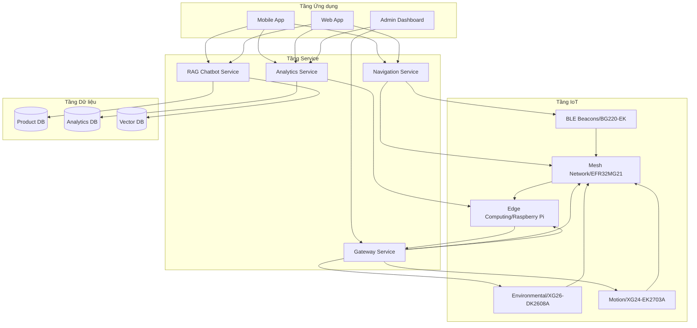
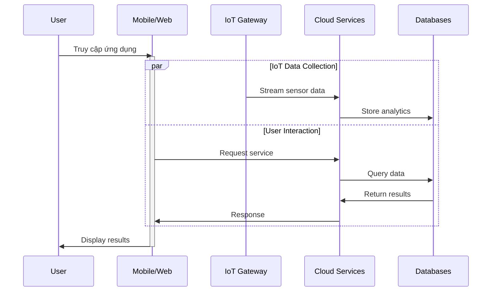
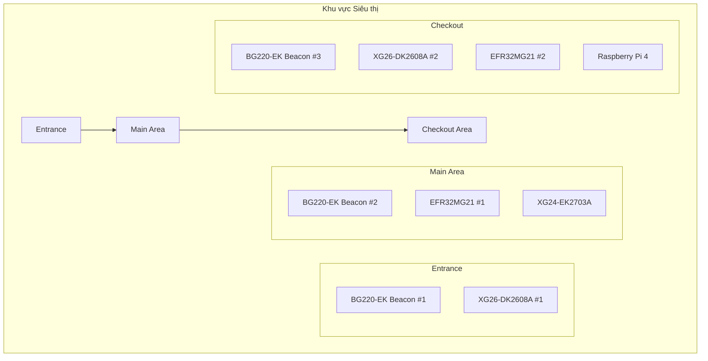
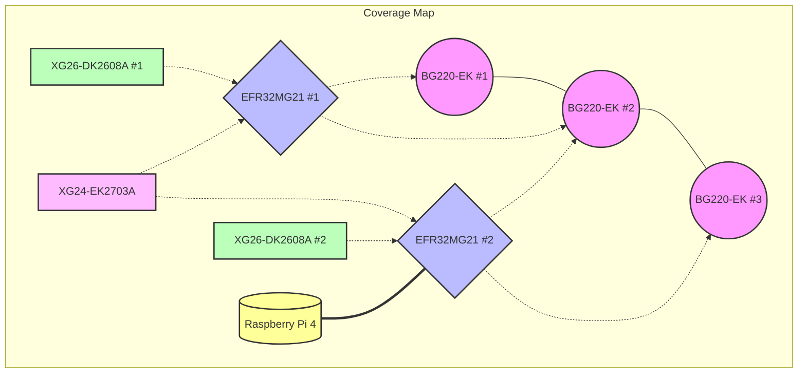
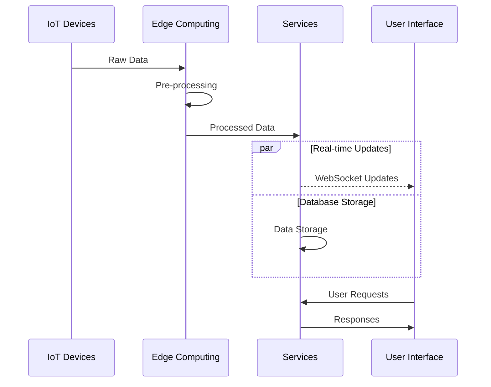
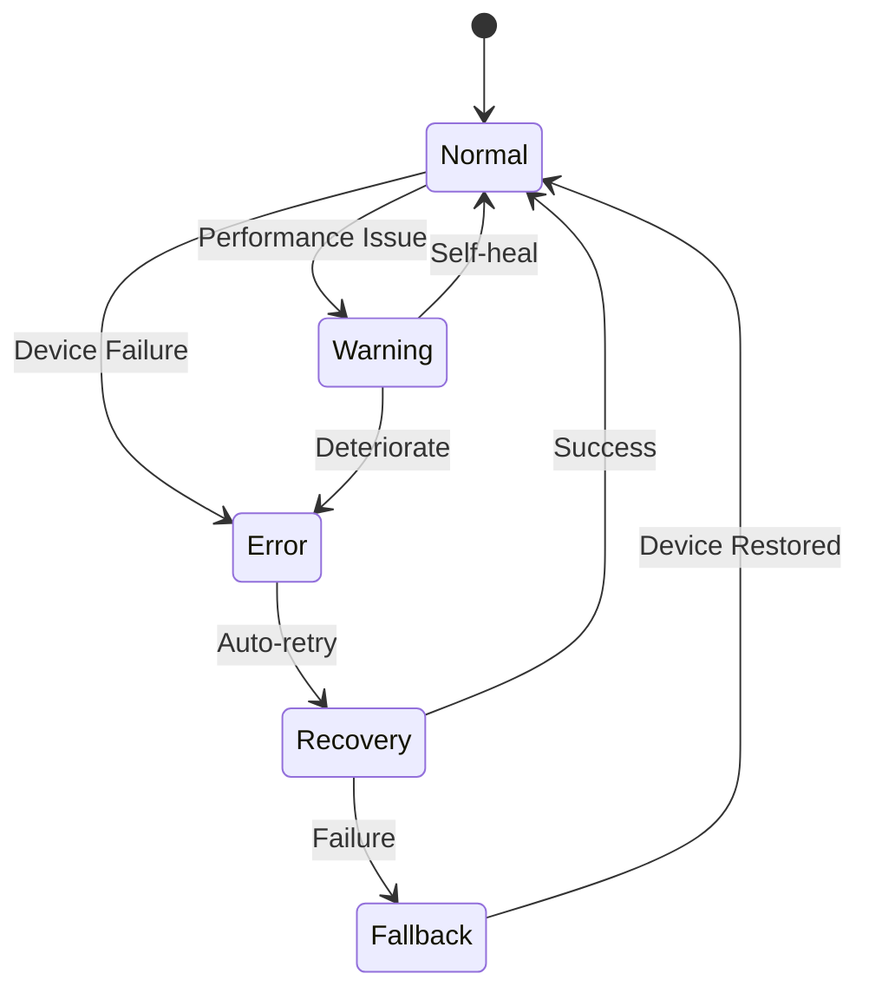
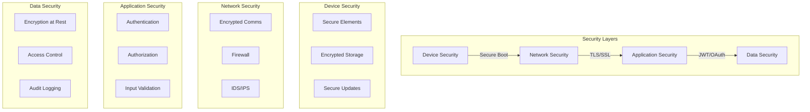
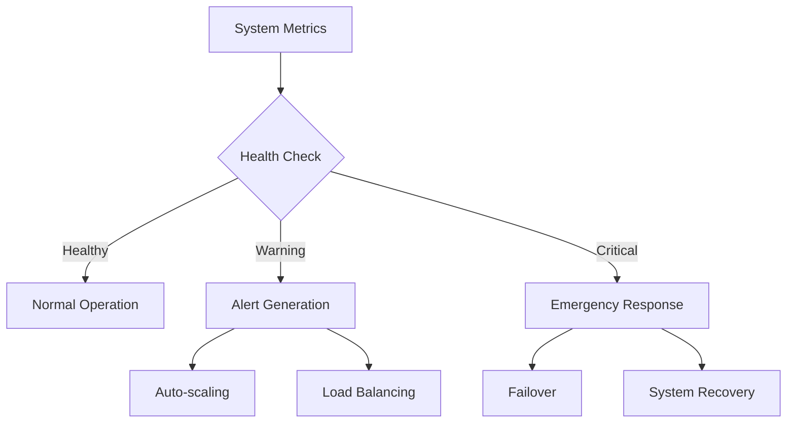
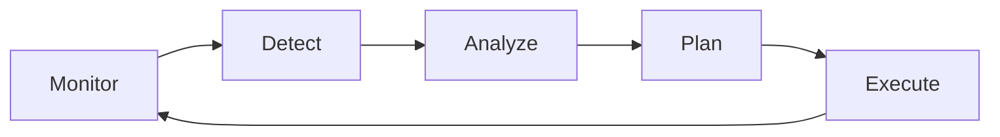

# Tổng quan Hệ thống IoT-AI Retail Assistant

## 1. Kiến trúc Tổng thể

## 2. Luồng Dữ liệu Tổng thể

## 3. Phân bố Thiết bị

### 3.1 Sơ đồ Phân bố Vật lý

### 3.2 Vùng Phủ Sóng

## 4. Tích hợp Module

### 4.1 Communication Flow

### 4.2 Error Handling

## 5. Security Architecture

## 6. Monitoring & Maintenance

### 6.1 System Health Monitoring

### 6.2 Maintenance Workflow

