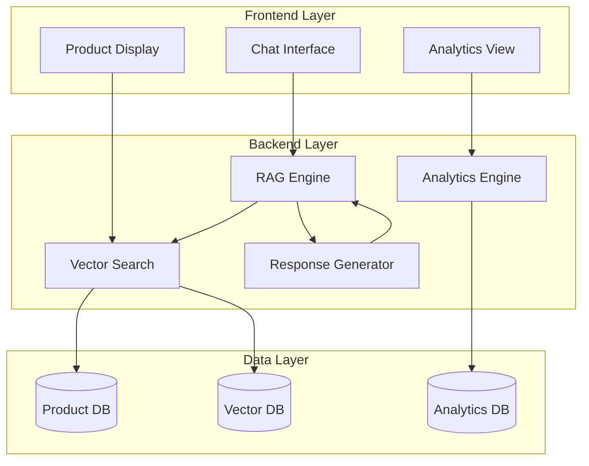
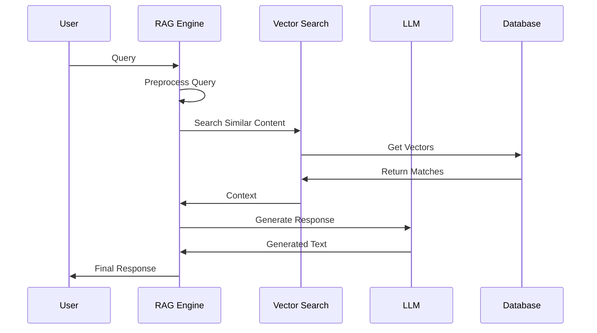
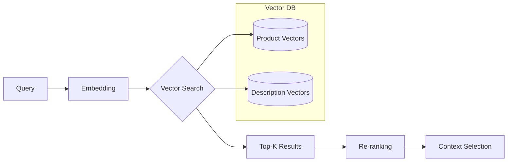
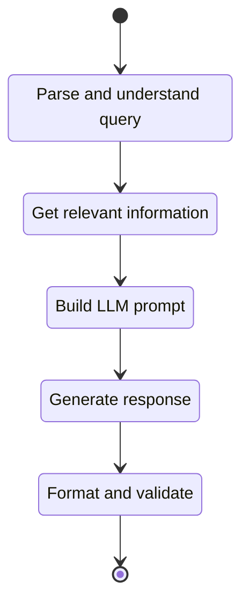
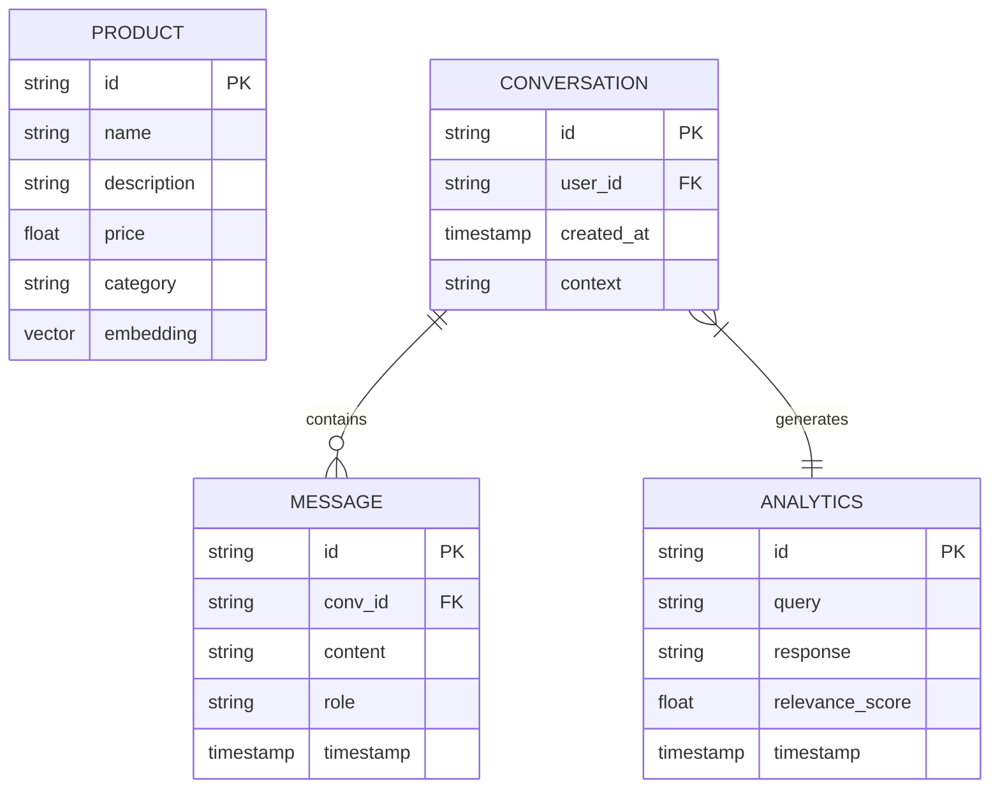
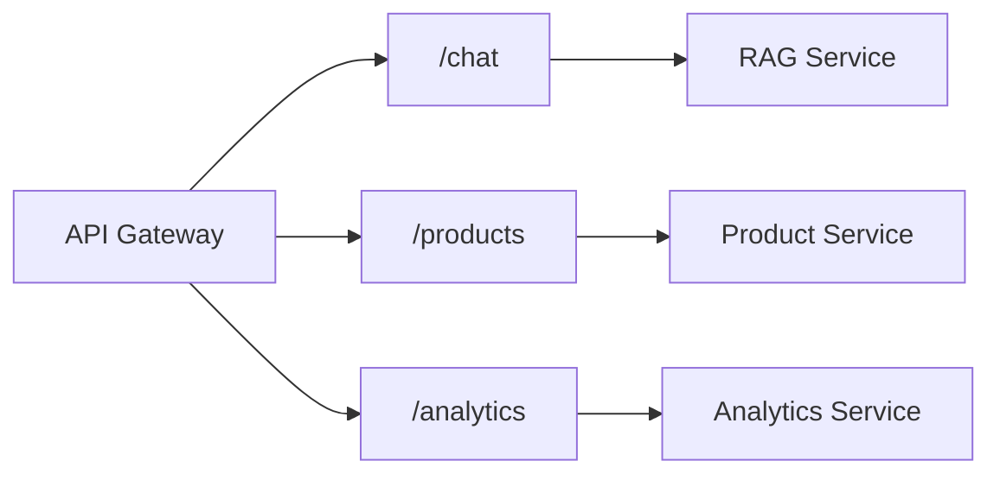
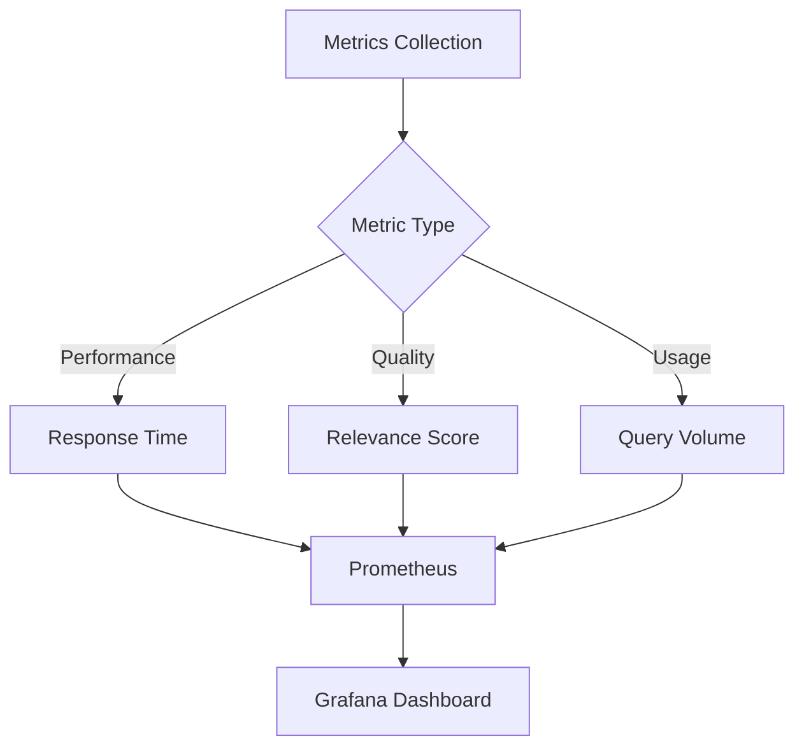
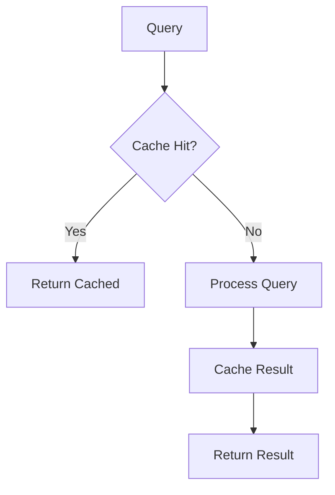
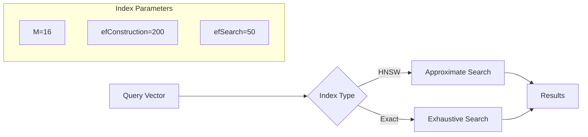

# RAG Chatbot Module Documentation

## 1. Tổng quan Module

RAG (Retrieval Augmented Generation) Chatbot là module tư vấn thông minh, kết hợp giữa tìm kiếm thông tin và sinh text để tạo ra câu trả lời chính xác và phù hợp với context.

### 1.1 Kiến trúc Module

Tổng quan kiến trúc hệ thống

Kiến trúc hệ thống được chia thành ba lớp chính: Frontend Layer, Backend Layer, và Data Layer. Mỗi lớp đảm nhận vai trò riêng biệt, giúp hệ thống có tính mô-đun, dễ bảo trì và mở rộng. Kiến trúc này đặc biệt phù hợp với các ứng dụng sử dụng mô hình Retrieval-Augmented Generation (RAG).

1. Frontend Layer

Đây là lớp giao diện người dùng, nơi diễn ra các tương tác trực tiếp:

Product Display: Giao diện hiển thị thông tin chi tiết về sản phẩm cho người dùng.

Chat Interface: Nơi người dùng nhập câu hỏi hoặc yêu cầu, và nhận lại phản hồi từ hệ thống.

Analytics View: Giao diện trực quan hóa dữ liệu phân tích, như hành vi người dùng hoặc xu hướng sản phẩm.

2. Backend Layer

Lớp này chịu trách nhiệm xử lý logic nghiệp vụ và liên kết giữa frontend với cơ sở dữ liệu:

RAG Engine: Là thành phần trung tâm, kết hợp khả năng retrieval (truy xuất tài liệu) với generation (tạo văn bản) để tạo ra phản hồi phù hợp. Nó nhận câu hỏi từ Chat Interface và chuyển tiếp truy vấn đến Vector Search.

Vector Search: Thực hiện tìm kiếm ngữ nghĩa dựa trên các vector embedding được lưu trong Vector DB. Khi cần, nó cũng truy xuất thông tin từ Product DB để bổ sung ngữ cảnh.

Response Generator: Nhận thông tin đã được truy xuất từ RAG Engine, sau đó tổng hợp thành phản hồi hoàn chỉnh gửi lại người dùng.

Analytics Engine: Thu thập và xử lý dữ liệu liên quan đến tương tác người dùng và hiệu suất hệ thống, lưu trữ trong Analytics DB để phục vụ phân tích.

3. Data Layer

Lớp dữ liệu gồm các kho lưu trữ chính:

Product DB: Lưu thông tin chi tiết về sản phẩm như mô tả, giá, thông số kỹ thuật...

Vector DB: Lưu trữ các vector embedding dùng cho tìm kiếm ngữ nghĩa trong Vector Search.

Analytics DB: Lưu các chỉ số, log hệ thống và hành vi người dùng để phục vụ việc phân tích và hiển thị qua Analytics View.

Luồng xử lý dữ liệu

Người dùng đặt câu hỏi tại Chat Interface.

RAG Engine nhận câu hỏi và chuyển đến Vector Search.

Vector Search truy vấn trong Vector DB và/hoặc Product DB để lấy thông tin liên quan.

RAG Engine xử lý thông tin truy xuất và gửi đến Response Generator để tạo phản hồi.

Phản hồi được trả lại người dùng qua Chat Interface.

Đồng thời, Analytics Engine ghi nhận tương tác và cập nhật dữ liệu vào Analytics DB để phục vụ Analytics View.

Ưu điểm kiến trúc
Phân tầng rõ ràng giúp dễ bảo trì, mở rộng và tối ưu hóa.

Ứng dụng semantic search qua Vector DB nâng cao độ chính xác của truy xuất.

RAG Engine cho phép phản hồi chính xác và có ngữ cảnh tốt hơn.

Hệ thống có thể theo dõi và phân tích hiệu quả qua Analytics Engine và Analytics DB.




## 2. Chi tiết Thành phần

### 2.1 RAG Engine Flow

Sơ đồ "RAG Engine Flow" mô tả luồng xử lý của hệ thống khi một truy vấn được người dùng gửi đến. Đây là quy trình kết hợp giữa việc truy xuất thông tin liên quan từ cơ sở dữ liệu (retrieval) và sinh phản hồi (generation) bằng mô hình ngôn ngữ lớn (LLM). Hệ thống RAG (Retrieval-Augmented Generation) giúp cải thiện độ chính xác và tính cập nhật của câu trả lời so với việc chỉ dùng LLM đơn thuần.

1. Các thành phần chính trong hệ thống
   
User: Người dùng gửi truy vấn đầu vào.

RAG Engine: Thành phần trung tâm chịu trách nhiệm điều phối toàn bộ quy trình từ tiền xử lý truy vấn đến sinh phản hồi cuối cùng.

Vector Search: Công cụ tìm kiếm ngữ nghĩa dựa trên vector embedding, nhằm truy xuất các tài liệu liên quan.

LLM (Large Language Model): Mô hình ngôn ngữ lớn sử dụng để sinh văn bản phản hồi dựa trên truy vấn và ngữ cảnh.

Database: Nơi lưu trữ các tài liệu, dữ liệu văn bản hoặc nội dung cần tìm kiếm.

2. Mô tả chi tiết luồng xử lý
   
Người dùng gửi truy vấn đến RAG Engine. Đây có thể là một câu hỏi tự nhiên hoặc một yêu cầu cụ thể.

RAG Engine thực hiện tiền xử lý truy vấn. Việc này có thể bao gồm chuẩn hóa ngôn ngữ, chuyển sang vector embedding, hoặc tách cụm từ chính.

RAG Engine gửi yêu cầu tìm kiếm đến Vector Search. Vector Search sử dụng truy vấn đã được xử lý để tìm ra các nội dung tương tự nhất trong cơ sở dữ liệu.

Vector Search gửi yêu cầu đến Database để truy xuất các vector. Các đoạn văn bản trong cơ sở dữ liệu đã được mã hóa thành vector trước đó.

Database trả về các vector phù hợp, tương ứng với những tài liệu hoặc đoạn nội dung gần nhất với truy vấn.

Vector Search trả lại tập hợp các nội dung liên quan (context) cho RAG Engine.

RAG Engine kết hợp context với truy vấn gốc và gửi đến LLM để sinh phản hồi.

LLM sinh phản hồi hoàn chỉnh dưới dạng văn bản, dựa trên ngữ cảnh đã truy xuất.

RAG Engine nhận phản hồi từ LLM và gửi lại cho người dùng.

3. Ưu điểm của kiến trúc RAG Engine
   
Giảm phụ thuộc vào trí nhớ của mô hình LLM bằng cách bổ sung thông tin theo thời gian thực từ cơ sở dữ liệu.

Đảm bảo tính cập nhật và tính đúng đắn của phản hồi vì thông tin được lấy trực tiếp từ nguồn dữ liệu đáng tin cậy.

Tăng tính minh bạch vì có thể kiểm tra các nguồn thông tin được sử dụng trong quá trình sinh phản hồi.

Dễ dàng mở rộng và tùy biến cho các ứng dụng khác nhau như chatbot, hệ thống tìm kiếm thông minh, trợ lý ảo doanh nghiệp,...



### 2.2 Vector Search Process

1. Các thành phần chính
Query: Truy vấn đầu vào của người dùng, có thể là một câu hỏi hoặc từ khóa tìm kiếm.

Embedding: Giai đoạn chuyển truy vấn sang biểu diễn vector (embedding) bằng một mô hình ngôn ngữ (thường là transformer hoặc encoder).

Vector Search: Quá trình so khớp vector của truy vấn với các vector đã lưu trữ trong cơ sở dữ liệu để tìm ra các nội dung gần nhất.

Vector DB: Cơ sở dữ liệu lưu trữ các vector đã được mã hóa từ trước. Trong sơ đồ này có hai loại:

Product Vectors: Vector biểu diễn các sản phẩm.

Description Vectors: Vector biểu diễn phần mô tả sản phẩm hoặc nội dung liên quan.

Top-K Results: Tập hợp K kết quả gần nhất (theo khoảng cách cosine hoặc độ tương đồng khác).

Re-ranking: Sắp xếp lại các kết quả tìm được theo tiêu chí cụ thể (ví dụ: mức độ liên quan theo ngữ cảnh, trọng số ưu tiên,...).

Context Selection: Lựa chọn kết quả cuối cùng để sử dụng làm context (ngữ cảnh đầu vào cho LLM hoặc công cụ downstream).

2. Diễn giải luồng xử lý
Query → Embedding
Truy vấn văn bản được mã hóa thành vector nhờ một mô hình embedding (thường là sentence-transformer hoặc encoder như BERT, MiniLM...).

Embedding → Vector Search
Vector của truy vấn được so sánh với các vector đã lưu trữ trong Vector DB để tìm ra các vector gần nhất (khoảng cách nhỏ nhất hoặc tương đồng cao nhất).

Vector DB
Có hai tập vector chính:

Product Vectors: Biểu diễn các thuộc tính định danh hoặc định lượng của sản phẩm.

Description Vectors: Biểu diễn các nội dung mô tả, chi tiết kỹ thuật, đánh giá, v.v.

Vector Search → Top-K Results
Lấy ra Top-K kết quả gần nhất, ví dụ K = 5 hoặc 10, nhằm giới hạn số lượng dữ liệu được xử lý tiếp theo.

Top-K Results → Re-ranking
Giai đoạn tái sắp xếp các kết quả dựa trên tiêu chí nâng cao (có thể kết hợp điểm vector similarity với yếu tố thời gian, độ phổ biến, v.v.).

Re-ranking → Context Selection
Từ các kết quả đã được tái sắp xếp, lựa chọn một hoặc vài nội dung phù hợp nhất để đưa vào LLM sinh phản hồi.



### 2.3 Response Generation

Sơ đồ mô tả quy trình tạo phản hồi trong hệ thống sử dụng mô hình ngôn ngữ lớn (LLM - Large Language Model). Quy trình bao gồm năm bước chính, từ việc tiếp nhận truy vấn của người dùng cho đến khi phản hồi hoàn chỉnh được trả về giao diện.

Bước 1: Parse and understand query
Khi người dùng gửi một truy vấn (query), hệ thống đầu tiên thực hiện phân tích cú pháp và ngữ nghĩa để hiểu nội dung, mục đích và ngữ cảnh của truy vấn đó. Việc hiểu đúng ý định người dùng là điều kiện tiên quyết để đảm bảo phản hồi sau cùng chính xác.

Các tác vụ có thể bao gồm:

Chuẩn hóa văn bản (normalization)

Loại bỏ nhiễu hoặc ký tự không cần thiết

Phân loại truy vấn (ví dụ: truy vấn so sánh, mô tả, yêu cầu thông tin,…)

Trích xuất thực thể liên quan (entity extraction)

Bước 2: Get relevant information
Sau khi truy vấn được hiểu, hệ thống tiến hành truy xuất thông tin có liên quan. Giai đoạn này có thể được hỗ trợ bởi Vector Search – một cơ chế tìm kiếm theo vector trong Vector Database (Vector DB).

Tùy thuộc vào ứng dụng, thông tin truy xuất có thể đến từ:

Vector DB (chứa vector embedding của sản phẩm, mô tả, tài liệu…)

Structured database (chứa dữ liệu định dạng như tên sản phẩm, giá, tồn kho,…)

Knowledge Base (với các quy tắc, chính sách, thông tin chi tiết về doanh nghiệp,…)

Mục tiêu của bước này là cung cấp bối cảnh (context) cần thiết để hỗ trợ LLM tạo ra phản hồi phù hợp và giàu thông tin.

Bước 3: Build LLM prompt
Thông tin thu thập được từ bước trước sẽ được dùng để xây dựng prompt đầu vào cho mô hình ngôn ngữ LLM. Một prompt tốt sẽ hướng dẫn LLM sinh ra nội dung đúng mục đích, đúng định dạng và đúng ngữ cảnh mong muốn.

Prompt có thể bao gồm:

Truy vấn gốc từ người dùng

Bối cảnh liên quan được tìm thấy

Hướng dẫn cụ thể về định dạng câu trả lời (ví dụ: “Trả lời dưới dạng danh sách sản phẩm kèm mô tả ngắn”)

Bước 4: Generate response
LLM sẽ nhận prompt và sinh ra phản hồi dạng văn bản. Đây là quá trình inference từ mô hình, nơi nó sử dụng kiến thức được huấn luyện kết hợp với bối cảnh được cung cấp để đưa ra câu trả lời tự nhiên, hợp lý và thuyết phục.

Đầu ra ở bước này có thể là:

Văn bản thuần (plain text)

Đoạn mô tả sản phẩm

Gợi ý sản phẩm phù hợp với truy vấn

So sánh sản phẩm hoặc giải thích chi tiết

Bước 5: Format and validate
Sau khi phản hồi được sinh ra, hệ thống tiến hành định dạng (format) lại kết quả theo yêu cầu của frontend hoặc API trung gian. Đồng thời, phản hồi có thể được kiểm tra (validate) về mặt:

Cấu trúc nội dung (theo schema JSON, HTML,…)

Ngữ nghĩa (có đúng chủ đề không)

Tính chính xác hoặc mức độ an toàn nội dung (nếu cần kiểm duyệt)

Cuối cùng, kết quả đã được xử lý sẽ được gửi trở lại người dùng dưới dạng phản hồi hoàn chỉnh.



## 3. Implementation Details

### 3.1 Embedding Model

```python
# Sử dụng SentenceTransformer cho embedding
from sentence_transformers import SentenceTransformer

class EmbeddingEngine:
    def __init__(self):
        self.model = SentenceTransformer('paraphrase-multilingual-MiniLM-L12-v2')
        
    def encode(self, text):
        # Tạo vector embedding cho văn bản
        return self.model.encode(text)
    
    def batch_encode(self, texts):
        # Xử lý nhiều văn bản cùng lúc
        return self.model.encode(texts, batch_size=32)
```

### 3.2 RAG Process

```python
class RAGEngine:
    def process_query(self, query, k=3):
        # 1. Tạo embedding cho query
        query_vector = self.embedding_engine.encode(query)
        
        # 2. Tìm kiếm context liên quan
        similar_docs = self.vector_db.search(
            query_vector,
            k=k
        )
        
        # 3. Tạo prompt với context
        prompt = self.construct_prompt(query, similar_docs)
        
        # 4. Gọi LLM để sinh response
        response = self.llm.generate(prompt)
        
        return response
```

### 3.3 Mô hình Dữ liệu

Hệ thống bao gồm 5 phần chính: PRODUCT, CONVERSATION, MESSAGE, ANALYTICS

1. PRODUCT
Đại diện cho dữ liệu của sản phẩm trong hệ thống. Mỗi sản phẩm có một id duy nhất (khóa chính), cùng với các thuộc tính như name (tên sản phẩm), description (mô tả chi tiết), price (giá tiền), và category (loại sản phẩm).

Điểm đặc biệt là trường embedding, một vector nhúng thể hiện đặc trưng ngữ nghĩa của sản phẩm. Trường này được tạo từ mô hình NLP và dùng trong việc tìm kiếm ngữ nghĩa – ví dụ: tìm các sản phẩm "tương tự về ý nghĩa" thay vì chỉ khớp từ khóa.

2. CONVERSATION
Lưu trữ thông tin về từng phiên hội thoại giữa người dùng và hệ thống. Mỗi cuộc trò chuyện có một id riêng và liên kết với người dùng qua trường user_id. Thời điểm bắt đầu cuộc trò chuyện được lưu bằng trường created_at, và toàn bộ bối cảnh hoặc chủ đề cuộc trò chuyện được tóm tắt trong trường context.

3. MESSAGE
Chứa các tin nhắn riêng lẻ trong mỗi cuộc trò chuyện. Mỗi tin nhắn có id, thuộc về một cuộc trò chuyện thông qua conv_id (liên kết với bảng CONVERSATION). Nội dung của tin nhắn được lưu trong trường content.

Trường role chỉ định người gửi tin nhắn là ai – ví dụ như "user" (người dùng), "assistant" (AI), hoặc "system". Thời điểm gửi tin nhắn được lưu trong timestamp.

Mối quan hệ giữa CONVERSATION và MESSAGE là một-nhiều: một cuộc trò chuyện có thể chứa nhiều tin nhắn.

4. ANALYTICS
Dùng để lưu trữ các bản ghi phân tích liên quan đến truy vấn và phản hồi của hệ thống. Mỗi bản ghi gồm có query (truy vấn từ người dùng), response (phản hồi được hệ thống tạo ra), cùng với relevance_score – một điểm số thể hiện mức độ liên quan giữa query và response. Dữ liệu này rất quan trọng cho việc huấn luyện lại mô hình hoặc đánh giá chất lượng hệ thống.

Mỗi bản ghi trong này có id riêng và được đánh dấu thời gian thông qua timestamp.

ANALYTICS có mối liên hệ một-nhiều với CONVERSATION: một cuộc trò chuyện có thể sinh ra nhiều bản ghi phân tích.




## 4. API Documentation

### 4.1 Endpoints

1. Tổng quan kiến trúc
Sơ đồ ở dưới mô tả một kiến trúc microservices cơ bản, trong đó API Gateway là điểm nhập trung tâm, định tuyến các yêu cầu từ client đến ba dịch vụ backend độc lập: RAG Service, Product Service, và Analytics Service. Kiến trúc này được thiết kế để đảm bảo tính module hóa, khả năng mở rộng (scalability), và tính dễ bảo trì (maintainability).

3. Thành phần và chức năng
2.1. API Gateway
Vai trò: API Gateway là một reverse proxy nhận tất cả các yêu cầu HTTP/HTTPS từ client, phân tích và định tuyến chúng đến các dịch vụ backend dựa trên endpoint được cấu hình (/chat, /products, /analytics).

Chức năng chính:

Định tuyến (Routing): Ánh xạ yêu cầu đến dịch vụ tương ứng:

/chat → RAG Service

/products → Product Service

/analytics → Analytics Service

Xác thực và ủy quyền: Tích hợp cơ chế xác thực (OAuth 2.0, JWT) để kiểm tra yêu cầu.

Giới hạn tốc độ (Rate Limiting): Ngăn chặn lạm dụng bằng cách giới hạn số lượng yêu cầu.

Ghi log và giám sát: Ghi lại thông tin yêu cầu (thời gian, trạng thái, lỗi) để phân tích.

Chuyển đổi giao thức: Chuyển đổi HTTP sang các giao thức nội bộ (như gRPC) nếu cần.

Công nghệ khả thi: NGINX, Kong, Amazon API Gateway, Traefik, hoặc Envoy (hỗ trợ gRPC).

2.2. RAG Service (Retrieval-Augmented Generation Service)
Chức năng: Xử lý yêu cầu tại /chat. RAG Service kết hợp:

Retrieval: Tìm kiếm thông tin từ kho dữ liệu (vector store như Pinecone, Weaviate).

Generation: Sử dụng mô hình LLM (LLaMA, GPT) để tạo phản hồi.

Ứng dụng: Chatbot, hệ thống hỏi đáp (Q&A), hoặc ứng dụng cần truy xuất thông tin động.

Kỹ thuật triển khai:

Kho dữ liệu: Cơ sở dữ liệu vector lưu trữ embedding (từ BERT, Sentence Transformers).

Mô hình AI: Tích hợp LLM qua API (Hugging Face) hoặc triển khai trên GPU cluster (PyTorch/TensorFlow).

Hiệu suất: Sử dụng caching (Redis) và GPU để giảm độ trễ suy luận (inference).

Thách thức:

Độ trễ: Truy xuất và sinh phản hồi có thể chậm nếu dữ liệu lớn.

Độ chính xác: Pipeline retrieval cần tối ưu để tránh phản hồi sai lệch.

2.3. Product Service
Chức năng: Xử lý yêu cầu tại /products, cung cấp thông tin sản phẩm (danh sách, chi tiết, giá).

Kỹ thuật triển khai:

Cơ sở dữ liệu: RDBMS (PostgreSQL, MySQL) hoặc Elasticsearch (tìm kiếm nhanh).

API: RESTful API hoặc GraphQL:

GET /products → Danh sách sản phẩm.

GET /products/{id} → Chi tiết sản phẩm.

Hiệu suất: Caching (Redis, Memcached) để giảm tải cơ sở dữ liệu.

Tích hợp: Giao tiếp với hệ thống kho/thanh toán qua message queue (RabbitMQ, Kafka).

Thách thức:

Đồng bộ dữ liệu: Đảm bảo dữ liệu nhất quán từ nhiều nguồn.

Tải cao: Xử lý tải lớn (flash sale) bằng autoscaling hoặc CDN.

2.4. Analytics Service
Chức năng: Xử lý yêu cầu tại /analytics, phân tích dữ liệu, tạo báo cáo (số liệu truy cập, doanh thu).

Kỹ thuật triển khai:

Nguồn dữ liệu: Log từ API Gateway, cơ sở dữ liệu giao dịch, sự kiện client.

Lưu trữ dữ liệu: Data warehouse (Snowflake, BigQuery) hoặc Apache Druid.

Xử lý dữ liệu: Apache Spark/Flink cho xử lý lô/thời gian thực.

API: RESTful API:

GET /analytics/users → Số lượng người dùng.

GET /analytics/revenue → Doanh thu.

Hiệu suất: Tối ưu truy vấn (indexing, partitioning), caching báo cáo tĩnh.

Thách thức:

Thời gian thực: Xử lý luồng dữ liệu lớn với độ trễ thấp.

Tính chính xác: Làm sạch dữ liệu để tránh sai lệch.

3. Luồng hoạt động
Client gửi yêu cầu đến API Gateway (/chat, /products, /analytics).

API Gateway xử lý:

Xác thực yêu cầu.

Ánh xạ endpoint đến dịch vụ backend.

Chuyển tiếp yêu cầu.

Dịch vụ backend xử lý:

RAG Service: Truy xuất → Sinh phản hồi.

Product Service: Truy vấn cơ sở dữ liệu.

Analytics Service: Phân tích dữ liệu.

API Gateway nhận kết quả và gửi lại cho client.


Retry với backoff cho lỗi tạm thời.



### 4.2 API Schema

```yaml
# Chat Endpoint
POST /chat
Request:
{
    "query": string,
    "context": {
        "user_id": string,
        "conversation_id": string?,
        "products": string[]?
    }
}

Response:
{
    "response": string,
    "products": [
        {
            "id": string,
            "name": string,
            "description": string,
            "price": number,
            "relevance": number
        }
    ],
    "analytics": {
        "query_vector": number[],
        "response_time": number,
        "confidence": number
    }
}
```

## 5. Performance Monitoring

### 5.1 Metrics Collection



### 5.2 Alerting Rules

```yaml
# Alert Configuration
rules:
  - name: high_latency
    condition: response_time > 2s
    duration: 5m
    
  - name: low_relevance
    condition: avg_relevance_score < 0.7
    duration: 15m
    
  - name: high_error_rate
    condition: error_rate > 5%
    duration: 5m
```

## 6. Tối ưu hóa

### 6.1 Caching Strategy



### 6.2 Vector Search Optimization


