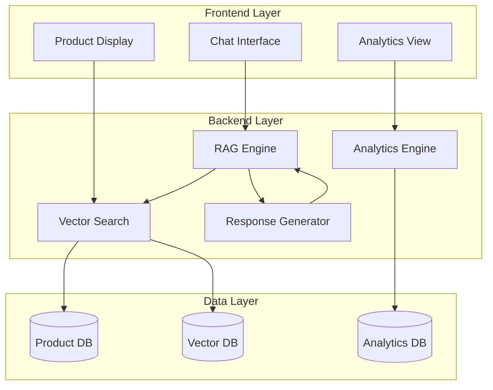
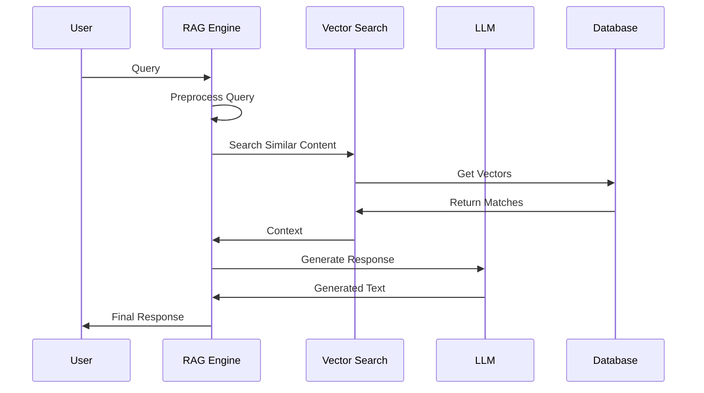
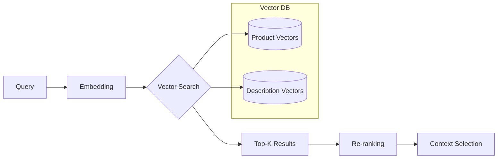
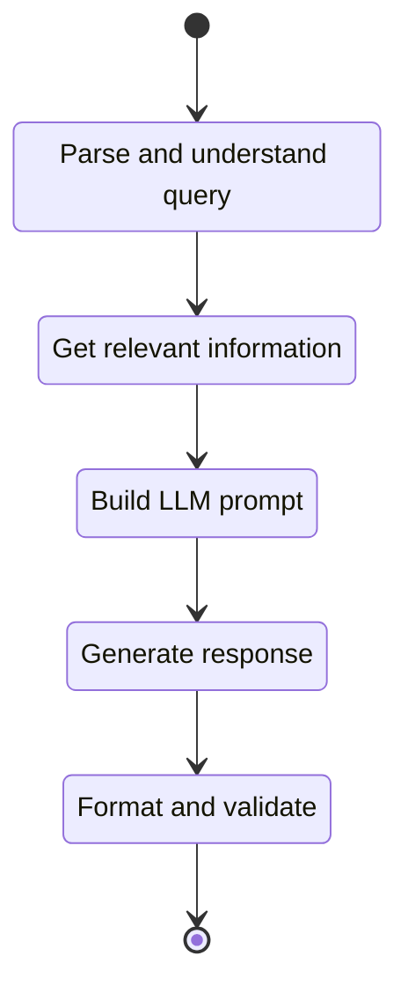
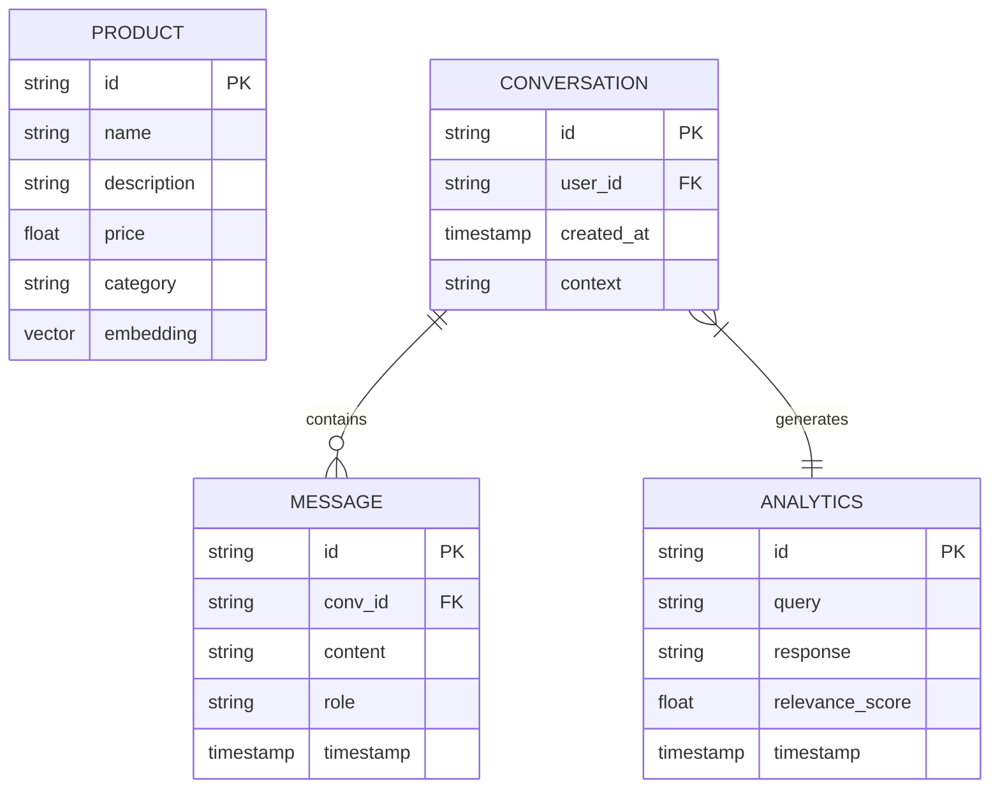
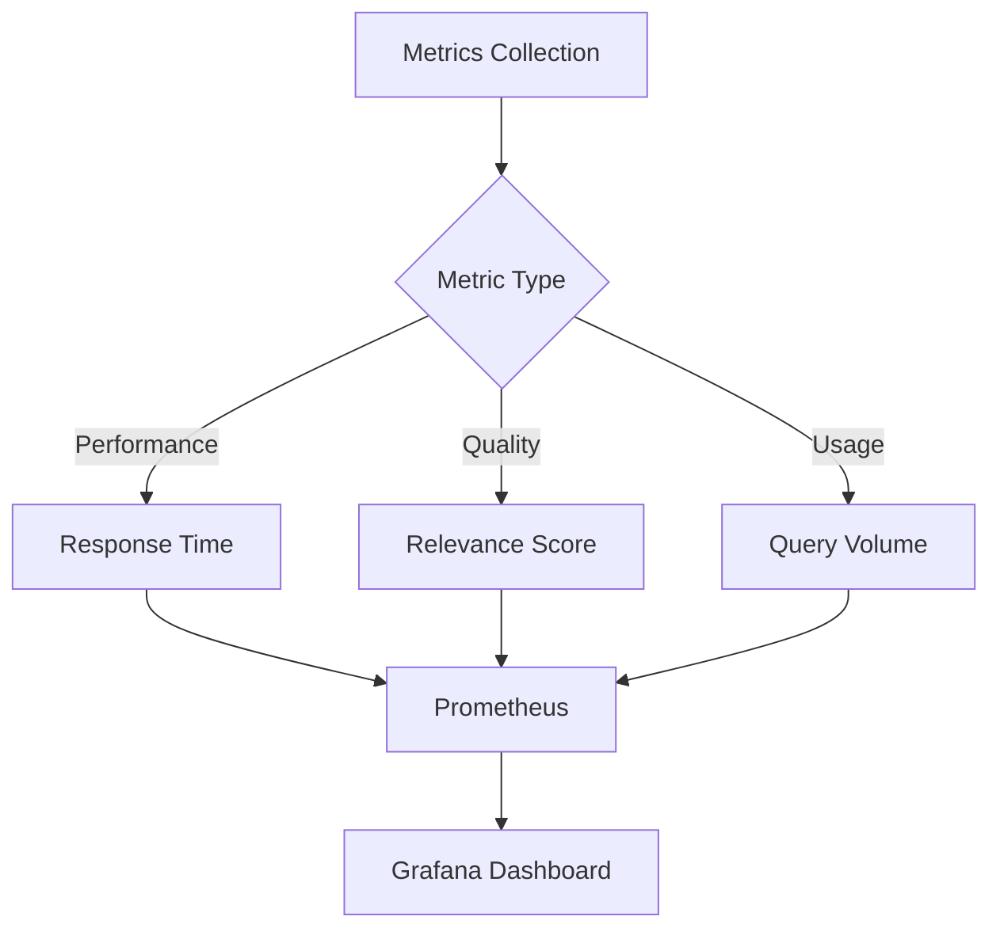
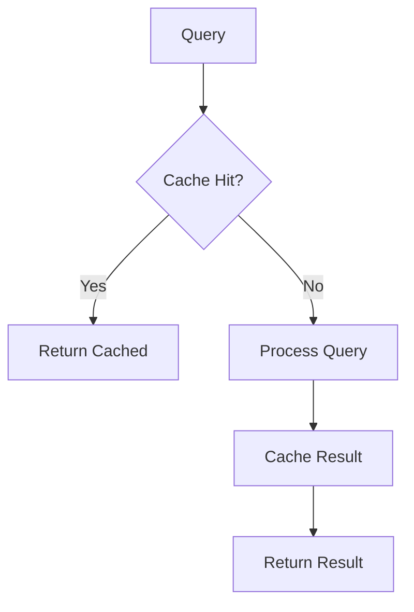
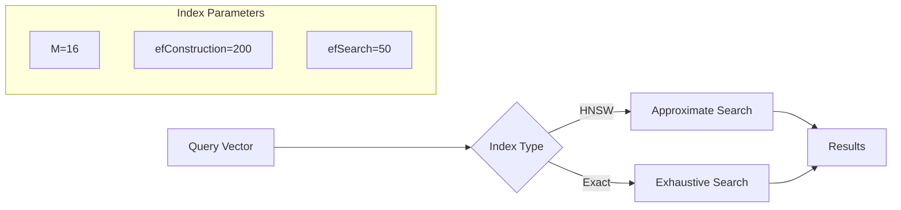

# RAG Chatbot Module Documentation

## 1. Tổng quan Module

RAG (Retrieval Augmented Generation) Chatbot là module tư vấn thông minh, kết hợp giữa tìm kiếm thông tin và sinh text để tạo ra câu trả lời chính xác và phù hợp với context.

### 1.1 Kiến trúc Module



## 2. Chi tiết Thành phần

### 2.1 RAG Engine Flow



### 2.2 Vector Search Process



### 2.3 Response Generation



## 3. Implementation Details

### 3.1 Embedding Model

```python
# Sử dụng SentenceTransformer cho embedding
from sentence_transformers import SentenceTransformer

class EmbeddingEngine:
    def __init__(self):
        self.model = SentenceTransformer('paraphrase-multilingual-MiniLM-L12-v2')
        
    def encode(self, text):
        # Tạo vector embedding cho văn bản
        return self.model.encode(text)
    
    def batch_encode(self, texts):
        # Xử lý nhiều văn bản cùng lúc
        return self.model.encode(texts, batch_size=32)
```

### 3.2 RAG Process

```python
class RAGEngine:
    def process_query(self, query, k=3):
        # 1. Tạo embedding cho query
        query_vector = self.embedding_engine.encode(query)
        
        # 2. Tìm kiếm context liên quan
        similar_docs = self.vector_db.search(
            query_vector,
            k=k
        )
        
        # 3. Tạo prompt với context
        prompt = self.construct_prompt(query, similar_docs)
        
        # 4. Gọi LLM để sinh response
        response = self.llm.generate(prompt)
        
        return response
```

### 3.3 Mô hình Dữ liệu



## 4. API Documentation

### 4.1 Endpoints

```mermaid
flowchart LR
    Gateway[API Gateway]
    Chat[/chat]
    Products[/products]
    Analytics[/analytics]
    RAG[RAG Service]
    PS[Product Service]
    AS[Analytics Service]

    Gateway --> Chat
    Gateway --> Products
    Gateway --> Analytics
    
    Chat --> RAG
    Products --> PS
    Analytics --> AS
```

### 4.2 API Schema

```yaml
# Chat Endpoint
POST /chat
Request:
{
    "query": string,
    "context": {
        "user_id": string,
        "conversation_id": string?,
        "products": string[]?
    }
}

Response:
{
    "response": string,
    "products": [
        {
            "id": string,
            "name": string,
            "description": string,
            "price": number,
            "relevance": number
        }
    ],
    "analytics": {
        "query_vector": number[],
        "response_time": number,
        "confidence": number
    }
}
```

## 5. Performance Monitoring

### 5.1 Metrics Collection



### 5.2 Alerting Rules

```yaml
# Alert Configuration
rules:
  - name: high_latency
    condition: response_time > 2s
    duration: 5m
    
  - name: low_relevance
    condition: avg_relevance_score < 0.7
    duration: 15m
    
  - name: high_error_rate
    condition: error_rate > 5%
    duration: 5m
```

## 6. Tối ưu hóa

### 6.1 Caching Strategy



### 6.2 Vector Search Optimization


