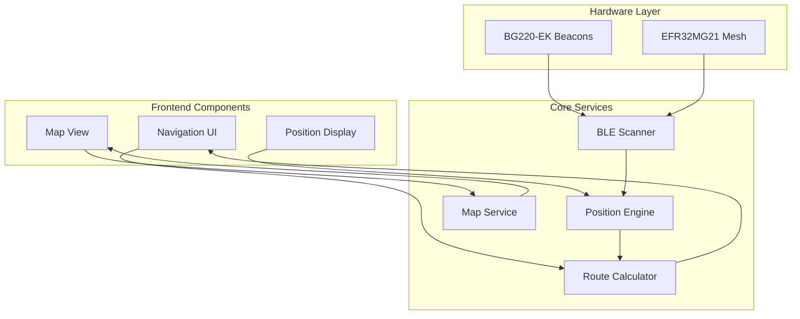
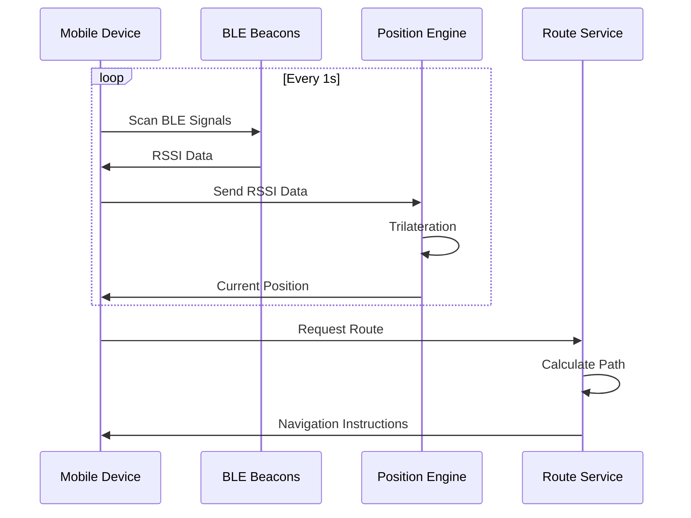
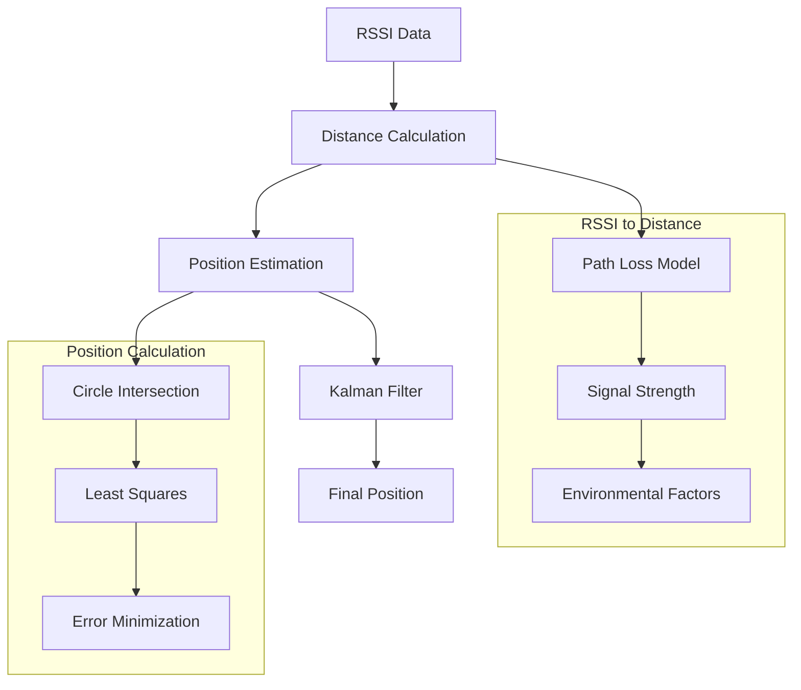
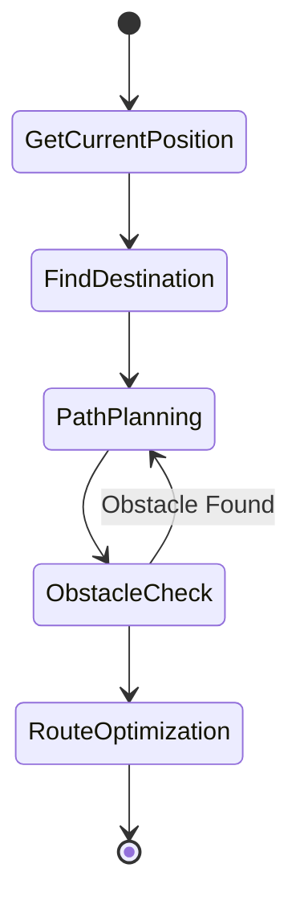
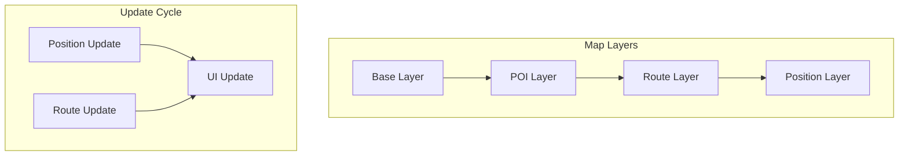
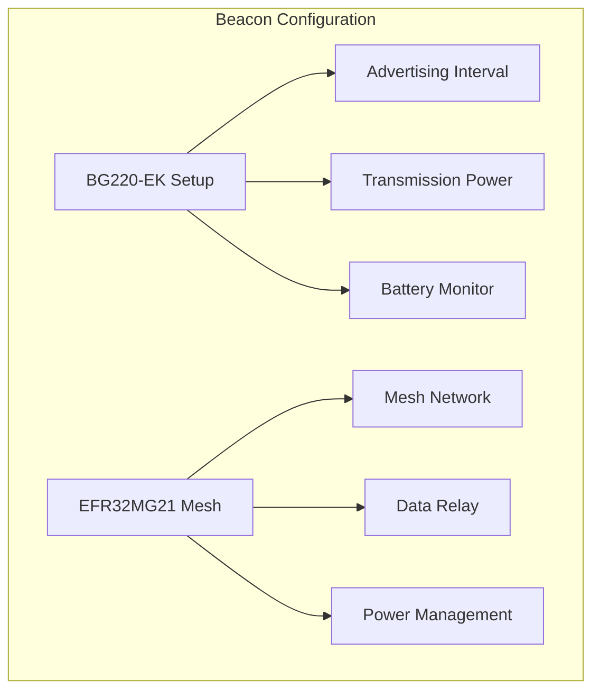
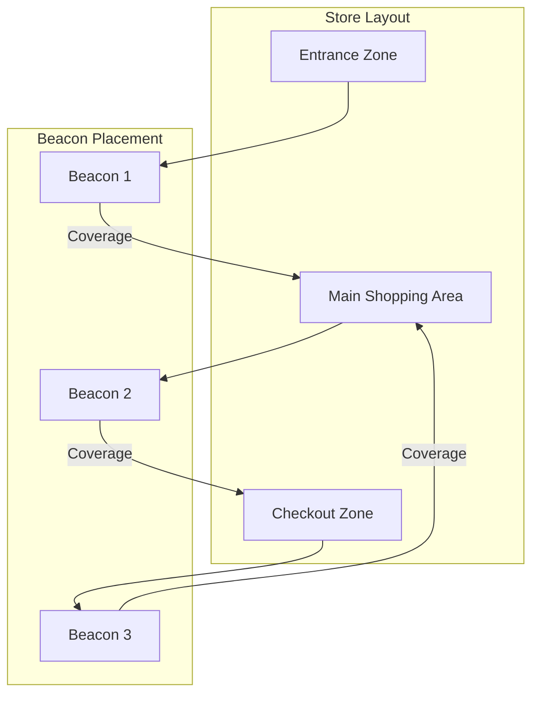
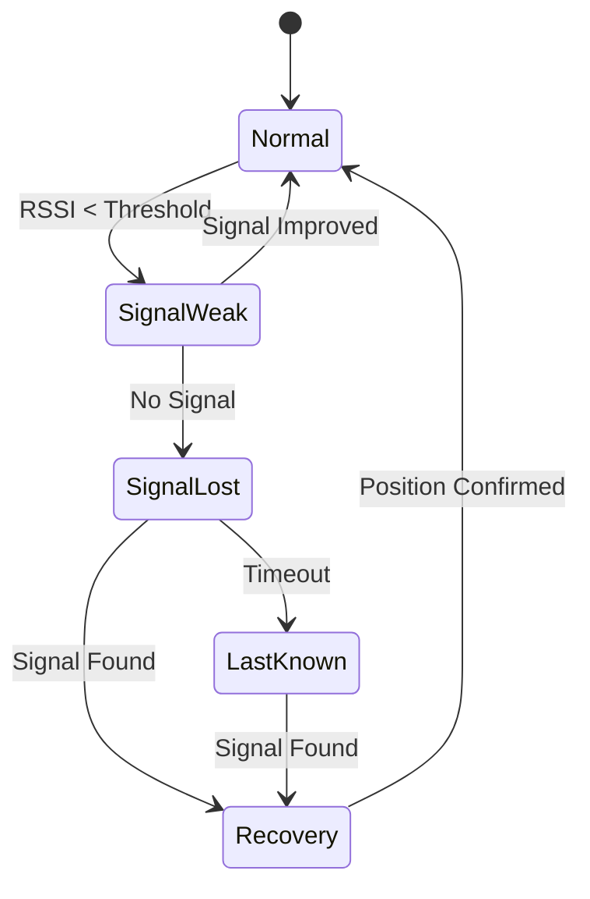
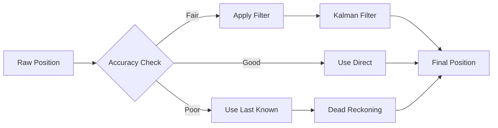
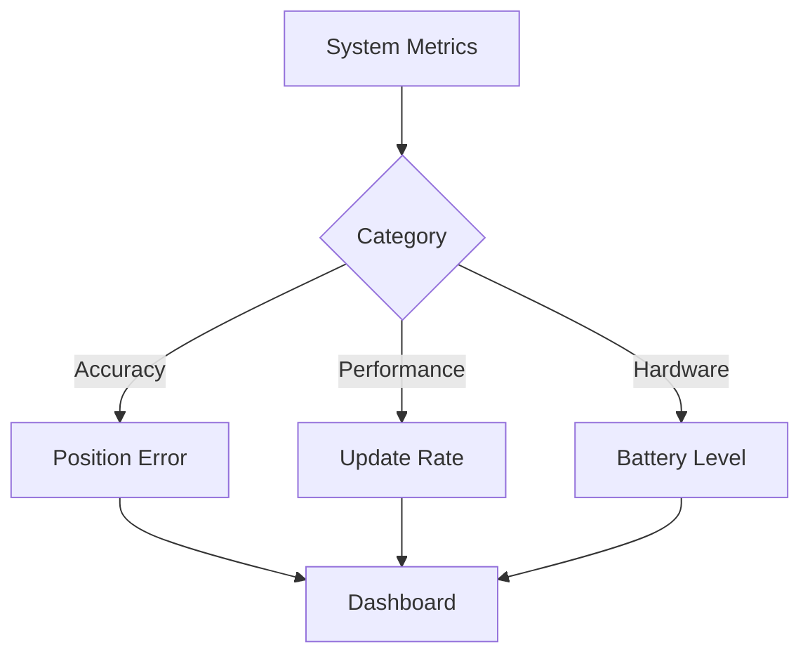

# Indoor Navigation Module Documentation

## 1. Tổng quan Module

Module Indoor Navigation cung cấp khả năng định vị và dẫn đường trong nhà dựa trên công nghệ BLE Beacon và thuật toán trilateration.

### 1.1 Kiến trúc Module

1. Hardware Layer
Lớp phần cứng gồm các thiết bị:

BG22O-EK Beacons

EFR32/MG21 Mesh

Cả hai thiết bị đều phát ra tín hiệu BLE được quét bởi BLE Scanner phía dưới.

2. Core Services
Lớp xử lý trung tâm, chịu trách nhiệm thu thập tín hiệu, xác định vị trí và tính toán lộ trình:

BLE Scanner: Thành phần thu thập RSSI (Received Signal Strength Indicator) từ các beacon hoặc thiết bị mesh. Đây là bước đầu để xác định vị trí.

Position Engine: Nhận dữ liệu từ BLE Scanner và tính toán vị trí của thiết bị di động bằng thuật toán trilateration hoặc fingerprinting. Đây là thành phần chính của định vị thời gian thực.

Route Calculator: Dựa trên vị trí hiện tại và điểm đến, Route Calculator tính toán lộ trình ngắn nhất, có thể sử dụng thuật toán như A*, Dijkstra. Kết quả lộ trình được gửi tới frontend.

Map Service: Quản lý dữ liệu bản đồ (kết cấu tòa nhà, lối đi, chướng ngại vật), cung cấp cho các thành phần khác như Position Engine và Frontend để hiển thị và điều hướng.

3. Frontend Components
Các thành phần giao diện hiển thị và tương tác với người dùng:

Map View: Hiển thị bản đồ không gian nội bộ, bao gồm vị trí hiện tại, các beacon, lộ trình.

Navigation UI: Cung cấp chỉ dẫn di chuyển theo thời gian thực dựa trên dữ liệu từ Position Engine và Route Calculator. Có thể bao gồm chỉ mũi tên, hướng rẽ, khoảng cách còn lại.

Position Display: Hiển thị vị trí hiện tại trên bản đồ cho người dùng, thường dưới dạng icon (ví dụ: chấm tròn hoặc avatar).

Luồng hoạt động
Beacon phát tín hiệu BLE liên tục.

BLE Scanner nhận tín hiệu này và chuyển về cho Position Engine.

Position Engine xử lý và xác định vị trí hiện tại.

Dữ liệu vị trí được truyền tới:

Route Calculator để tạo đường đi nếu cần

Map View và Position Display để vẽ lên UI

Map Service cung cấp dữ liệu bản đồ để phục vụ việc hiển thị và tính toán đường đi.

Navigation UI lấy lộ trình và cập nhật chỉ dẫn tương ứng.




## 2. Các Thành phần Chính

### 2.1 BLE Positioning System

Sơ đồ thể hiện luồng tương tác theo thời gian thực giữa 4 thành phần chính:

Mobile Device: thiết bị đầu cuối của người dùng (smartphone, máy tính bảng).

BLE Beacons: các thiết bị phần cứng cố định phát tín hiệu BLE định kỳ.

Position Engine: hệ thống xử lý định vị dựa trên tín hiệu nhận được.

Route Service: dịch vụ xử lý tính toán chỉ đường từ vị trí hiện tại đến đích.

Chi tiết các bước xử lý
1. Chu kỳ lặp liên tục (Loop – mỗi 1s)
Thiết bị di động thực hiện vòng lặp mỗi 1 giây để cập nhật vị trí.

Mục đích: đảm bảo định vị thời gian thực và cập nhật liên tục hướng dẫn di chuyển.

2. Scan BLE Signals
Thiết bị di động bắt đầu quét tín hiệu BLE từ các beacon lân cận.

Mỗi beacon phát sóng theo định kỳ (quảng bá tín hiệu ở tần suất xác định, thường là 100–1000ms).

Thiết bị thu về giá trị RSSI (Received Signal Strength Indicator) tương ứng với từng beacon.

3. Trả về RSSI Data
Các giá trị RSSI này được gắn với địa chỉ MAC của từng beacon.

RSSI phản ánh cường độ tín hiệu, gián tiếp biểu thị khoảng cách từ thiết bị đến từng beacon.

Thiết bị gửi RSSI Data này cho Position Engine để xử lý định vị.

4. Trilateration (Tính toán vị trí)
Position Engine thực hiện thuật toán trilateration (tam định vị):

Dựa trên khoảng cách ước lượng từ thiết bị đến tối thiểu 3 beacon.

Cắt giao nhau giữa 3 vòng tròn để xác định vị trí chính xác trong mặt phẳng (2D).

Các yếu tố như nhiễu sóng, phản xạ đa đường (multipath) có thể được xử lý bằng bộ lọc Kalman hoặc mô hình hóa sai số.

5. Gửi Current Position
Vị trí hiện tại được gửi ngược lại về Mobile Device.

Dữ liệu này sẽ được frontend dùng để hiển thị lên bản đồ hoặc UI điều hướng.

Tìm đường (Routing)
6. Request Route
Sau khi biết vị trí hiện tại, thiết bị gửi yêu cầu dẫn đường đến dịch vụ định tuyến.

Thông tin bao gồm:

Vị trí hiện tại (tính được từ bước trên).

Vị trí đích (do người dùng chọn từ bản đồ).

7. Calculate Path
Route Service xử lý dữ liệu và tính toán đường đi tối ưu.

Thuật toán thường sử dụng: A* (tối ưu tốc độ và độ chính xác), hoặc Dijkstra nếu yêu cầu đầy đủ nhất.

Cấu trúc bản đồ trong nhà có thể là:

Graph (nút – đoạn nối).

Grid (dạng ma trận ô vuông).

Weighted Map (tính trọng số theo khoảng cách/thời gian).

8. Navigation Instructions
Kết quả là một tập hợp chỉ dẫn điều hướng (ví dụ: đi thẳng 10m, rẽ trái, v.v.).

Gửi lại về Mobile Device để hiển thị cho người dùng.

Tóm tắt cơ chế hoạt động
Toàn bộ hệ thống hoạt động như một vòng lặp:

Mobile Device liên tục quét tín hiệu BLE.

Gửi RSSI về Position Engine → định vị → trả lại vị trí.

Gửi yêu cầu tính đường đi → nhận chỉ dẫn → điều hướng người dùng.

Đặc điểm kỹ thuật:

Cập nhật nhanh (mỗi 1 giây).

Định vị chính xác theo phương pháp trilateration.

Đường đi được cá nhân hóa theo vị trí thời gian thực.



### 2.2 Trilateration Process

Sơ đồ mô tả quá trình định vị vị trí của thiết bị người dùng dựa trên tín hiệu BLE (Bluetooth Low Energy). Phương pháp sử dụng là Trilateration – tính toán vị trí dựa trên khoảng cách đến nhiều điểm cố định (các beacon).

1. RSSI Data – Dữ liệu tín hiệu nhận được
Thiết bị người dùng thu thập RSSI (cường độ tín hiệu) từ nhiều beacon xung quanh. Đây là đầu vào để tính khoảng cách từ thiết bị đến từng beacon. RSSI yếu hơn → thiết bị ở xa hơn.

2. Distance Calculation – Tính khoảng cách
Từ giá trị RSSI, ta sử dụng mô hình suy hao tín hiệu (Path Loss Model) để ước lượng khoảng cách từ thiết bị đến mỗi beacon.

Tuy nhiên, tín hiệu RSSI có thể bị ảnh hưởng bởi nhiều yếu tố như tường chắn, con người, môi trường → kết quả tính khoảng cách không hoàn toàn chính xác.

3. Position Estimation – Ước lượng vị trí
Sau khi tính được khoảng cách đến ít nhất 3 beacon, hệ thống bắt đầu ước lượng vị trí thiết bị bằng cách xác định giao điểm của các khoảng cách đó.

Có hai hướng xử lý:

4. Nhánh trái – Tính toán vị trí bằng hình học
a. Circle Intersection (Giao điểm vòng tròn)
Mỗi beacon tạo thành một vòng tròn với bán kính là khoảng cách đến thiết bị.

Vị trí của thiết bị nằm ở điểm giao nhau giữa các vòng tròn.

b. Least Squares (Phương pháp bình phương tối thiểu)
Trong thực tế, các vòng tròn thường không giao nhau tại một điểm chính xác do sai số.

Phương pháp này tìm điểm gần nhất sao cho tổng sai số là nhỏ nhất.

c. Error Minimization (Giảm sai số)
Tiếp tục tối ưu vị trí bằng cách giảm sai số giữa khoảng cách lý thuyết và thực tế.

Mục tiêu là tìm vị trí có độ lệch thấp nhất so với tất cả beacon.

5. Nhánh phải – Lọc dữ liệu bằng Kalman Filter
Sau khi có vị trí tạm thời, ta sử dụng Kalman Filter để:

Làm mượt tín hiệu.

Loại bỏ nhiễu từ RSSI.

Dự đoán vị trí kế tiếp dựa trên chuyển động trước đó.

Cho kết quả vị trí ổn định hơn và không bị dao động liên tục.

6. Final Position – Vị trí cuối cùng
Kết quả cuối cùng là vị trí chính xác nhất có thể của thiết bị người dùng, sau khi:

Tính toán khoảng cách từ RSSI.

Xử lý định vị bằng hình học và lọc tín hiệu.

Tối ưu và giảm sai số.



### 2.3 Route Calculation



## 3. Implementation Details

### 3.1 Position Engine

```python
class PositionEngine:
    def __init__(self):
        self.kalman_filter = KalmanFilter()
        self.beacons = self.load_beacon_positions()
    
    def calculate_position(self, rssi_data):
        # Convert RSSI to distances
        distances = [
            rssi_to_distance(rssi) 
            for rssi in rssi_data
        ]
        
        # Trilateration calculation
        position = self.trilaterate(distances)
        
        # Apply Kalman filter for smoothing
        filtered_position = self.kalman_filter.update(position)
        
        return filtered_position
```

### 3.2 Route Calculator

```python
class RouteCalculator:
    def calculate_route(self, start, end, obstacles):
        # A* pathfinding implementation
        open_set = {start}
        came_from = {}
        
        g_score = {start: 0}
        f_score = {start: self.heuristic(start, end)}
        
        while open_set:
            current = min(open_set, key=lambda x: f_score[x])
            
            if current == end:
                return self.reconstruct_path(came_from, current)
            
            # Process neighbors
            for neighbor in self.get_neighbors(current):
                if self.is_valid_move(current, neighbor, obstacles):
                    tentative_g_score = g_score[current] + 1
                    
                    if tentative_g_score < g_score.get(neighbor, float('inf')):
                        came_from[neighbor] = current
                        g_score[neighbor] = tentative_g_score
                        f_score[neighbor] = g_score[neighbor] + self.heuristic(neighbor, end)
                        open_set.add(neighbor)
        
        return None
```

### 3.3 Map Rendering



## 4. Hardware Configuration

### 4.1 BLE Beacon Setup



### 4.2 Coverage Optimization



## 5. Error Handling

### 5.1 Signal Loss Recovery



### 5.2 Position Accuracy



## 6. Performance Monitoring

### 6.1 Metrics



### 6.2 Alert System

```yaml
# Alert Configuration
alerts:
  position_accuracy:
    threshold: 2.0  # meters
    window: 60s
    
  signal_strength:
    min_rssi: -85
    max_missing: 3
    
  battery_level:
    warning: 20%
    critical: 10%
```

## 7. API Documentation

### 7.1 Position Service API

```yaml
# Position API
GET /api/position
Response:
{
    "x": number,
    "y": number,
    "accuracy": number,
    "timestamp": string
}

# Route API
POST /api/route
Request:
{
    "start": {
        "x": number,
        "y": number
    },
    "end": {
        "x": number,
        "y": number
    }
}
Response:
{
    "route": [
        {
            "x": number,
            "y": number,
            "instruction": string
        }
    ],
    "distance": number,
    "estimated_time": number
}
```

### 7.2 WebSocket Events

```yaml
# Real-time Updates
position_update:
    type: "position"
    data: {
        "x": number,
        "y": number,
        "accuracy": number
    }

route_update:
    type: "route"
    data: {
        "current_segment": number,
        "next_instruction": string,
        "distance_remaining": number
    }
```
