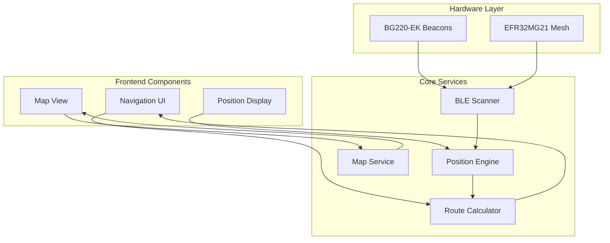
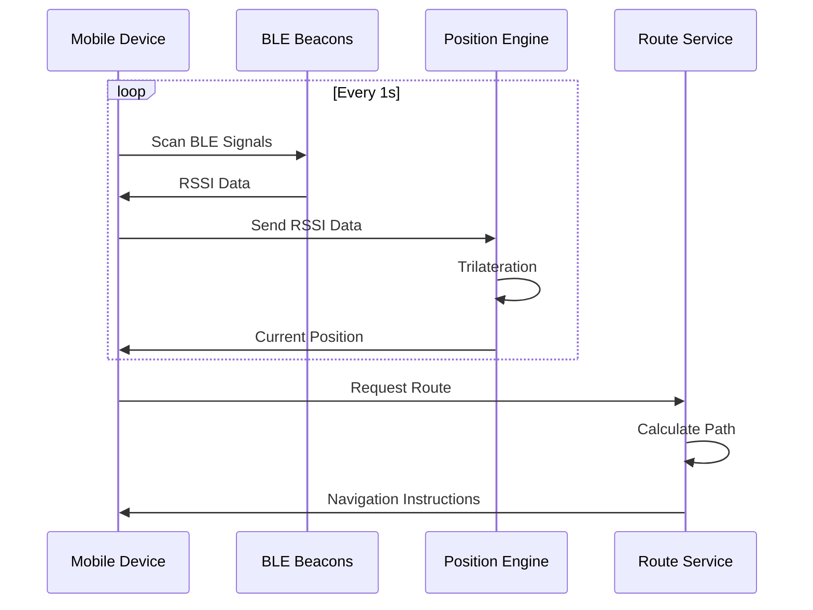
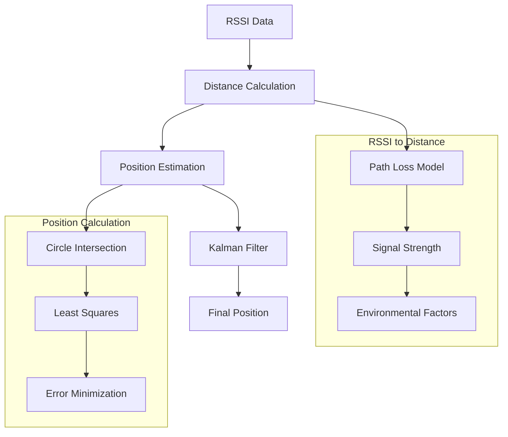
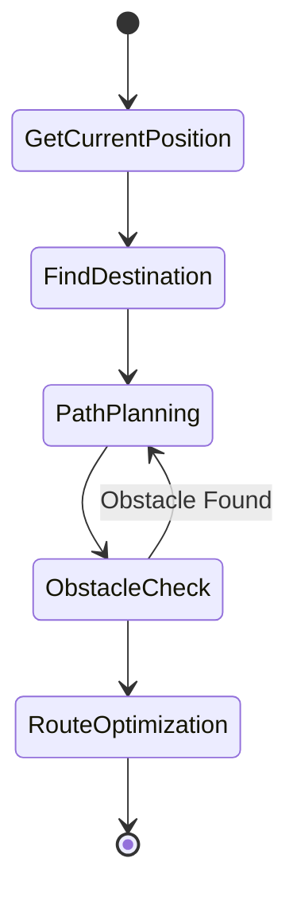
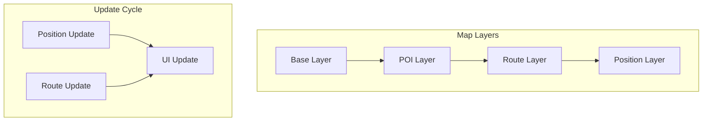
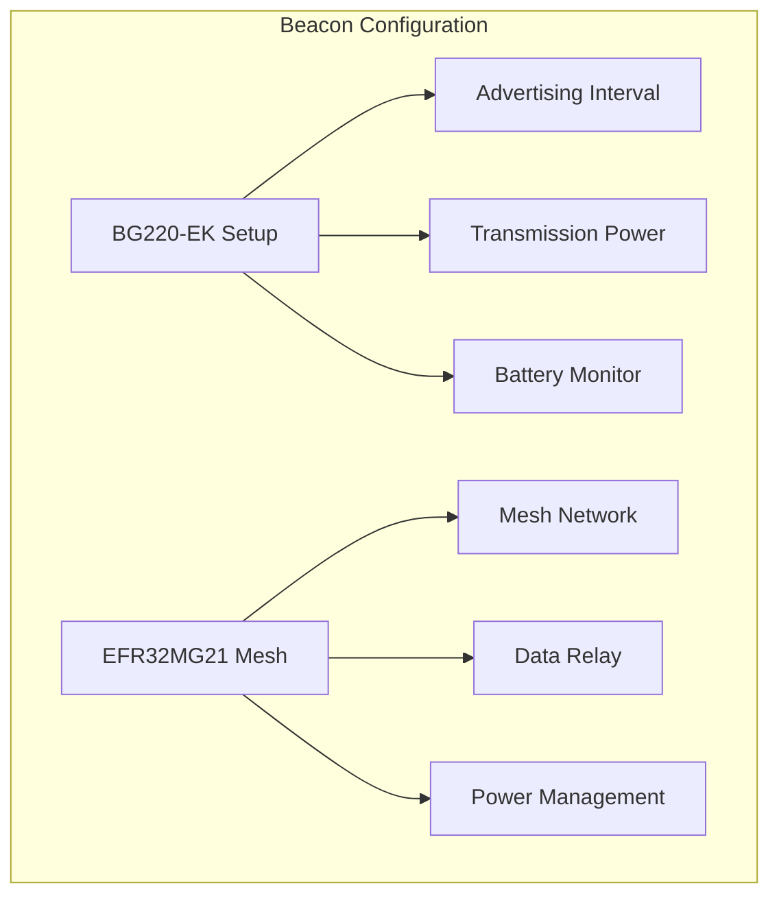
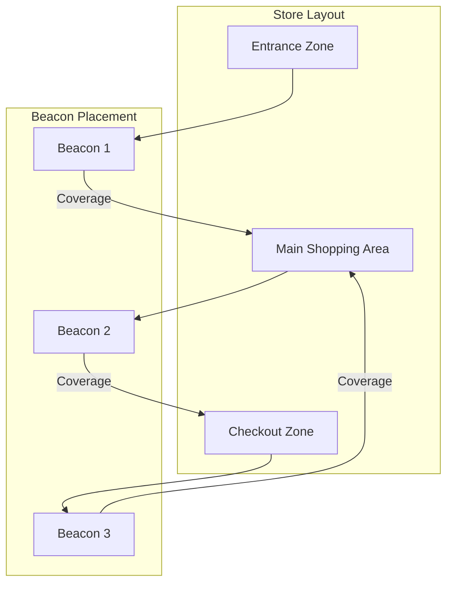
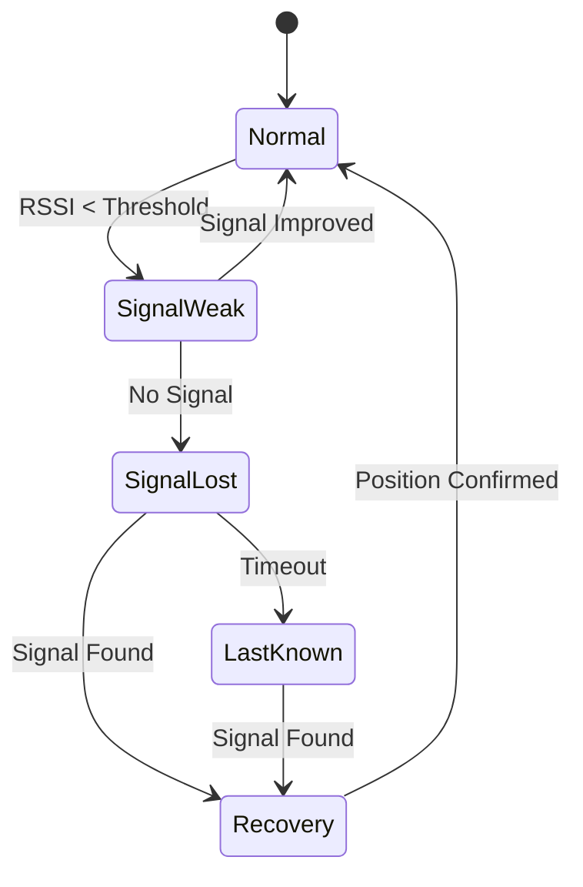
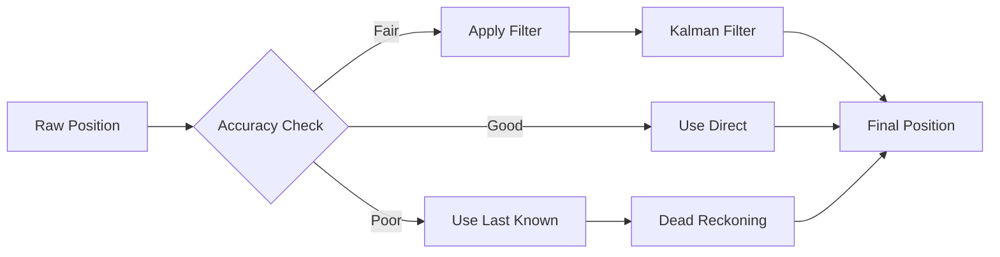
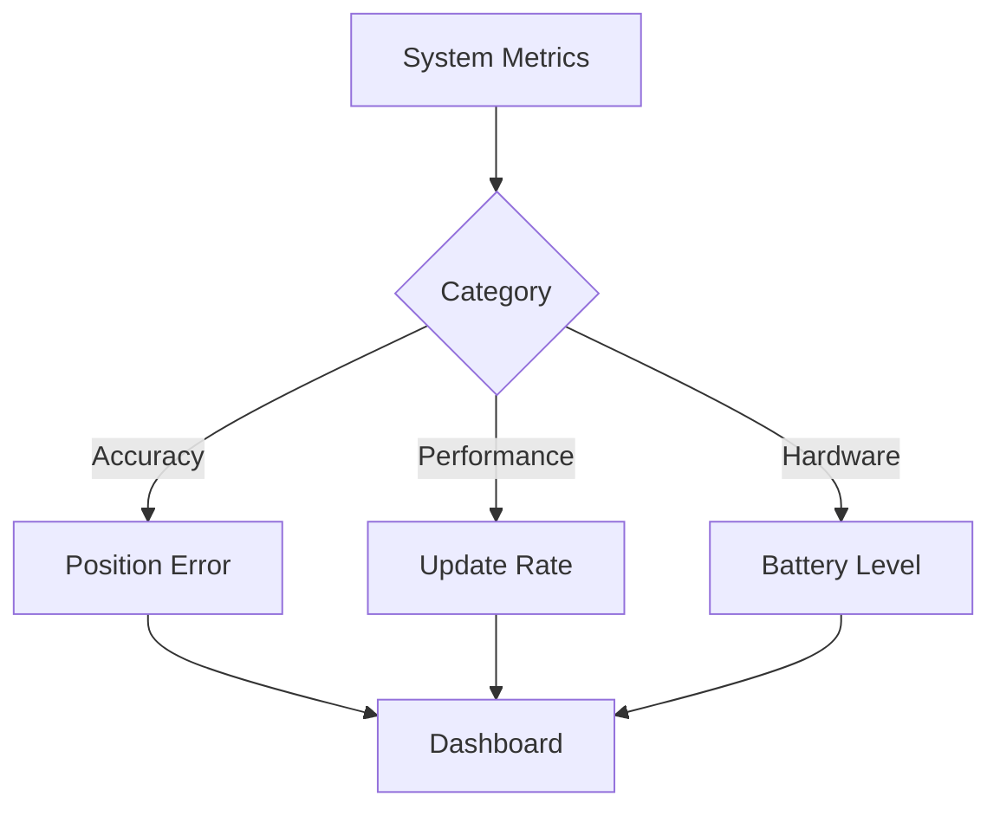

# Indoor Navigation Module Documentation

## 1. Tổng quan Module

Module Indoor Navigation cung cấp khả năng định vị và dẫn đường trong nhà dựa trên công nghệ BLE Beacon và thuật toán trilateration.

### 1.1 Kiến trúc Module



## 2. Các Thành phần Chính

### 2.1 BLE Positioning System



### 2.2 Trilateration Process



### 2.3 Route Calculation



## 3. Implementation Details

### 3.1 Position Engine

```python
class PositionEngine:
    def __init__(self):
        self.kalman_filter = KalmanFilter()
        self.beacons = self.load_beacon_positions()
    
    def calculate_position(self, rssi_data):
        # Convert RSSI to distances
        distances = [
            rssi_to_distance(rssi) 
            for rssi in rssi_data
        ]
        
        # Trilateration calculation
        position = self.trilaterate(distances)
        
        # Apply Kalman filter for smoothing
        filtered_position = self.kalman_filter.update(position)
        
        return filtered_position
```

### 3.2 Route Calculator

```python
class RouteCalculator:
    def calculate_route(self, start, end, obstacles):
        # A* pathfinding implementation
        open_set = {start}
        came_from = {}
        
        g_score = {start: 0}
        f_score = {start: self.heuristic(start, end)}
        
        while open_set:
            current = min(open_set, key=lambda x: f_score[x])
            
            if current == end:
                return self.reconstruct_path(came_from, current)
            
            # Process neighbors
            for neighbor in self.get_neighbors(current):
                if self.is_valid_move(current, neighbor, obstacles):
                    tentative_g_score = g_score[current] + 1
                    
                    if tentative_g_score < g_score.get(neighbor, float('inf')):
                        came_from[neighbor] = current
                        g_score[neighbor] = tentative_g_score
                        f_score[neighbor] = g_score[neighbor] + self.heuristic(neighbor, end)
                        open_set.add(neighbor)
        
        return None
```

### 3.3 Map Rendering



## 4. Hardware Configuration

### 4.1 BLE Beacon Setup



### 4.2 Coverage Optimization



## 5. Error Handling

### 5.1 Signal Loss Recovery



### 5.2 Position Accuracy



## 6. Performance Monitoring

### 6.1 Metrics



### 6.2 Alert System

```yaml
# Alert Configuration
alerts:
  position_accuracy:
    threshold: 2.0  # meters
    window: 60s
    
  signal_strength:
    min_rssi: -85
    max_missing: 3
    
  battery_level:
    warning: 20%
    critical: 10%
```

## 7. API Documentation

### 7.1 Position Service API

```yaml
# Position API
GET /api/position
Response:
{
    "x": number,
    "y": number,
    "accuracy": number,
    "timestamp": string
}

# Route API
POST /api/route
Request:
{
    "start": {
        "x": number,
        "y": number
    },
    "end": {
        "x": number,
        "y": number
    }
}
Response:
{
    "route": [
        {
            "x": number,
            "y": number,
            "instruction": string
        }
    ],
    "distance": number,
    "estimated_time": number
}
```

### 7.2 WebSocket Events

```yaml
# Real-time Updates
position_update:
    type: "position"
    data: {
        "x": number,
        "y": number,
        "accuracy": number
    }

route_update:
    type: "route"
    data: {
        "current_segment": number,
        "next_instruction": string,
        "distance_remaining": number
    }
```
