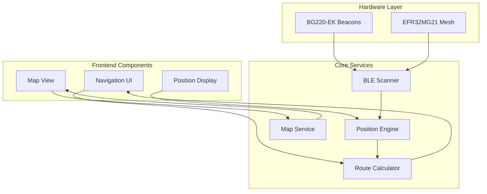
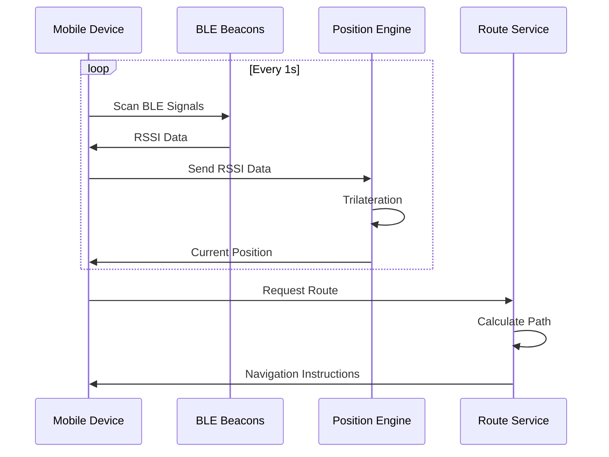
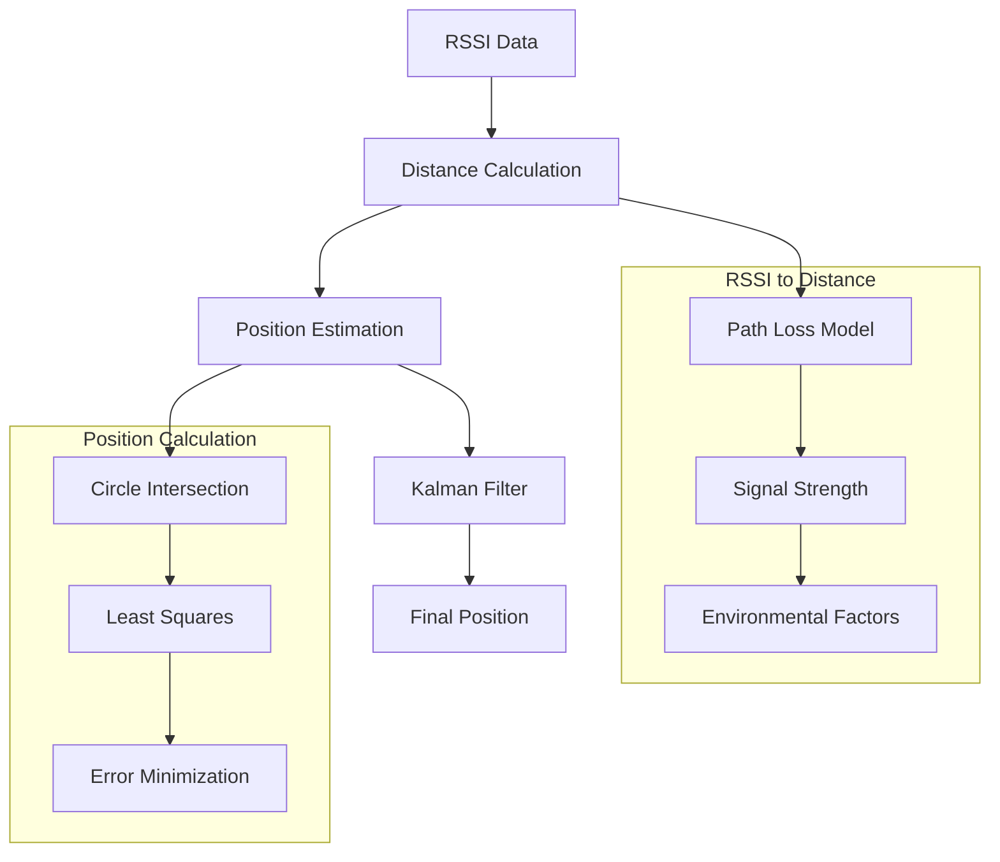
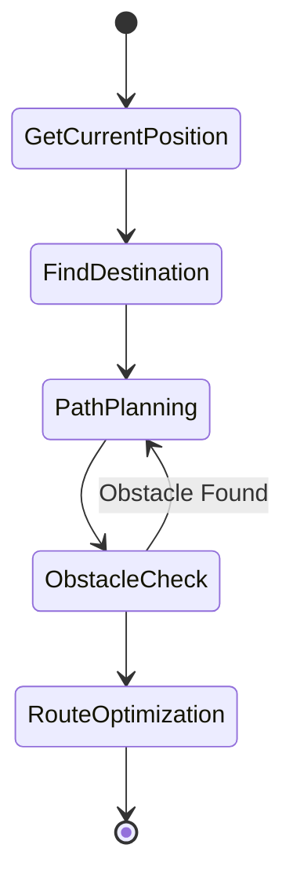
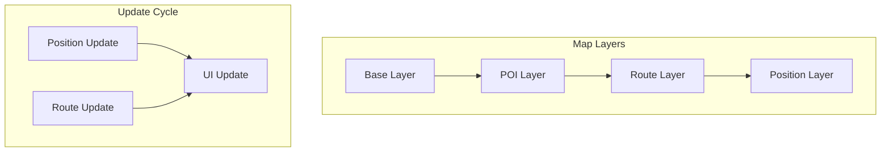
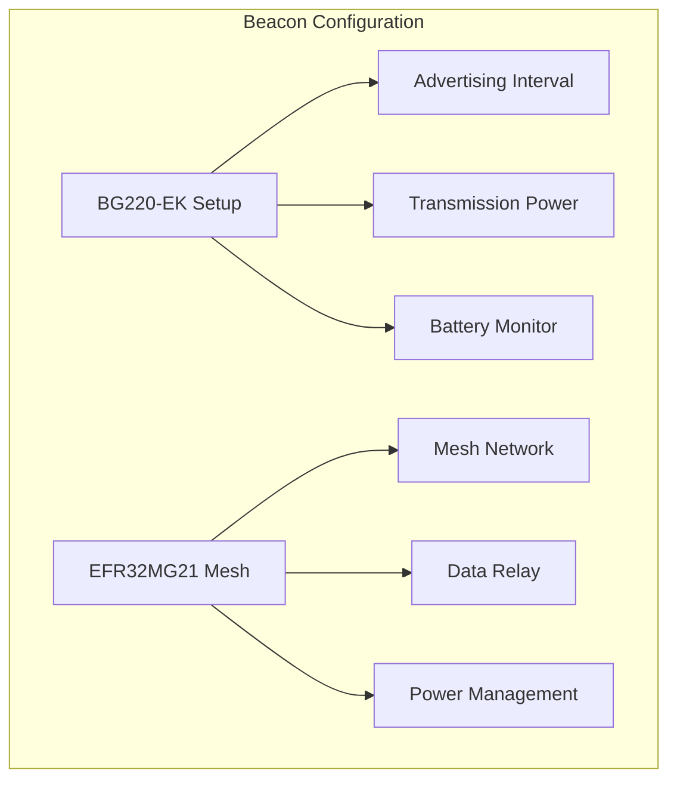
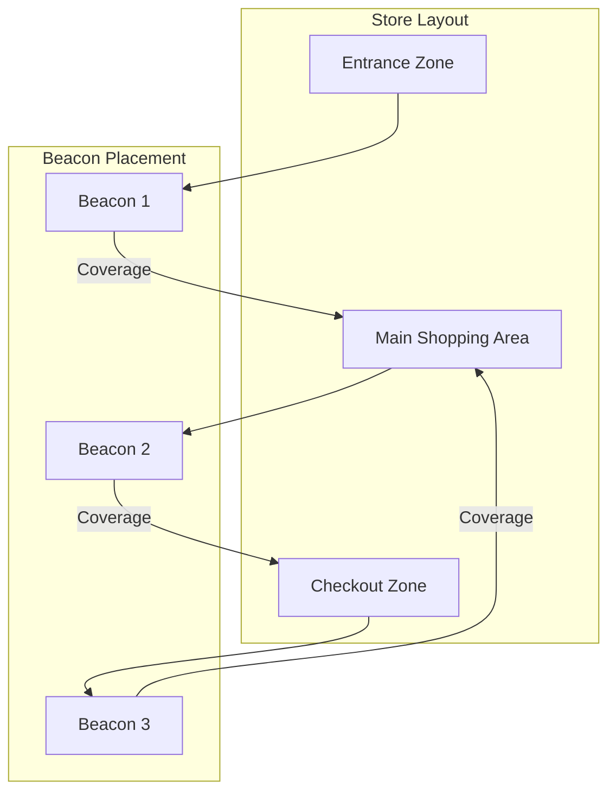
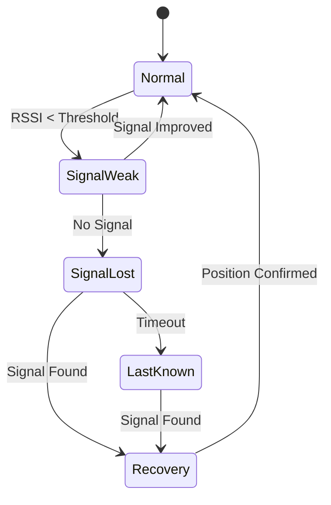
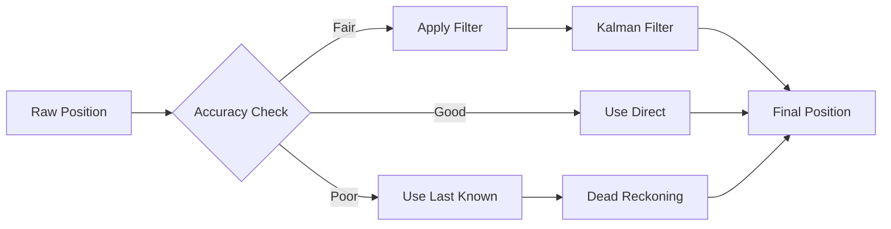
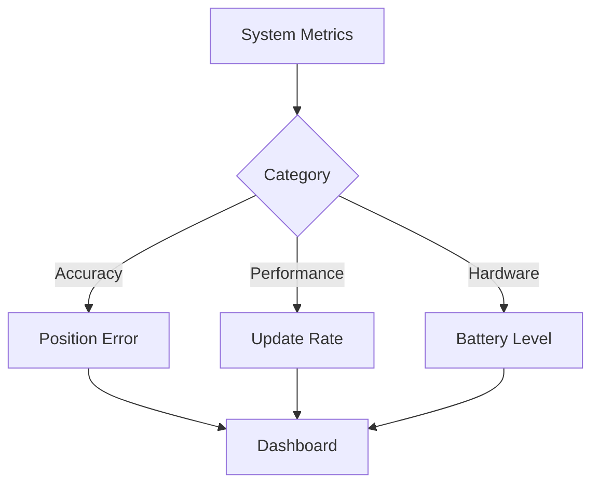

# Indoor Navigation Module Documentation

## 1. Tổng quan Module

Module Indoor Navigation cung cấp khả năng định vị và dẫn đường trong nhà dựa trên công nghệ BLE Beacon và thuật toán trilateration.

### 1.1 Kiến trúc Module

1. Hardware Layer
Lớp phần cứng gồm các thiết bị:

BG22O-EK Beacons

EFR32/MG21 Mesh

Cả hai thiết bị đều phát ra tín hiệu BLE được quét bởi BLE Scanner phía dưới.

2. Core Services
Lớp xử lý trung tâm, chịu trách nhiệm thu thập tín hiệu, xác định vị trí và tính toán lộ trình:

BLE Scanner: Thành phần thu thập RSSI (Received Signal Strength Indicator) từ các beacon hoặc thiết bị mesh. Đây là bước đầu để xác định vị trí.

Position Engine: Nhận dữ liệu từ BLE Scanner và tính toán vị trí của thiết bị di động bằng thuật toán trilateration hoặc fingerprinting. Đây là thành phần chính của định vị thời gian thực.

Route Calculator: Dựa trên vị trí hiện tại và điểm đến, Route Calculator tính toán lộ trình ngắn nhất, có thể sử dụng thuật toán như A*, Dijkstra. Kết quả lộ trình được gửi tới frontend.

Map Service: Quản lý dữ liệu bản đồ (kết cấu tòa nhà, lối đi, chướng ngại vật), cung cấp cho các thành phần khác như Position Engine và Frontend để hiển thị và điều hướng.

3. Frontend Components
Các thành phần giao diện hiển thị và tương tác với người dùng:

Map View: Hiển thị bản đồ không gian nội bộ, bao gồm vị trí hiện tại, các beacon, lộ trình.

Navigation UI: Cung cấp chỉ dẫn di chuyển theo thời gian thực dựa trên dữ liệu từ Position Engine và Route Calculator. Có thể bao gồm chỉ mũi tên, hướng rẽ, khoảng cách còn lại.

Position Display: Hiển thị vị trí hiện tại trên bản đồ cho người dùng, thường dưới dạng icon (ví dụ: chấm tròn hoặc avatar).

Luồng hoạt động
Beacon phát tín hiệu BLE liên tục.

BLE Scanner nhận tín hiệu này và chuyển về cho Position Engine.

Position Engine xử lý và xác định vị trí hiện tại.

Dữ liệu vị trí được truyền tới:

Route Calculator để tạo đường đi nếu cần

Map View và Position Display để vẽ lên UI

Map Service cung cấp dữ liệu bản đồ để phục vụ việc hiển thị và tính toán đường đi.

Navigation UI lấy lộ trình và cập nhật chỉ dẫn tương ứng.




## 2. Các Thành phần Chính

### 2.1 BLE Positioning System

Sơ đồ thể hiện luồng tương tác theo thời gian thực giữa 4 thành phần chính:

Mobile Device: thiết bị đầu cuối của người dùng (smartphone, máy tính bảng).

BLE Beacons: các thiết bị phần cứng cố định phát tín hiệu BLE định kỳ.

Position Engine: hệ thống xử lý định vị dựa trên tín hiệu nhận được.

Route Service: dịch vụ xử lý tính toán chỉ đường từ vị trí hiện tại đến đích.

Chi tiết các bước xử lý
1. Chu kỳ lặp liên tục (Loop – mỗi 1s)
Thiết bị di động thực hiện vòng lặp mỗi 1 giây để cập nhật vị trí.

Mục đích: đảm bảo định vị thời gian thực và cập nhật liên tục hướng dẫn di chuyển.

2. Scan BLE Signals
Thiết bị di động bắt đầu quét tín hiệu BLE từ các beacon lân cận.

Mỗi beacon phát sóng theo định kỳ (quảng bá tín hiệu ở tần suất xác định, thường là 100–1000ms).

Thiết bị thu về giá trị RSSI (Received Signal Strength Indicator) tương ứng với từng beacon.

3. Trả về RSSI Data
Các giá trị RSSI này được gắn với địa chỉ MAC của từng beacon.

RSSI phản ánh cường độ tín hiệu, gián tiếp biểu thị khoảng cách từ thiết bị đến từng beacon.

Thiết bị gửi RSSI Data này cho Position Engine để xử lý định vị.

4. Trilateration (Tính toán vị trí)
Position Engine thực hiện thuật toán trilateration (tam định vị):

Dựa trên khoảng cách ước lượng từ thiết bị đến tối thiểu 3 beacon.

Cắt giao nhau giữa 3 vòng tròn để xác định vị trí chính xác trong mặt phẳng (2D).

Các yếu tố như nhiễu sóng, phản xạ đa đường (multipath) có thể được xử lý bằng bộ lọc Kalman hoặc mô hình hóa sai số.

5. Gửi Current Position
Vị trí hiện tại được gửi ngược lại về Mobile Device.

Dữ liệu này sẽ được frontend dùng để hiển thị lên bản đồ hoặc UI điều hướng.

Tìm đường (Routing)
6. Request Route
Sau khi biết vị trí hiện tại, thiết bị gửi yêu cầu dẫn đường đến dịch vụ định tuyến.

Thông tin bao gồm:

Vị trí hiện tại (tính được từ bước trên).

Vị trí đích (do người dùng chọn từ bản đồ).

7. Calculate Path
Route Service xử lý dữ liệu và tính toán đường đi tối ưu.

Thuật toán thường sử dụng: A* (tối ưu tốc độ và độ chính xác), hoặc Dijkstra nếu yêu cầu đầy đủ nhất.

Cấu trúc bản đồ trong nhà có thể là:

Graph (nút – đoạn nối).

Grid (dạng ma trận ô vuông).

Weighted Map (tính trọng số theo khoảng cách/thời gian).

8. Navigation Instructions
Kết quả là một tập hợp chỉ dẫn điều hướng (ví dụ: đi thẳng 10m, rẽ trái, v.v.).

Gửi lại về Mobile Device để hiển thị cho người dùng.

Tóm tắt cơ chế hoạt động
Toàn bộ hệ thống hoạt động như một vòng lặp:

Mobile Device liên tục quét tín hiệu BLE.

Gửi RSSI về Position Engine → định vị → trả lại vị trí.

Gửi yêu cầu tính đường đi → nhận chỉ dẫn → điều hướng người dùng.

Đặc điểm kỹ thuật:

Cập nhật nhanh (mỗi 1 giây).

Định vị chính xác theo phương pháp trilateration.

Đường đi được cá nhân hóa theo vị trí thời gian thực.



### 2.2 Trilateration Process

Sơ đồ mô tả quá trình định vị vị trí của thiết bị người dùng dựa trên tín hiệu BLE (Bluetooth Low Energy). Phương pháp sử dụng là Trilateration – tính toán vị trí dựa trên khoảng cách đến nhiều điểm cố định (các beacon).

1. RSSI Data – Dữ liệu tín hiệu nhận được

Thiết bị người dùng thu thập RSSI (cường độ tín hiệu) từ nhiều beacon xung quanh. Đây là đầu vào để tính khoảng cách từ thiết bị đến từng beacon. RSSI yếu hơn → thiết bị ở xa hơn.

3. Distance Calculation – Tính khoảng cách
4. 
Từ giá trị RSSI, ta sử dụng mô hình suy hao tín hiệu (Path Loss Model) để ước lượng khoảng cách từ thiết bị đến mỗi beacon.

Tuy nhiên, tín hiệu RSSI có thể bị ảnh hưởng bởi nhiều yếu tố như tường chắn, con người, môi trường → kết quả tính khoảng cách không hoàn toàn chính xác.

3. Position Estimation – Ước lượng vị trí
   
Sau khi tính được khoảng cách đến ít nhất 3 beacon, hệ thống bắt đầu ước lượng vị trí thiết bị bằng cách xác định giao điểm của các khoảng cách đó.

Có hai hướng xử lý:

4. Nhánh trái – Tính toán vị trí bằng hình học

a. Circle Intersection

Mỗi beacon tạo thành một vòng tròn với bán kính là khoảng cách đến thiết bị.

Vị trí của thiết bị nằm ở điểm giao nhau giữa các vòng tròn.

b. Least Squares
Trong thực tế, các vòng tròn thường không giao nhau tại một điểm chính xác do sai số.

Phương pháp này tìm điểm gần nhất sao cho tổng sai số là nhỏ nhất.

c. Error Minimization
Tiếp tục tối ưu vị trí bằng cách giảm sai số giữa khoảng cách lý thuyết và thực tế.

Mục tiêu là tìm vị trí có độ lệch thấp nhất so với tất cả beacon.

5. Nhánh phải – Lọc dữ liệu bằng Kalman Filter
6. 
Sau khi có vị trí tạm thời, ta sử dụng Kalman Filter để:

Làm mượt tín hiệu.

Loại bỏ nhiễu từ RSSI.

Dự đoán vị trí kế tiếp dựa trên chuyển động trước đó.

Cho kết quả vị trí ổn định hơn và không bị dao động liên tục.

6. Final Position – Vị trí cuối cùng
   
Kết quả cuối cùng là vị trí chính xác nhất có thể của thiết bị người dùng, sau khi:

Tính toán khoảng cách từ RSSI.

Xử lý định vị bằng hình học và lọc tín hiệu.

Tối ưu và giảm sai số.



### 2.3 Route Calculation

1. Bắt đầu quy trình (Start Node)
   
Ký hiệu bằng dấu tròn trên cùng. Đây là điểm khởi đầu của quá trình tính toán lộ trình.

Từ đây, hệ thống bắt đầu lấy dữ liệu đầu vào và thực hiện từng bước logic tiếp theo.

2. GetCurrentPosition

Chức năng: Xác định vị trí hiện tại của người dùng (hoặc thiết bị).

Nguồn dữ liệu: Kết quả từ hệ thống định vị, chẳng hạn như hệ thống định vị dựa trên BLE (Bluetooth Low Energy).

Mục tiêu: Cung cấp toạ độ xuất phát để làm đầu vào cho thuật toán dẫn đường.

Kỹ thuật liên quan: trilateration (đã mô tả ở sơ đồ 2.2), Kalman Filter (lọc nhiễu).

3. FindDestination

Chức năng: Xác định vị trí đích mà người dùng muốn đi đến.

Nguồn: Có thể từ giao diện người dùng (UI) hoặc từ yêu cầu dịch vụ.

Xử lý: Tọa độ đích được ánh xạ từ tên hoặc ID điểm đến.

4. PathPlanning

Chức năng: Lập kế hoạch đường đi từ điểm hiện tại đến điểm đích.

Đầu vào: Vị trí hiện tại và vị trí đích.

Đầu ra: Một lộ trình ban đầu (initial path), chưa được kiểm tra vật cản.

Thuật toán phổ biến:

A* (A-star): Cân bằng giữa chi phí thực tế và ước lượng đến đích.

Dijkstra: Tìm đường đi ngắn nhất, nhưng có thể chậm hơn A*.

Graph-based routing: sử dụng bản đồ dạng đồ thị (graph with nodes and edges).

5. ObstacleCheck

Chức năng: Kiểm tra xem lộ trình ban đầu có vướng chướng ngại vật không.

Dữ liệu sử dụng:

Dữ liệu bản đồ (static obstacles).

Dữ liệu cảm biến thời gian thực (dynamic obstacles).

Dữ liệu từ camera, IoT, hoặc cơ sở dữ liệu trung tâm.

Kết quả:

Nếu không có vật cản: chuyển sang bước tối ưu.

Nếu có vật cản: kích hoạt nhánh "Obstacle Found" → quay lại bước PathPlanning để tính lại đường đi khác.

6. Obstacle Found (Nhánh điều kiện)

Ý nghĩa: Đây là điều kiện rẽ nhánh.

Khi phát hiện vật cản, đường đi không khả thi, hệ thống quay lại bước PathPlanning để lập kế hoạch mới → tạo vòng lặp cho đến khi tìm được đường khả thi.

7. RouteOptimization

Chức năng: Tối ưu hóa đường đi đã được xác minh không có vật cản.

Mục tiêu tối ưu:

Rút ngắn tổng khoảng cách di chuyển.

Giảm số lần rẽ (cải thiện trải nghiệm dẫn đường).

Tránh các khu vực tắc nghẽn hoặc khó tiếp cận.

Kỹ thuật có thể dùng:

Smoothing (làm mượt đường đi).

Heuristic reweighting.

Post-processing (lọc các điểm không cần thiết).

8. Kết thúc quy trình (End Node)

Được ký hiệu bằng hình tròn có viền kép ở dưới cùng.

Đánh dấu quy trình tính toán và tối ưu đường đi đã hoàn tất.

Hệ thống có thể bắt đầu hiển thị đường đi, hoặc chỉ dẫn dẫn đường cho người dùng (navigation instructions).



## 3. Implementation Details

### 3.1 Position Engine

```python
class PositionEngine:
    def __init__(self):
        self.kalman_filter = KalmanFilter()
        self.beacons = self.load_beacon_positions()
    
    def calculate_position(self, rssi_data):
        # Convert RSSI to distances
        distances = [
            rssi_to_distance(rssi) 
            for rssi in rssi_data
        ]
        
        # Trilateration calculation
        position = self.trilaterate(distances)
        
        # Apply Kalman filter for smoothing
        filtered_position = self.kalman_filter.update(position)
        
        return filtered_position
```

### 3.2 Route Calculator

```python
class RouteCalculator:
    def calculate_route(self, start, end, obstacles):
        # A* pathfinding implementation
        open_set = {start}
        came_from = {}
        
        g_score = {start: 0}
        f_score = {start: self.heuristic(start, end)}
        
        while open_set:
            current = min(open_set, key=lambda x: f_score[x])
            
            if current == end:
                return self.reconstruct_path(came_from, current)
            
            # Process neighbors
            for neighbor in self.get_neighbors(current):
                if self.is_valid_move(current, neighbor, obstacles):
                    tentative_g_score = g_score[current] + 1
                    
                    if tentative_g_score < g_score.get(neighbor, float('inf')):
                        came_from[neighbor] = current
                        g_score[neighbor] = tentative_g_score
                        f_score[neighbor] = g_score[neighbor] + self.heuristic(neighbor, end)
                        open_set.add(neighbor)
        
        return None
```

### 3.3 Map Rendering

1. Update Cycle
   
Position Update

Chức năng: Cập nhật thông tin vị trí hiện tại của người dùng hoặc thiết bị.

Nguồn dữ liệu: Vị trí được lấy từ hệ thống định vị, ví dụ: BLE trilateration, hoặc các cảm biến khác.

Tần suất cập nhật: Cập nhật vị trí theo chu kỳ hoặc khi có sự thay đổi lớn về vị trí (ví dụ: mỗi giây hoặc khi di chuyển qua một khoảng cách ngưỡng nhất định).

Vai trò: Đảm bảo rằng vị trí người dùng luôn được theo dõi và phản ánh đúng trên bản đồ.

Route Update

Chức năng: Cập nhật lộ trình từ vị trí hiện tại đến điểm đến sau khi có thay đổi (ví dụ: người dùng chọn điểm đến mới, hoặc có vật cản trên đường đi).

Nguồn dữ liệu: Thông tin từ Position Update và Destination Selection.

Vai trò: Cập nhật đường đi, đảm bảo đường dẫn trên bản đồ là chính xác và tối ưu.

UI Update

Chức năng: Cập nhật giao diện người dùng để phản ánh những thay đổi về vị trí và lộ trình.

Đầu vào: Nhận thông tin từ cả Position Update và Route Update.

Đầu ra: Dữ liệu cập nhật sẽ được gửi đến hệ thống hiển thị, yêu cầu làm mới các thành phần bản đồ, như di chuyển biểu tượng người dùng hoặc vẽ lại đường đi.

2. Map Layers
   
Hệ thống bản đồ được hiển thị theo nhiều lớp (layers), mỗi lớp đảm nhiệm một phần của bản đồ, giúp dễ dàng cập nhật và quản lý.

Base Layer

Chức năng: Hiển thị cấu trúc tĩnh của không gian như hành lang, tường, cửa, thang máy, cầu thang.

Đặc điểm: Đây là lớp nền của bản đồ và thường không thay đổi trong suốt quá trình sử dụng.

Vai trò: Cung cấp thông tin cơ bản về bản đồ, giúp người dùng có thể định vị các điểm và lối đi chính trong không gian.

POI Layer

Chức năng: Hiển thị các Point of Interest (POI) như phòng học, quầy lễ tân, nhà vệ sinh, cửa hàng, hoặc các điểm quan trọng khác.

Đặc điểm: Các POI có thể bao gồm tên, biểu tượng và mô tả ngắn, và người dùng có thể tương tác với các POI này (chọn làm điểm đến hoặc tham khảo).

Vai trò: Cung cấp thông tin chi tiết về các khu vực quan trọng, giúp người dùng dễ dàng nhận diện và di chuyển đến các điểm mong muốn.

Route Layer

Chức năng: Hiển thị đường đi từ vị trí hiện tại đến điểm đích.

Đặc điểm: Lộ trình được tính toán tự động bởi hệ thống, có thể thay đổi nếu có vật cản hoặc điều kiện môi trường thay đổi.

Vai trò: Cung cấp chỉ dẫn rõ ràng cho người dùng, bao gồm các mũi tên chỉ hướng, các đoạn đường và các chỉ dẫn cần thiết trong quá trình di chuyển.

Position Layer

Chức năng: Hiển thị vị trí hiện tại của người dùng.

Đặc điểm: Vị trí này sẽ được cập nhật liên tục thông qua hệ thống định vị. Thông thường, lớp này sẽ bao gồm một biểu tượng vị trí (ví dụ: hình tròn hoặc mũi tên) để người dùng dễ dàng nhận biết.

Vai trò: Đảm bảo rằng người dùng luôn thấy được chính xác vị trí của mình trên bản đồ, tạo cơ sở để tiếp tục dẫn đường.

3. Interaction Between Update Cycle and Map Layers
   
Update Cycle cung cấp dữ liệu cần thiết cho các lớp bản đồ thông qua các thông tin vị trí và lộ trình.

UI Update sẽ làm mới giao diện và yêu cầu hiển thị lại các lớp bản đồ tương ứng, đảm bảo bản đồ luôn đồng bộ với tình trạng thực tế.

Mỗi lớp bản đồ sẽ được cập nhật một cách độc lập:

Position Layer sẽ thay đổi khi có Position Update.

Route Layer sẽ thay đổi khi có Route Update.

Các lớp khác như POI Layer và Base Layer thường ít thay đổi trong quá trình sử dụng, trừ khi người dùng yêu cầu xem các POI mới hoặc thay đổi bố cục bản đồ.

Sơ đồ nó lên cách hệ thống bản đồ hoạt động trong môi trường dẫn đường. Các lớp bản đồ phân biệt rõ ràng giữa các yếu tố tĩnh và động, giúp người dùng dễ dàng tương tác với các thành phần bản đồ mà không làm ảnh hưởng đến các lớp khác. Quá trình cập nhật liên tục từ Position Update đến Route Update đảm bảo rằng bản đồ luôn phản ánh chính xác và kịp thời vị trí và đường đi của người dùng.



## 4. Hardware Configuration

### 4.1 BLE Beacon Setup

Tổng quan
   
BG220-EK Setup: tập trung vào cấu hình phần cứng beacon đơn lẻ.

EFR32MG21 Mesh: tập trung vào mở rộng khả năng truyền qua mạng mesh BLE.

2. BG220-EK

a. Advertising Interval

Vai trò: Là thời gian lặp lại giữa các gói quảng bá BLE.

Ảnh hưởng đến hệ thống:

Ngắn (ví dụ 100ms): tăng khả năng phát hiện nhanh từ smartphone hoặc gateway, nhưng tiêu thụ pin cao.

Dài (ví dụ 1000ms): tiết kiệm pin, nhưng khả năng được phát hiện giảm.

b. Transmission Power

Công suất phát tín hiệu BLE được điều chỉnh để:

Tối ưu vùng phủ sóng.

Giảm nhiễu cho các thiết bị lân cận.

Cân bằng với tuổi thọ pin.

Thường có các mức công suất như: -40 dBm đến +8 dBm.

Điều chỉnh động (dynamic power control) có thể được tích hợp để phù hợp với khoảng cách thực tế đến thiết bị thu.

c. Battery Monitor

Theo dõi điện áp hoặc % pin thông qua ADC hoặc mạch giám sát tích hợp.

Có thể gửi cảnh báo khi pin thấp.

Kết hợp với logic điều chỉnh:

Tự động giảm tần suất quảng bá khi pin yếu.

Chuyển sang chế độ tiết kiệm năng lượng (deep sleep).

3. EFR32MG21 Mesh (BLE Mesh Network)

EFR32MG21 là SoC hỗ trợ BLE mesh – cho phép các beacon hoạt động theo mạng lưới liên kết thay vì đơn lẻ.

a. Mesh Network

BLE Mesh mở rộng vùng phủ sóng bằng cách truyền thông qua các node trung gian (relay).

Ưu điểm chính:

Truyền dữ liệu xa hơn mà không cần tăng công suất từng beacon.

Cải thiện độ tin cậy nhờ khả năng định tuyến lại khi node bị mất.

Node trong mesh gồm:

Relay Node: chuyển tiếp gói tin.

Friend Node và Low Power Node (LPN): tối ưu tiêu thụ năng lượng.

b. Data Relay

Chức năng chuyển tiếp thông tin từ các node LPN hoặc thiết bị ngoại vi về gateway.

Tăng độ ổn định trong môi trường có vật cản (như tòa nhà).

Giảm yêu cầu phần cứng cho mỗi node (vì không cần truyền xa trực tiếp).

c. Power Management

Đây là trọng tâm của hệ thống mesh BLE, cho phép kéo dài thời gian sử dụng pin:

Low Power Mode: thiết bị ngủ phần lớn thời gian, chỉ thức dậy khi cần truyền.

Friend/LPN Relationship: LPN ngủ, friend node giữ dữ liệu cho đến khi LPN thức.

Adaptive Duty Cycling: tự điều chỉnh chu kỳ làm việc dựa theo mức pin hoặc lưu lượng truyền.

Có thể kết hợp thêm thuật toán tối ưu năng lượng cấp cao như energy-aware routing.




### 4.2 Coverage Optimization

1. Mục tiêu
Sơ đồ mô tả cách bố trí beacon BLE trong một cửa hàng nhằm:

Phủ sóng toàn bộ không gian cửa hàng.

Phục vụ các ứng dụng như theo dõi chuyển động, phân tích hành vi mua sắm, hoặc cung cấp tương tác theo vị trí thực.

Sơ đồ gồm hai khối chính:

Store Layout: Cấu trúc không gian thực tế.

Beacon Placement: Cách đặt beacon tương ứng với không gian đó.

Khu vực 1: Entrance Zone

Được bao phủ bởi: Beacon 1.

Chức năng:

Phát hiện khách vào cửa.

Kích hoạt kịch bản đầu hành trình: gửi thông báo chào mừng, mở ứng dụng, đếm lượt vào.

Khu vực 2: Main Shopping Area

Được bao phủ bởi: Beacon 1 và Beacon 3.

Chức năng:

Theo dõi chuyển động trong khu vực mua hàng chính.

Cho phép phân tích hành vi mua sắm: thời gian dừng, khu vực thu hút.

Có khả năng gửi nội dung quảng bá dựa trên vị trí.

Việc sử dụng hai beacon cho phép định vị tốt hơn và loại bỏ điểm mù.

Khu vực 3: Checkout Zone

Được bao phủ bởi: Beacon 2 và Beacon 3.

Chức năng:

Phát hiện khi khách hàng đến quầy thanh toán.

Kích hoạt quy trình kết thúc: xuất hóa đơn tự động, gửi khảo sát, thông báo khuyến mãi sau mua.

Có thể hỗ trợ thanh toán không tiếp xúc nếu tích hợp.

3. Vai trò cụ thể của từng beacon
   
Beacon 1

Phạm vi bao phủ: Entrance Zone và một phần Main Shopping Area.

Vai trò chính:

Khởi động hành trình của khách hàng.

Đóng vai trò điều hướng ban đầu.

Beacon 2

Phạm vi bao phủ: Checkout Zone.

Vai trò chính:

Ghi nhận điểm kết thúc hành trình mua sắm.

Kích hoạt các tương tác sau mua hàng.

Beacon 3

Phạm vi bao phủ: Main Shopping Area và Checkout Zone.

Vai trò chính:

Làm vùng chồng lắp để đảm bảo tín hiệu ổn định.

Cung cấp định vị chính xác hơn trong khu vực chính.

Nếu dùng BLE Mesh, Beacon 3 có thể làm node relay trung gian truyền dữ liệu giữa các beacon khác.



## 5. Error Handling

### 5.1 Signal Loss Recovery

I. Mục tiêu hệ thống

Cơ chế Signal Loss Recovery được thiết kế nhằm xử lý các tình huống tín hiệu không dây bị suy giảm hoặc mất hoàn toàn. Đây là một phần thiết yếu trong các hệ thống điều khiển thời gian thực.

II. Các trạng thái hoạt động

Hệ thống này dựa trên mô hình máy trạng thái với năm trạng thái chính.

Trạng thái đầu tiên là Normal. Đây là trạng thái hệ thống hoạt động ổn định, tín hiệu mạnh, và không có cảnh báo nào. Mọi tiến trình điều khiển hoặc nhiệm vụ (navigation, tracking, v.v.) đều được thực hiện bình thường.

Khi tín hiệu bắt đầu yếu đi, hệ thống chuyển sang trạng thái SignalWeak. Việc chuyển trạng thái này xảy ra khi chỉ số RSSI (Received Signal Strength Indicator) rơi xuống dưới một ngưỡng định sẵn. Mặc dù tín hiệu vẫn còn, hệ thống bắt đầu cảnh báo sớm và theo dõi sát cường độ tín hiệu theo thời gian thực. Trạng thái này là tiền đề để chuẩn bị cho phản ứng tiếp theo nếu tình hình xấu đi.

Nếu tín hiệu tiếp tục xấu và mất hoàn toàn (không còn gói dữ liệu nào nhận được), hệ thống chuyển sang trạng thái SignalLost. Tại đây, hệ thống sẽ tạm dừng các tác vụ yêu cầu kết nối, và kích hoạt các cơ chế đảm bảo an toàn như giữ nguyên vị trí, giữ hướng đi, hoặc dừng khẩn cấp – tùy theo thiết kế hệ thống.

Trong trường hợp tín hiệu không được phục hồi sau một khoảng thời gian chờ định trước (timeout), hệ thống sẽ bước vào trạng thái LastKnown. Ở trạng thái này, hệ thống sử dụng dữ liệu cuối cùng còn hợp lệ (vị trí, vận tốc, hướng) để tạm duy trì hoạt động. Điều này đặc biệt quan trọng trong các hệ thống đang di chuyển như UAV hoặc xe tự hành – nhằm tránh rơi tự do hoặc va chạm.

Khi tín hiệu được tìm thấy trở lại ở bất kỳ thời điểm nào trong SignalLost hoặc LastKnown, hệ thống chuyển sang trạng thái Recovery. Đây là giai đoạn phục hồi, nơi hệ thống đồng bộ lại dữ liệu, đánh giá tính toàn vẹn thông tin (position validity, velocity drift, error estimation), và thực hiện bất kỳ biện pháp hiệu chỉnh nào cần thiết.

Cuối cùng, khi quá trình phục hồi hoàn tất, hệ thống quay lại trạng thái Normal và tiếp tục hoạt động như bình thường.


Luồng điều khiển trong hệ thống diễn ra theo thứ tự sau:

Hệ thống bắt đầu trong trạng thái Normal và liên tục giám sát cường độ tín hiệu (RSSI).

Nếu RSSI giảm dưới ngưỡng kỹ thuật định nghĩa, hệ thống chuyển sang SignalWeak. Tại đây, vẫn duy trì nhiệm vụ chính nhưng bắt đầu giám sát chặt chẽ hơn.

Nếu tín hiệu phục hồi (RSSI tăng trở lại), hệ thống quay về Normal. Nếu tín hiệu bị mất hoàn toàn, hệ thống lập tức chuyển sang SignalLost.

Trong SignalLost, hệ thống có một khoảng thời gian để cố gắng khôi phục tín hiệu. Nếu tín hiệu được tìm lại và hệ thống xác định được vị trí chính xác, nó sẽ quay lại Normal ngay lập tức.

Nếu sau khoảng thời gian chờ mà không có tín hiệu, hệ thống chuyển sang LastKnown – sử dụng dữ liệu cuối cùng để duy trì trạng thái an toàn và tạm thời.

Bất cứ khi nào trong SignalLost hoặc LastKnown, nếu tín hiệu được tìm lại, hệ thống chuyển sang Recovery. Tại đây, dữ liệu mới được đánh giá, đồng bộ, kiểm tra lỗi, và sau đó đưa hệ thống trở lại trạng thái Normal.




### 5.2 Position Accuracy

Sơ đồ mô tả quy trình đánh giá độ chính xác của vị trí đầu vào và lựa chọn chiến lược xử lý phù hợp để đảm bảo đầu ra luôn là một vị trí đáng tin cậy.

1. Raw Position

Đây là dữ liệu vị trí ban đầu thu được từ hệ thống định vị như GPS, Lidar hoặc cảm biến quán tính. Dữ liệu này có thể có sai số tùy thuộc vào điều kiện môi trường như nhiễu tín hiệu, vật cản, hoặc mất kết nối.

3. Accuracy Check

Dữ liệu đầu vào được đưa qua một bước kiểm tra chất lượng. Tại đây, hệ thống đánh giá độ chính xác dựa trên các thông số kỹ thuật như:

Mức độ phân tán vị trí (ví dụ như HDOP, VDOP trong GPS).

Số lượng vệ tinh kết nối.

Độ trễ, mất gói hoặc dao động dữ liệu theo thời gian.

Kết quả được phân loại thành ba mức: Good, Fair hoặc Poor.

3. Nhánh xử lý theo độ chính xác
   
Trường hợp Good

Nếu dữ liệu đạt độ chính xác cao, hệ thống sử dụng trực tiếp vị trí đó làm kết quả cuối cùng mà không cần xử lý thêm. Trường hợp này thường xảy ra khi tín hiệu định vị mạnh, ổn định và sai số nằm trong giới hạn cho phép.

Trường hợp Fair

Nếu dữ liệu chỉ đạt mức trung bình, hệ thống sẽ xử lý bằng bộ lọc Kalman. Bộ lọc này hoạt động bằng cách kết hợp dữ liệu hiện tại với dữ liệu trước đó để loại bỏ nhiễu, giảm sai số và làm mượt quỹ đạo. Kết quả sau lọc sẽ được sử dụng làm đầu ra vị trí cuối cùng.

Trường hợp Poor

Nếu dữ liệu đầu vào có sai số lớn, thiếu tin cậy hoặc mất tín hiệu hoàn toàn, hệ thống sẽ loại bỏ nó. Thay vào đó, nó sẽ sử dụng vị trí cuối cùng còn tin cậy được lưu lại trước đó. Từ đó, hệ thống ước lượng vị trí mới bằng phương pháp dead reckoning, tức là tính toán dựa trên vận tốc, hướng di chuyển và thời gian đã trôi qua. Kết quả ước lượng được dùng làm vị trí cuối cùng.



## 6. Performance Monitoring

### 6.1 Metrics

1. Cấu trúc tổng quan

Diagram này biểu diễn cách phân loại System Metrics thành các nhóm con, sau đó được hiển thị trên Dashboard.

System Metrics là trọng tâm chính, được chia thành các nhóm thông qua một nút trung tâm là Category.

Từ Category, có ba nhánh chính được tạo ra: Accuracy, Performance, và Hardware.

Tất cả các nhánh này đều dẫn đến Dashboard, nơi các chỉ số được trình bày để theo dõi.

a. Accuracy

Nhánh này tập trung vào độ chính xác của hệ thống.

Chỉ số cụ thể được liệt kê là Position Error, biểu thị mức độ sai lệch giữa vị trí thực tế và vị trí dự đoán của hệ thống.


b. Performance

Nhánh này liên quan đến hiệu suất của hệ thống.

Chỉ số cụ thể là Update Rate, tức là tần suất mà hệ thống cập nhật dữ liệu hoặc trạng thái.


c. Hardware

Nhánh này tập trung vào trạng thái phần cứng của hệ thống.

Chỉ số cụ thể là Battery Level, thể hiện mức năng lượng còn lại trong pin của thiết bị.

5. Dashboard
   
Tất cả các chỉ số từ ba nhánh (Position Error, Update Rate, Battery Level) được tổng hợp và hiển thị trên Dashboard.




### 6.2 Alert System

```yaml
# Alert Configuration
alerts:
  position_accuracy:
    threshold: 2.0  # meters
    window: 60s
    
  signal_strength:
    min_rssi: -85
    max_missing: 3
    
  battery_level:
    warning: 20%
    critical: 10%
```

## 7. API Documentation

### 7.1 Position Service API

```yaml
# Position API
GET /api/position
Response:
{
    "x": number,
    "y": number,
    "accuracy": number,
    "timestamp": string
}

# Route API
POST /api/route
Request:
{
    "start": {
        "x": number,
        "y": number
    },
    "end": {
        "x": number,
        "y": number
    }
}
Response:
{
    "route": [
        {
            "x": number,
            "y": number,
            "instruction": string
        }
    ],
    "distance": number,
    "estimated_time": number
}
```

### 7.2 WebSocket Events

```yaml
# Real-time Updates
position_update:
    type: "position"
    data: {
        "x": number,
        "y": number,
        "accuracy": number
    }

route_update:
    type: "route"
    data: {
        "current_segment": number,
        "next_instruction": string,
        "distance_remaining": number
    }
```
