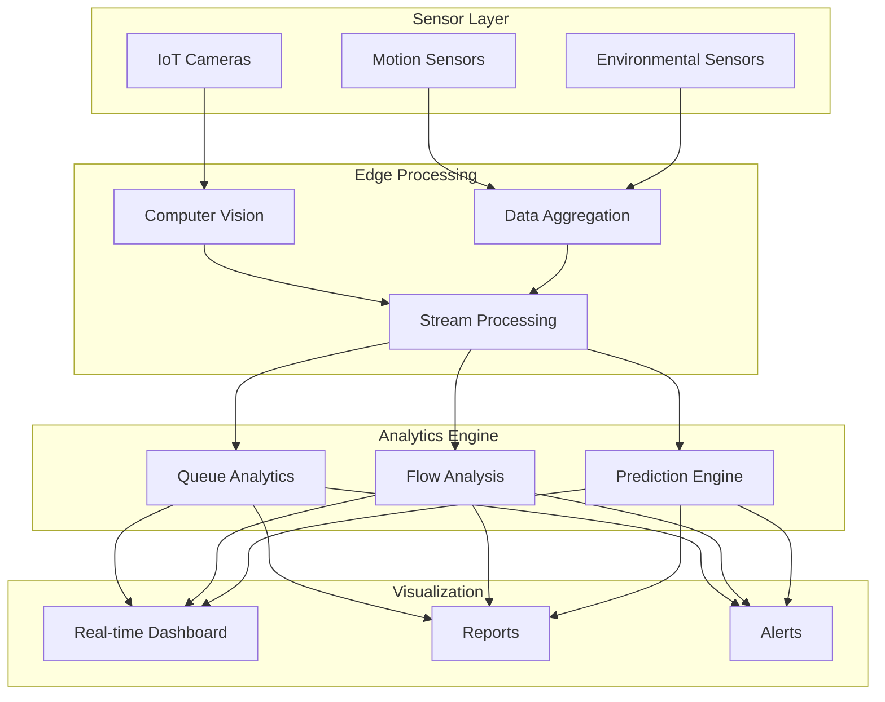
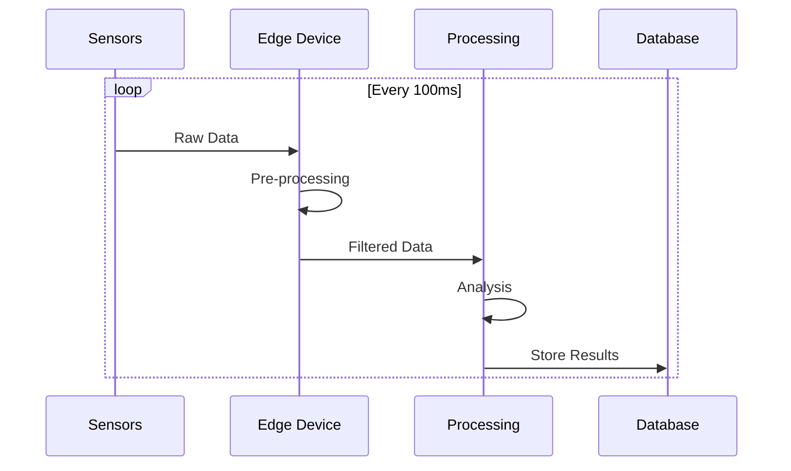
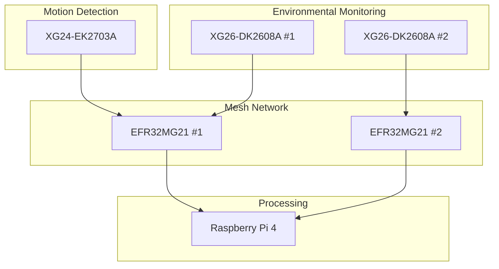
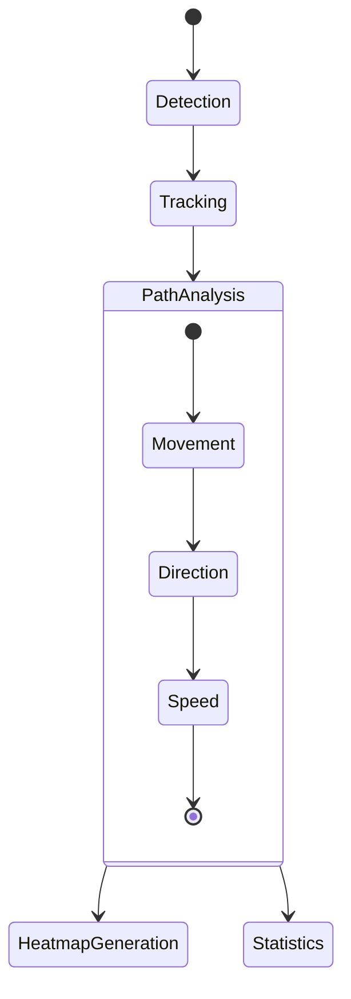
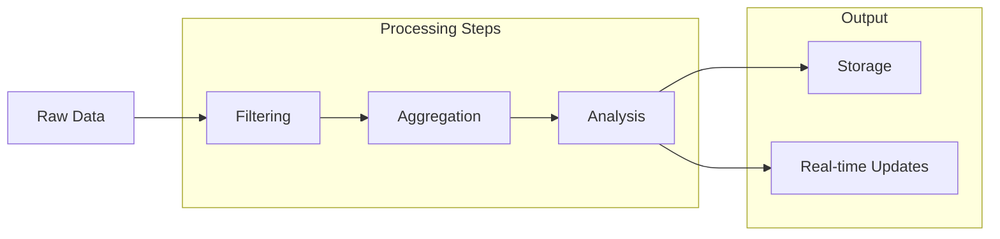
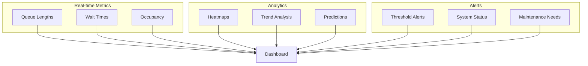
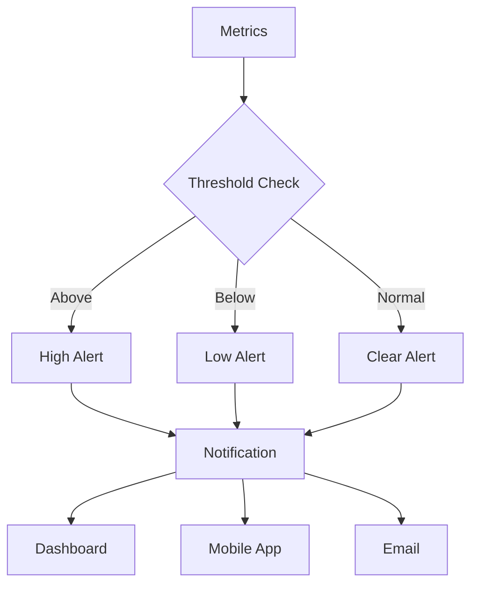
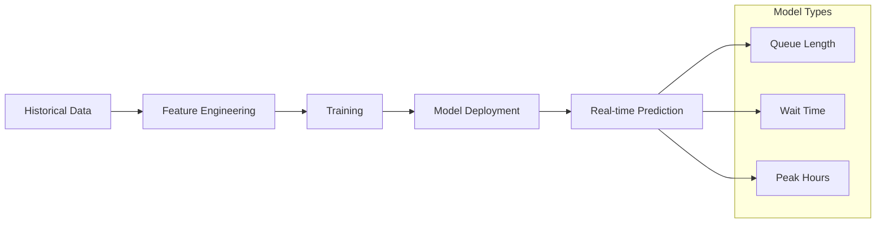

# IoT Analytics Module Documentation

## 1. Tổng quan Module

Module IoT Analytics xử lý dữ liệu từ hệ thống cảm biến và camera để phân tích luồng người, quản lý hàng đợi và tối ưu hóa trải nghiệm mua sắm.

### 1.1 Kiến trúc Module

1. Mục đích

Kiến trúc này được thiết kế để thu thập, xử lý, phân tích, và hiển thị dữ liệu thời gian thực từ Sensor Layer đến Visualization, hỗ trợ giám sát và ra quyết định trong các hệ thống IoT.

2. Cấu trúc hệ thống

Hệ thống gồm bốn tầng chính:

Sensor Layer: Bao gồm IoT Cameras, Motion Sensors, và Environmental Sensors, thu thập dữ liệu thô (hình ảnh, chuyển động, thông số môi trường).

Edge Processing: Gồm Computer Vision, Data Aggregation, và Stream Processing, xử lý sơ bộ dữ liệu tại thiết bị biên để giảm tải và tăng tốc độ.

Analytics Engine: Gồm Queue Analytics, Flow Analysis, và Prediction Engine, thực hiện phân tích sâu (hàng đợi, luồng, và dự đoán).

Visualization: Gồm Real-time Dashboard, Reports, và Alerts, cung cấp giao diện hiển thị dữ liệu, báo cáo, và cảnh báo.

3. Tổng thể cách dữ liệu di chuyển

Dữ liệu từ IoT Cameras được xử lý bởi Computer Vision, từ Motion Sensors và Environmental Sensors được tổng hợp bởi Data Aggregation.

Dữ liệu sau đó được xử lý thời gian thực bởi Stream Processing, rồi chuyển đến Analytics Engine để phân tích.

Kết quả phân tích được hiển thị trên Real-time Dashboard, tạo Reports, hoặc gửi Alerts khi có sự cố.



## 2. Xử lý Dữ liệu Sensor

### 2.1 Data Collection Flow

Cấu trúc hệ thống

Hệ thống bao gồm bốn thành phần chính:

Sensors: Là tập hợp các cảm biến (ví dụ: cảm biến nhiệt độ, độ ẩm, chuyển động, ánh sáng) chịu trách nhiệm thu thập Raw Data từ môi trường thực tế. Dữ liệu này có thể bao gồm các giá trị analog hoặc digital, tùy thuộc vào loại cảm biến.

Edge Device: Thiết bị biên thực hiện bước Pre-processing, bao gồm lọc nhiễu, chuẩn hóa dữ liệu, và loại bỏ dữ liệu không hợp lệ từ Raw Data, để tạo ra Filtered Data sẵn sàng cho phân tích.

Processing: Thành phần xử lý trung tâm, thực hiện bước Analysis trên Filtered Data với tần suất cập nhật mỗi 100ms, nhằm phân tích dữ liệu (ví dụ: phát hiện xu hướng, tính toán thống kê, hoặc nhận diện bất thường).

Database: Hệ thống lưu trữ dữ liệu, thực hiện Store Results để lưu kết quả phân tích dưới dạng có cấu trúc (ví dụ: cơ sở dữ liệu quan hệ hoặc NoSQL), phục vụ truy vấn và phân tích dài hạn.

Luồng dữ liệu di chuyển

Sensors liên tục thu thập Raw Data từ môi trường và gửi đến Edge Device thông qua một vòng lặp (loop), có thể được thực hiện qua giao thức truyền thông như MQTT hoặc I2C, tùy thuộc vào thiết kế hệ thống.

Tại Edge Device, Raw Data được xử lý qua bước Pre-processing, bao gồm các tác vụ như:

Lọc nhiễu (noise filtering) để loại bỏ dữ liệu không chính xác.

Chuẩn hóa (normalization) để đưa dữ liệu về định dạng thống nhất.

Nén dữ liệu (data compression) nếu cần để giảm băng thông truyền tải.

Kết quả là Filtered Data, được gửi đến Processing.

Processing nhận Filtered Data và thực hiện Analysis với chu kỳ 100ms. Quá trình Analysis có thể bao gồm:

Tính toán các chỉ số thống kê (ví dụ: trung bình, độ lệch chuẩn).

Phát hiện bất thường (anomaly detection) dựa trên ngưỡng định sẵn.

Xử lý dữ liệu thời gian thực để đưa ra kết luận nhanh chóng.

Kết quả từ Analysis được gửi đến Database thông qua bước Store Results, nơi dữ liệu được lưu trữ dưới dạng bảng hoặc bản ghi, có thể kèm theo thời gian (timestamp) để hỗ trợ truy vấn theo thời gian.



### 2.2 Sensor Network

1. Cấu trúc tổng quan
   
Motion Detection và Environmental Monitoring: Tầng cảm biến, thu thập dữ liệu từ môi trường.

Mesh Network: Tầng trung gian, kết nối các thiết bị cảm biến với thiết bị xử lý trung tâm.

Processing: Tầng xử lý, nơi dữ liệu được phân tích và xử lý.

2. Phân tích từng tầng và thiết bị

a. Motion Detection

XG24-EK2703A: Đây là một bộ phát triển (development kit) của Silicon Labs, sử dụng dòng chip XG24, hỗ trợ giao thức Zigbee, Thread, hoặc Bluetooth Low Energy (BLE). Thiết bị này được cấu hình để thực hiện Motion 

Detection, có thể tích hợp cảm biến chuyển động (PIR sensor) hoặc các cảm biến tương tự.

Vai trò: Thu thập dữ liệu chuyển động (motion data) từ môi trường.

b. Environmental Monitoring

XG26-DK2608A #1 và XG26-DK2608A #2: Đây là hai bộ phát triển thuộc dòng XG26 của Silicon Labs, được sử dụng để thực hiện Environmental Monitoring. Mỗi bộ có thể tích hợp các cảm biến môi trường như cảm biến nhiệt độ, độ ẩm, ánh sáng, hoặc chất lượng không khí.

Vai trò: Thu thập dữ liệu môi trường (environmental data) từ hai vị trí hoặc khu vực khác nhau (được đánh số #1 và #2).

c. Mesh Network

EFR32MG21 #1 và EFR32MG21 #2: Đây là các mô-đun vi điều khiển không dây của Silicon Labs, thuộc dòng EFR32 Mighty Gecko, hỗ trợ giao thức Zigbee và Thread, được cấu hình để tạo thành Mesh Network.

Mesh Network: Mạng lưới dạng lưới (mesh topology), cho phép các thiết bị kết nối với nhau theo cấu trúc phi tập trung. Các thiết bị trong mạng có thể giao tiếp trực tiếp hoặc gián tiếp (qua các nút trung gian), tăng độ tin cậy và phạm vi phủ sóng.

Vai trò:

EFR32MG21 #1 kết nối với XG24-EK2703A (Motion Detection).

EFR32MG21 #2 kết nối với XG26-DK2608A #1 và XG26-DK2608A #2 (Environmental Monitoring).

Cả hai thiết bị này giao tiếp với nhau trong Mesh Network để truyền dữ liệu từ tầng cảm biến xuống tầng xử lý.

d. Processing

Raspberry Pi 4: Một máy tính nhúng phổ biến, được sử dụng để xử lý dữ liệu (data processing). Raspberry Pi 4 có khả năng chạy các ứng dụng phân tích dữ liệu, lưu trữ tạm thời, hoặc giao tiếp với các hệ thống khác.

Vai trò: Nhận dữ liệu từ Mesh Network, thực hiện các tác vụ xử lý như phân tích, tổng hợp, hoặc lưu trữ dữ liệu.



## 3. Computer Vision System

### 3.1 Queue Detection

```python
class QueueAnalytics:
    def __init__(self):
        self.model = YOLOv5('yolov5s.pt')
        self.tracker = Sort()
        
    def process_frame(self, frame):
        # Detect people
        detections = self.model(frame)
        
        # Track objects
        tracked_objects = self.tracker.update(detections)
        
        # Analyze queue
        queue_length = self.count_people_in_queue(tracked_objects)
        wait_time = self.estimate_wait_time(queue_length)
        
        return {
            'queue_length': queue_length,
            'wait_time': wait_time,
            'heatmap': self.generate_heatmap(tracked_objects)
        }
```

### 3.2 People Flow Analysis

1. Cấu trúc tổng quan
   
Mô tả quy trình People Flow Analysis, nhằm phân tích luồng di chuyển của con người trong một không gian giám sát, thường sử dụng dữ liệu video từ camera. Quy trình được chia thành hai giai đoạn chính:

Giai đoạn xử lý dữ liệu: Bao gồm Detection, Tracking, và Path Analysis (gồm các bước chi tiết Movement, Direction, Speed).

Giai đoạn xuất kết quả: Bao gồm Heatmap Generation và Statistics, cung cấp dữ liệu trực quan và số liệu phân tích.

2. Các bước thực hiện
   
a. Detection

Bước này phát hiện sự hiện diện của con người trong khung hình video.

Sử dụng các mô hình học sâu (deep learning) như YOLOv8 (You Only Look Once) hoặc SSD (Single Shot MultiBox Detector) để nhận diện đối tượng là con người.

Đầu vào: Khung hình video từ camera (thường có độ phân giải tối thiểu 720p để đảm bảo độ chính xác).

Đầu ra: Danh sách các bounding box (hộp giới hạn) với tọa độ (x, y, width, height) và độ tin cậy (confidence score) của mỗi người được phát hiện.

Thách thức:

Che khuất (occlusion): Nhiều người đứng gần nhau gây khó khăn trong việc phân biệt.

Điều kiện ánh sáng: Ánh sáng yếu hoặc thay đổi nhanh (như bóng tối, đèn nhấp nháy) có thể làm giảm độ chính xác.

Giải pháp đề xuất:

Tích hợp mô hình học sâu với khả năng xử lý che khuất, như Faster R-CNN với Region Proposal Network (RPN).

b. Tracking

Mô tả: Theo dõi từng người qua các khung hình liên tiếp để tạo đường đi (trajectory).

Sử dụng thuật toán DeepSORT (Simple Online and Realtime Tracking with a Deep Association Metric), kết hợp với bộ lọc Kalman (Kalman Filter) để dự đoán vị trí tiếp theo của đối tượng.

Gán ID duy nhất cho từng người dựa trên đặc trưng hình ảnh (visual features) được trích xuất bằng mạng nơ-ron sâu (deep neural network).

Đầu vào: Danh sách bounding box từ Detection.

Đầu ra: Tập hợp các trajectory (ID, tọa độ qua thời gian) cho từng người.

Thách thức:

Mất dấu (tracking loss): Khi người di chuyển nhanh hoặc bị che khuất hoàn toàn.

Giải pháp đề xuất:

Tăng tần suất khung hình (frame rate) của camera (ví dụ: 30 FPS trở lên) để giảm khoảng cách giữa các khung hình.

c. Path Analysis

Bước này phân tích chi tiết đường đi của từng người, bao gồm ba thành phần:

Movement:

Mô tả: Xác định trạng thái di chuyển (đi, đứng, chạy) của từng người.

Phương pháp: Tính toán độ dịch chuyển (displacement) giữa các khung hình liên tiếp. Nếu độ dịch chuyển nhỏ hơn ngưỡng (threshold), đối tượng được coi là đứng yên.

Direction:

Mô tả: Phân tích hướng di chuyển của từng người (ví dụ: trái, phải, lên, xuống).

Phương pháp: Tính vector hướng từ tọa độ của các khung hình liên tiếp.

Ứng dụng: Xác định các hướng di chuyển phổ biến trong không gian (ví dụ: khách hàng thường đi từ lối vào đến quầy hàng nào).

Speed:

Mô tả: Tính tốc độ di chuyển của từng người.

Phương pháp: Speed = Displacement / Δt, trong đó Δt là khoảng thời gian giữa hai khung hình (thường tính bằng giây).

Đơn vị: Tốc độ thường được tính bằng pixel/giây, sau đó có thể chuyển đổi sang đơn vị thực tế (m/s) nếu biết tỷ lệ pixel-to-meter của không gian.

Đầu ra: Dữ liệu chi tiết về hành vi di chuyển (movement state, direction, speed) của từng người.

d. Heatmap Generation

Mô tả: Tạo bản đồ nhiệt (Heatmap) biểu thị mật độ di chuyển của con người trong không gian.

Phương pháp:

Thu thập tất cả trajectory từ Path Analysis.

Chia không gian thành lưới (grid) với kích thước ô (cell) cố định (ví dụ: 10x10 pixel).

Đếm số lần mỗi ô được đi qua bởi các trajectory, sau đó ánh xạ mật độ thành màu sắc (mật độ cao → màu đỏ, mật độ thấp → màu xanh).

Sử dụng thư viện như OpenCV hoặc Matplotlib để tạo Heatmap.

Xác định các khu vực đông đúc (hotspots).

e. Statistics

Mô tả: Tổng hợp số liệu thống kê từ dữ liệu Path Analysis.

Các số liệu bao gồm:

Số lượng người đi qua từng khu vực (dựa trên Heatmap).

Hướng di chuyển phổ biến: Tính tần suất các hướng (direction histogram).

Thời gian lưu lại (dwell time): Tính thời gian trung bình một người ở lại một khu vực cụ thể.



## 4. Real-time Analytics

### 4.1 Data Processing Pipeline

1. Mục đích

Quy trình Data Processing Pipeline xử lý dữ liệu từ Raw Data đến các đầu ra có giá trị (Storage và Real-time Updates), nhằm hỗ trợ giám sát, phân tích, và ra quyết định trong các hệ thống IoT, an ninh, hoặc công nghiệp.

2. Quy trình xử lý

Raw Data: Thu thập dữ liệu thô từ cảm biến, camera, hoặc thiết bị IoT (ví dụ: dữ liệu nhiệt độ mỗi giây, luồng video).

Filtering: Lọc nhiễu (noise filtering) bằng Moving Average, loại bỏ trùng lặp (deduplication) bằng hashing, và kiểm tra tính hợp lệ (validation) để tạo dữ liệu sạch.

Aggregation: Tổng hợp dữ liệu theo thời gian (temporal aggregation) hoặc nhóm (group aggregation), ví dụ: tính trung bình nhiệt độ mỗi 5 phút từ dữ liệu mỗi giây.

Analysis: Áp dụng các phương pháp:

Phân tích thống kê (statistical analysis): Tính trung bình, độ lệch chuẩn.

Phát hiện bất thường (anomaly detection): Sử dụng Isolation Forest để phát hiện giá trị bất thường (như nhiệt độ tăng đột biến).

Dự đoán (predictive analysis): Sử dụng LSTM để dự đoán xu hướng dữ liệu (như nhiệt độ trong 1 giờ tới).

Output:

Storage: Lưu kết quả phân tích vào InfluxDB (time-series database) để phân tích lịch sử.



### 4.2 Analytics Engine

```python
class AnalyticsEngine:
    def process_data(self, sensor_data, vision_data):
        # Combine sensor and vision data
        combined_data = self.merge_data_sources(sensor_data, vision_data)
        
        # Calculate metrics
        metrics = {
            'occupancy': self.calculate_occupancy(combined_data),
            'flow_rate': self.calculate_flow_rate(combined_data),
            'queue_status': self.analyze_queues(combined_data),
            'predictions': self.predict_next_hour(combined_data)
        }
        
        # Generate alerts if needed
        self.check_thresholds(metrics)
        
        return metrics
```

## 5. Visualization System

### 5.1 Dashboard Components

Quy trình và thành phần

Real-time Metrics:

Queue Lengths: Thu thập dữ liệu từ cảm biến hoặc hệ thống nhận diện, đếm số lượng đối tượng trong hàng đợi, áp dụng bộ lọc Kalman để làm mượt dữ liệu, cập nhật mỗi 500ms.

Wait Times: Ghi nhận thời gian gia nhập và rời hàng đợi, tính thời gian chờ trung bình, làm mượt dữ liệu bằng Exponential Moving Average, cập nhật liên tục.

Occupancy: Xác định số lượng đối tượng hiện tại, tính tỷ lệ lấp đầy so với dung lượng tối đa, sử dụng thuật toán nhận diện đối tượng, cập nhật mỗi 150ms.

Analytics:

Heatmaps: Chia không gian thành lưới, tính tần suất xuất hiện của đối tượng trong mỗi ô, ánh xạ mật độ thành màu sắc (mật độ cao → đỏ), áp dụng Gaussian blur để làm mượt, thời gian xử lý dưới 500ms.

Trend Analysis: Áp dụng Moving Average, Exponential Smoothing, và Seasonal Decomposition để phân tích xu hướng, tích hợp Isolation Forest để phát hiện bất thường, hiển thị dưới dạng biểu đồ đường, độ trễ dưới 1 giây.

Prediction: Sử dụng mô hình LSTM để dự đoán chuỗi thời gian, đào tạo trên dữ liệu lịch sử, tối ưu bằng grid search và early stopping, độ chính xác tối thiểu 85%, thời gian xử lý dưới 2 giây.

Alerts:

Thresh Alerts: So sánh chỉ số với ngưỡng, tích hợp Z-Score để điều chỉnh ngưỡng động, gửi thông báo qua RabbitMQ, độ trễ dưới 500ms, tỷ lệ cảnh báo sai dưới 5%.

System Status: Thu thập dữ liệu từ Prometheus (phần cứng) và ELK Stack (phần mềm), hiển thị dưới dạng biểu đồ gauge, độ trễ cập nhật dưới 1 giây, độ chính xác 99%.

Maintenance Needs: Theo dõi chỉ số vận hành (battery level, disk usage), áp dụng Random Forest để dự đoán bảo trì, gửi thông báo qua email/Slack, độ trễ dưới 1 giây, tỷ lệ phát hiện sai dưới 3%.

Dashboard: Tổng hợp dữ liệu từ tất cả thành phần, hiển thị dưới dạng biểu đồ đường, heatmap, và bảng thông báo, sử dụng Grafana với WebSocket, hỗ trợ tương tác (zoom, filter), độ trễ dưới 100ms.



### 5.2 Data Visualization

```javascript
// Dashboard update logic
class DashboardUpdater {
    updateQueueStatus(data) {
        // Update queue length chart
        this.queueChart.updateData(data.queueLengths);
        
        // Update wait time displays
        this.waitTimeDisplays.forEach((display, index) => {
            display.setValue(data.waitTimes[index]);
        });
        
        // Update heatmap
        this.heatmap.setData(data.occupancyMap);
    }
    
    updatePredictions(data) {
        // Update prediction graphs
        this.predictionChart.setData(data.predictions);
        
        // Update recommendations
        this.recommendationPanel.update(data.suggestions);
    }
}
```

## 6. Alert System

### 6.1 Alert Configuration

Mô tả Hệ thống

Hệ thống Alert Configuration hoạt động theo các bước chính sau:

Thu thập Metrics: Hệ thống liên tục thu thập các metrics từ các nguồn dữ liệu (ví dụ: hiệu suất hệ thống, lưu lượng mạng, tỷ lệ lỗi, v.v.).

Threshold Check: Các metrics được so sánh với các threshold đã được thiết lập. Kết quả được phân loại thành ba trạng thái:

Above: Kích hoạt High Alert khi metrics vượt threshold cao.

Below: Kích hoạt Low Alert khi metrics dưới threshold thấp.

Normal: Kích hoạt Clear Alert khi metrics nằm trong phạm vi chấp nhận được.

Phân loại Alert:

High Alert: Báo động cho các vấn đề nghiêm trọng, yêu cầu xử lý khẩn cấp.

Low Alert: Báo động cho các vấn đề tiềm tàng, cần theo dõi thêm.

Clear Alert: Báo hiệu hệ thống đã trở lại trạng thái normal.

Notification: Các alert được gửi qua hệ thống notification và phân phối đến ba kênh:

Dashboard: Hiển thị trực quan trên giao diện dashboard.

Mobile App: Gửi thông báo đẩy đến mobile app.

Email: Gửi thông báo qua email để lưu trữ hoặc thông báo cho các bên liên quan.

3. Lợi ích của Hệ thống

Phát hiện kịp thời: Hệ thống tự động phát hiện các vấn đề dựa trên threshold, giảm thiểu rủi ro do lỗi con người.
Notification đa kênh: Đảm bảo người dùng nhận được alert qua nhiều phương thức (Dashboard, Mobile App, Email), tăng tính linh hoạt và hiệu quả.
Tối ưu hóa giám sát: Phân loại alert (High, Low, Clear) giúp ưu tiên xử lý các vấn đề quan trọng, đồng thời giảm thiểu thông báo không cần thiết.



### 6.2 Alert Rules

```yaml
# Alert Configuration
rules:
  queue_length:
    warning: 10
    critical: 20
    check_interval: 60s
    
  wait_time:
    warning: 300  # 5 minutes
    critical: 600 # 10 minutes
    check_interval: 60s
    
  occupancy:
    warning: 80%
    critical: 90%
    check_interval: 300s
```

## 7. API Documentation

### 7.1 Analytics API

```yaml
# Queue Status API
GET /api/queues
Response:
{
    "queues": [
        {
            "id": string,
            "length": number,
            "wait_time": number,
            "status": "low"|"medium"|"high"
        }
    ],
    "recommendations": {
        "suggested_queue": string,
        "estimated_wait": number
    }
}

# Occupancy API
GET /api/occupancy
Response:
{
    "total_capacity": number,
    "current_occupancy": number,
    "occupancy_rate": number,
    "hotspots": [
        {
            "location": string,
            "density": number
        }
    ]
}
```

### 7.2 WebSocket Events

```yaml
# Real-time Updates
queue_update:
    type: "queue"
    data: {
        "queue_id": string,
        "length": number,
        "wait_time": number,
        "trend": "increasing"|"decreasing"|"stable"
    }

occupancy_update:
    type: "occupancy"
    data: {
        "current": number,
        "capacity": number,
        "hotspots": [
            {
                "x": number,
                "y": number,
                "density": number
            }
        ]
    }
```

## 8. Machine Learning Models

### 8.1 Prediction Models

Mô tả Hệ thống

Hệ thống Prediction Models được xây dựng và vận hành theo các giai đoạn sau:

Thu thập Historical Data:

Nguồn dữ liệu: Historical data bao gồm các thông số vận hành trong quá khứ, được thu thập từ hệ thống.

Dữ liệu cần được làm sạch (data cleaning) để loại bỏ nhiễu, giá trị ngoại lệ (outliers), và các bản ghi không đầy đủ.

Historical data phải bao phủ một khoảng thời gian đủ dài (ví dụ: 6 tháng đến 1 năm) để phản ánh các xu hướng và mẫu dữ liệu cần thiết cho việc huấn luyện model.

Tầm quan trọng: Historical data là nền tảng để xây dựng các prediction models, đảm bảo model có thể học hỏi từ các mẫu dữ liệu trong quá khứ.

Feature Engineering:

Quá trình: Dữ liệu từ historical data được xử lý để trích xuất và chuẩn bị các features (đặc trưng) cho việc training model.

Các bước chi tiết:

Feature Extraction: Trích xuất các đặc trưng như giá trị trung bình, độ lệch chuẩn, hoặc các xu hướng thời gian (time-based patterns).

Feature Selection: Sử dụng các kỹ thuật như correlation analysis hoặc feature importance ranking để chọn các features quan trọng, giảm chiều dữ liệu (dimensionality reduction) và tránh overfitting.

Feature Transformation:

Chuẩn hóa dữ liệu (normalization) để đưa các giá trị về cùng thang đo (ví dụ: từ 0 đến 1).

Mã hóa các biến phân loại (categorical variables) nếu có, chẳng hạn như các biến thời gian (ngày trong tuần, giờ trong ngày).

Tầm quan trọng: Feature engineering đảm bảo các features được sử dụng phản ánh đúng các yếu tố ảnh hưởng đến các thông số cần dự đoán, từ đó nâng cao độ chính xác của model.

Training:

Quá trình: Sử dụng các features đã được xử lý để huấn luyện các prediction models.

Model Types: Hệ thống hỗ trợ nhiều loại model, bao gồm:

Time-series Models: ARIMA hoặc Prophet để dự đoán xu hướng dựa trên dữ liệu thời gian.

Machine Learning Models: Random Forest, Gradient Boosting (XGBoost, LightGBM) để xử lý dữ liệu phức tạp.

Deep Learning Models: LSTM (Long Short-Term Memory) để xử lý dữ liệu chuỗi thời gian dài.

Quy trình training:

Chia dữ liệu thành training set (80%) và test set (20%) để đánh giá hiệu suất model.

Sử dụng các metrics như Mean Absolute Error (MAE), Root Mean Squared Error (RMSE), và R-squared để đo lường độ chính xác.


Áp dụng k-fold cross-validation để đảm bảo tính ổn định của model trên các tập dữ liệu khác nhau.

Tối ưu hóa:

Sử dụng các thuật toán như Gradient Descent để điều chỉnh tham số model.

Áp dụng regularization (L1, L2) để tránh overfitting và cải thiện khả năng tổng quát hóa (generalization).

Thách thức: Đảm bảo model không bị overfitting và có thể hoạt động hiệu quả trên dữ liệu mới.

Model Deployment:

Quá trình: Các model đã được training được triển khai (deployed) vào môi trường sản xuất để thực hiện real-time prediction.

Chi tiết triển khai:

Deployment Strategy:

Model được triển khai dưới dạng API, sử dụng các framework như Flask hoặc FastAPI.

Sử dụng containerization (Docker) và orchestration (Kubernetes) để quản lý và mở rộng quy mô (scaling).

Monitoring:

Thiết lập hệ thống giám sát để theo dõi hiệu suất model, bao gồm prediction accuracy và latency.

Sử dụng các công cụ như Prometheus và Grafana để ghi nhận và trực quan hóa các metrics giám sát.

Model Versioning:

Sử dụng các công cụ như MLflow để quản lý phiên bản model, đảm bảo khả năng rollback nếu model mới không đạt yêu cầu.

Yêu cầu: Model cần xử lý real-time data với độ trễ thấp (dưới 100ms) để đáp ứng nhu cầu dự đoán theo thời gian thực.

Real-time Prediction:

Quá trình: Các model đã triển khai được sử dụng để thực hiện real-time prediction dựa trên real-time data.

Thông số dự đoán:

Queue Length: Dự đoán độ dài hàng đợi tại một thời điểm nhất định.

Wait Time: Dự đoán thời gian chờ trung bình.

Peak Hours: Dự đoán các khung giờ cao điểm.

Chi tiết kỹ thuật:

Data Pipeline: Thiết lập một data pipeline sử dụng Kafka hoặc RabbitMQ để thu thập và xử lý real-time data trước khi đưa vào model.

Prediction Frequency: Model có thể thực hiện dự đoán theo khoảng thời gian cố định (ví dụ: mỗi 5 phút) hoặc theo sự kiện (event-driven).

Output Integration: Kết quả dự đoán được định dạng để tích hợp vào các hệ thống khác, như dashboard hoặc các công cụ phân tích, thông qua API hoặc WebSocket.



### 8.2 Model Architecture

```python
class PredictionModel:
    def __init__(self):
        self.queue_model = self.build_lstm_model()
        self.occupancy_model = self.build_time_series_model()
        
    def predict_queue_length(self, current_data):
        # Preprocess current data
        features = self.extract_features(current_data)
        
        # Make prediction
        prediction = self.queue_model.predict(features)
        
        # Calculate confidence
        confidence = self.calculate_confidence(prediction)
        
        return {
            'predicted_length': prediction,
            'confidence': confidence,
            'valid_duration': '15m'
        }
```
