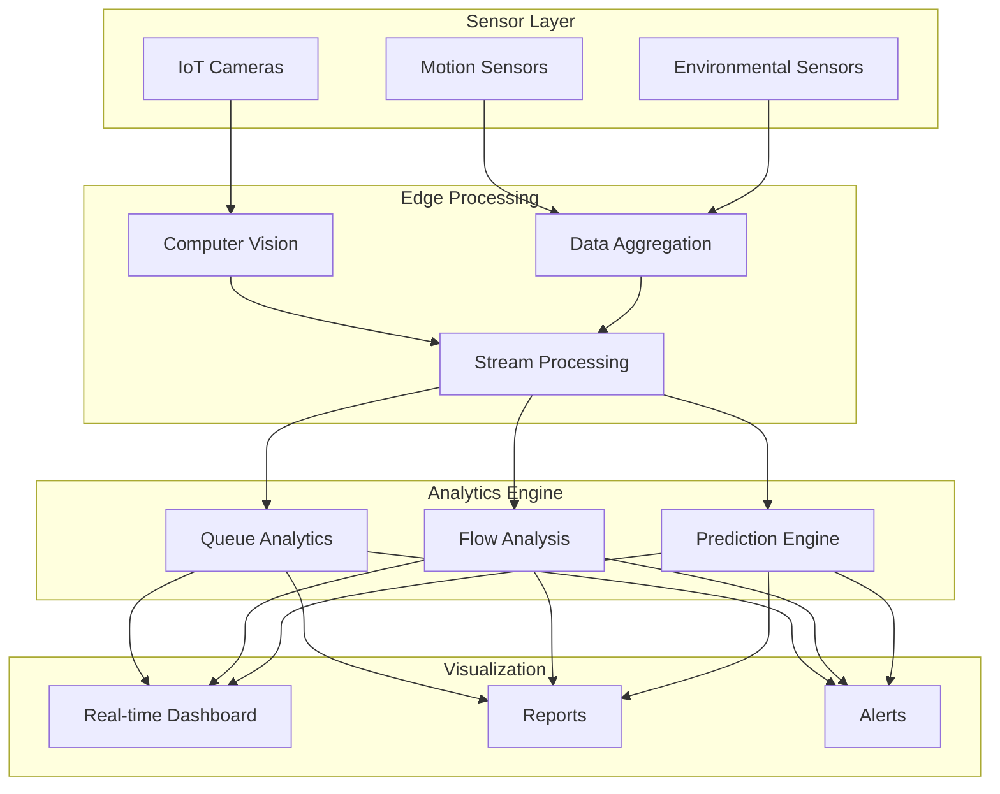
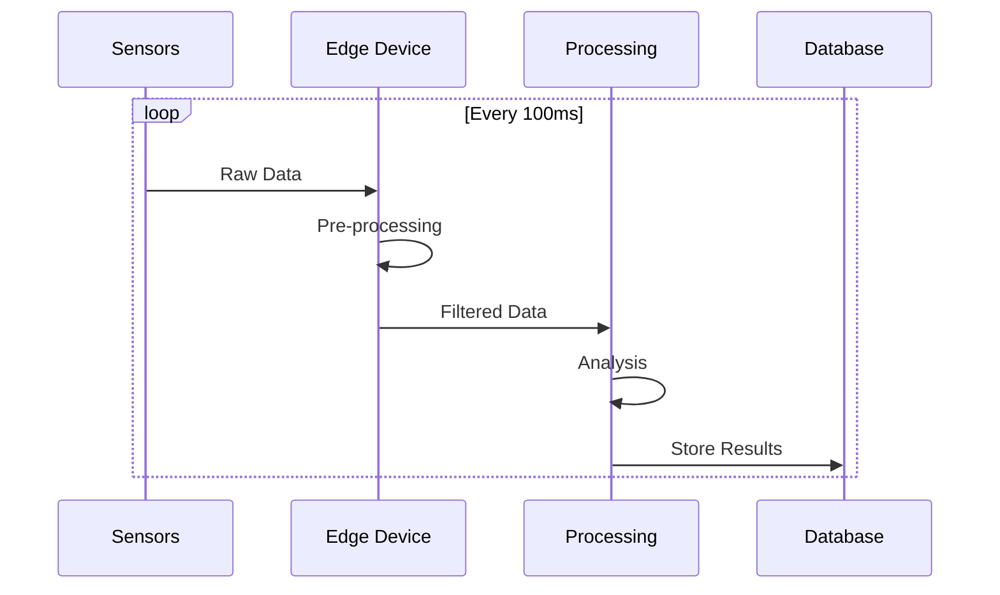
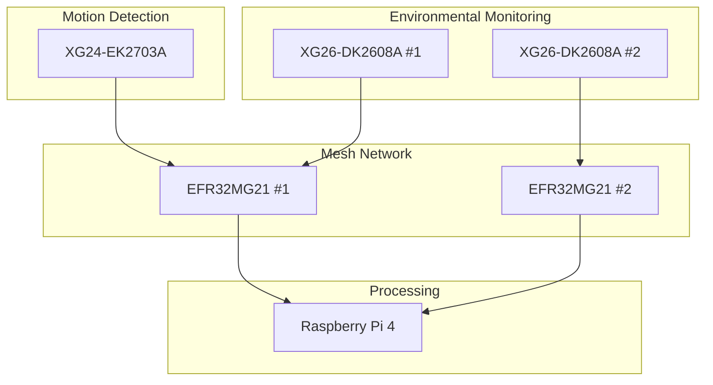
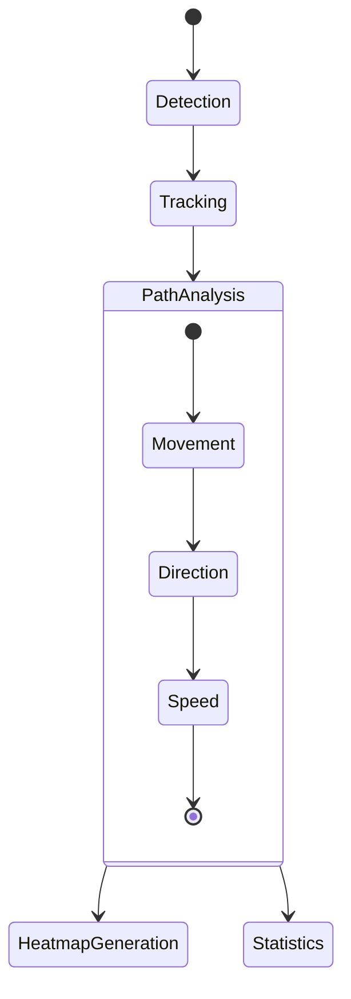
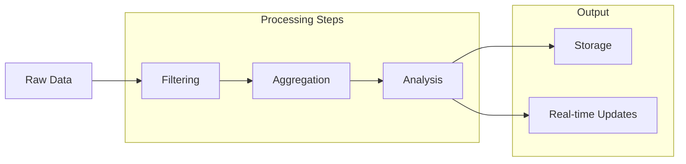
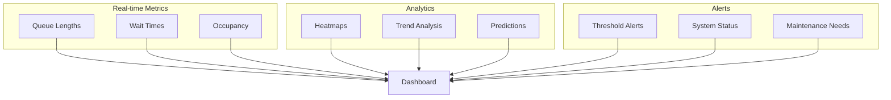
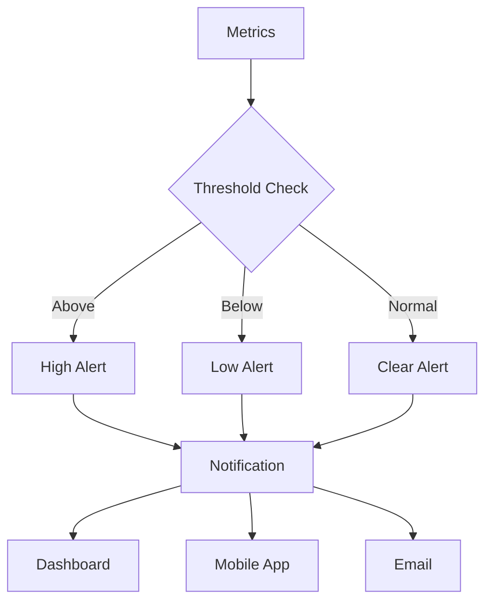
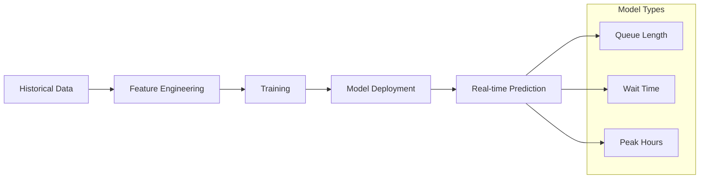

# IoT Analytics Module Documentation

## 1. Tổng quan Module

Module IoT Analytics xử lý dữ liệu từ hệ thống cảm biến và camera để phân tích luồng người, quản lý hàng đợi và tối ưu hóa trải nghiệm mua sắm.

### 1.1 Kiến trúc Module



## 2. Xử lý Dữ liệu Sensor

### 2.1 Data Collection Flow



### 2.2 Sensor Network



## 3. Computer Vision System

### 3.1 Queue Detection

```python
class QueueAnalytics:
    def __init__(self):
        self.model = YOLOv5('yolov5s.pt')
        self.tracker = Sort()
        
    def process_frame(self, frame):
        # Detect people
        detections = self.model(frame)
        
        # Track objects
        tracked_objects = self.tracker.update(detections)
        
        # Analyze queue
        queue_length = self.count_people_in_queue(tracked_objects)
        wait_time = self.estimate_wait_time(queue_length)
        
        return {
            'queue_length': queue_length,
            'wait_time': wait_time,
            'heatmap': self.generate_heatmap(tracked_objects)
        }
```

### 3.2 People Flow Analysis



## 4. Real-time Analytics

### 4.1 Data Processing Pipeline



### 4.2 Analytics Engine

```python
class AnalyticsEngine:
    def process_data(self, sensor_data, vision_data):
        # Combine sensor and vision data
        combined_data = self.merge_data_sources(sensor_data, vision_data)
        
        # Calculate metrics
        metrics = {
            'occupancy': self.calculate_occupancy(combined_data),
            'flow_rate': self.calculate_flow_rate(combined_data),
            'queue_status': self.analyze_queues(combined_data),
            'predictions': self.predict_next_hour(combined_data)
        }
        
        # Generate alerts if needed
        self.check_thresholds(metrics)
        
        return metrics
```

## 5. Visualization System

### 5.1 Dashboard Components



### 5.2 Data Visualization

```javascript
// Dashboard update logic
class DashboardUpdater {
    updateQueueStatus(data) {
        // Update queue length chart
        this.queueChart.updateData(data.queueLengths);
        
        // Update wait time displays
        this.waitTimeDisplays.forEach((display, index) => {
            display.setValue(data.waitTimes[index]);
        });
        
        // Update heatmap
        this.heatmap.setData(data.occupancyMap);
    }
    
    updatePredictions(data) {
        // Update prediction graphs
        this.predictionChart.setData(data.predictions);
        
        // Update recommendations
        this.recommendationPanel.update(data.suggestions);
    }
}
```

## 6. Alert System

### 6.1 Alert Configuration



### 6.2 Alert Rules

```yaml
# Alert Configuration
rules:
  queue_length:
    warning: 10
    critical: 20
    check_interval: 60s
    
  wait_time:
    warning: 300  # 5 minutes
    critical: 600 # 10 minutes
    check_interval: 60s
    
  occupancy:
    warning: 80%
    critical: 90%
    check_interval: 300s
```

## 7. API Documentation

### 7.1 Analytics API

```yaml
# Queue Status API
GET /api/queues
Response:
{
    "queues": [
        {
            "id": string,
            "length": number,
            "wait_time": number,
            "status": "low"|"medium"|"high"
        }
    ],
    "recommendations": {
        "suggested_queue": string,
        "estimated_wait": number
    }
}

# Occupancy API
GET /api/occupancy
Response:
{
    "total_capacity": number,
    "current_occupancy": number,
    "occupancy_rate": number,
    "hotspots": [
        {
            "location": string,
            "density": number
        }
    ]
}
```

### 7.2 WebSocket Events

```yaml
# Real-time Updates
queue_update:
    type: "queue"
    data: {
        "queue_id": string,
        "length": number,
        "wait_time": number,
        "trend": "increasing"|"decreasing"|"stable"
    }

occupancy_update:
    type: "occupancy"
    data: {
        "current": number,
        "capacity": number,
        "hotspots": [
            {
                "x": number,
                "y": number,
                "density": number
            }
        ]
    }
```

## 8. Machine Learning Models

### 8.1 Prediction Models



### 8.2 Model Architecture

```python
class PredictionModel:
    def __init__(self):
        self.queue_model = self.build_lstm_model()
        self.occupancy_model = self.build_time_series_model()
        
    def predict_queue_length(self, current_data):
        # Preprocess current data
        features = self.extract_features(current_data)
        
        # Make prediction
        prediction = self.queue_model.predict(features)
        
        # Calculate confidence
        confidence = self.calculate_confidence(prediction)
        
        return {
            'predicted_length': prediction,
            'confidence': confidence,
            'valid_duration': '15m'
        }
```
