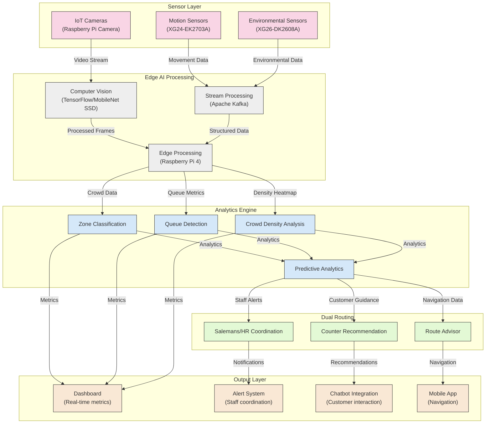
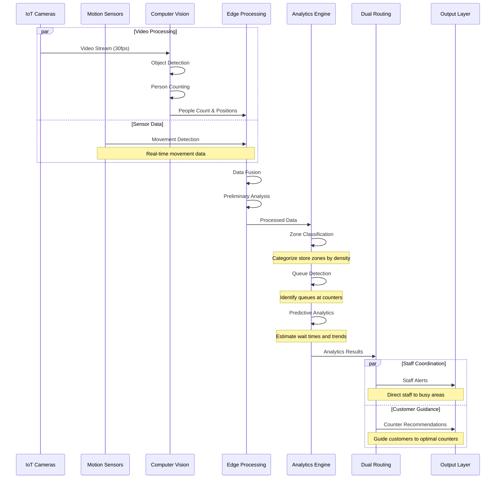
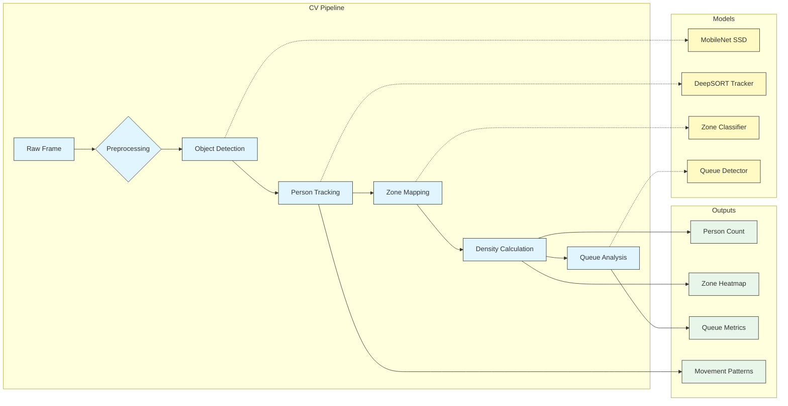
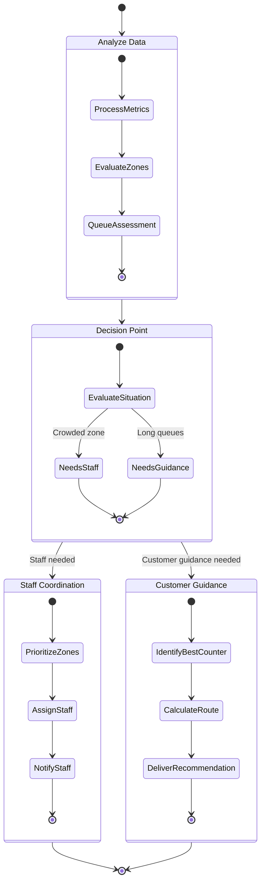
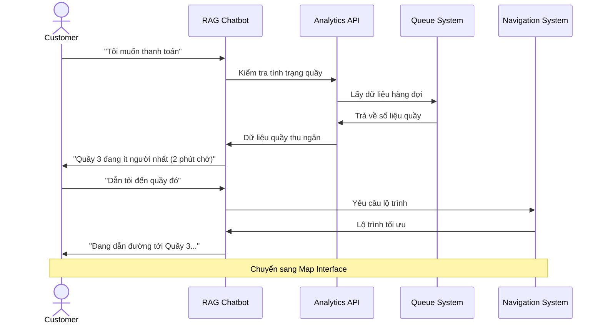
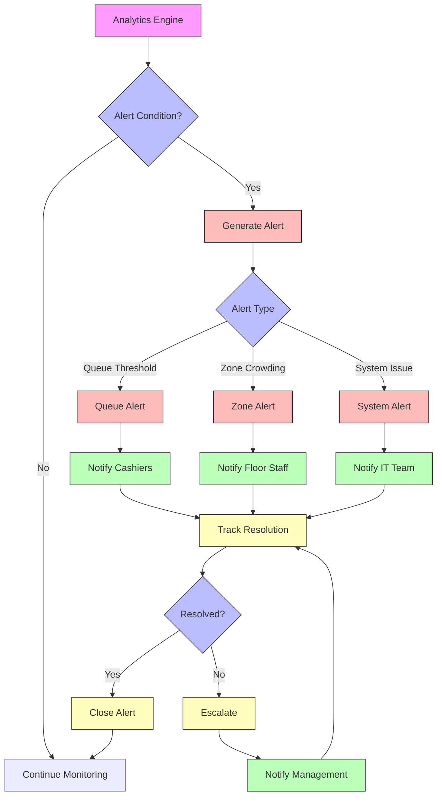
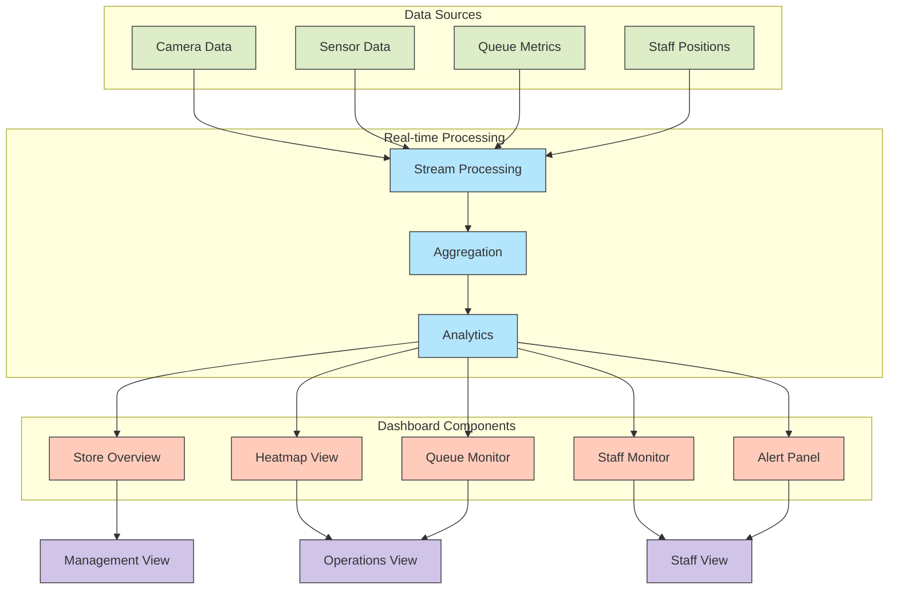
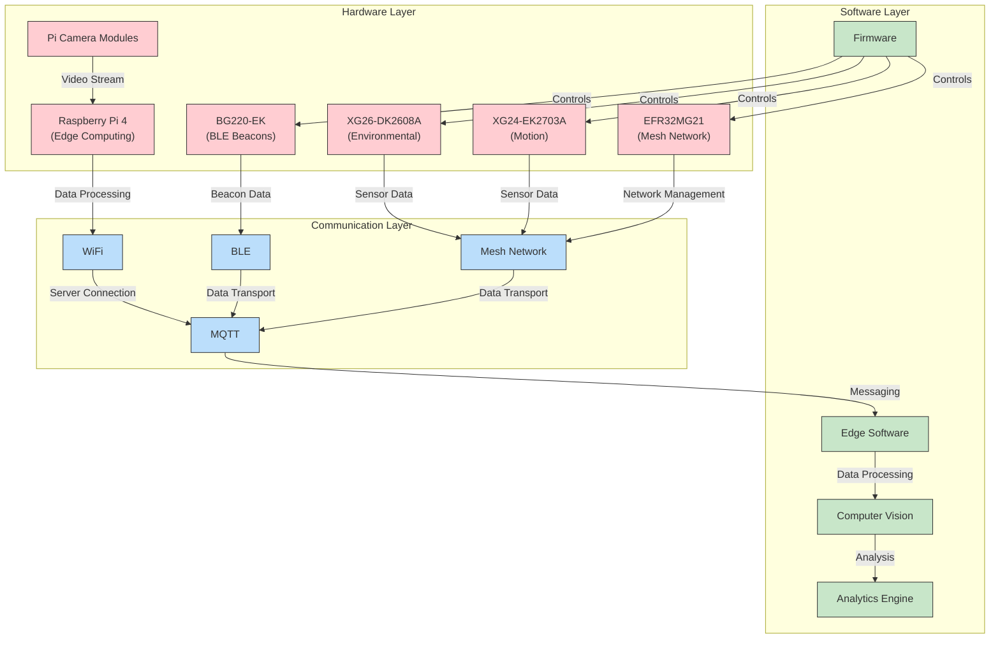

# Mô tả Chi tiết Kiến trúc Module Hệ thống IoT-AI Retail Assistant

## 1. Tổng quan Kiến trúc

## 2. Data Flow từ Sensor đến Analytics

## 3. Computer Vision Processing Pipeline

## 4. Dual Routing Decision System

## 5. Tương tác với Chatbot (RAG)

## 6. Alert System for Staff

## 7. Dashboard Integration

## 8. Integration với Hardware

