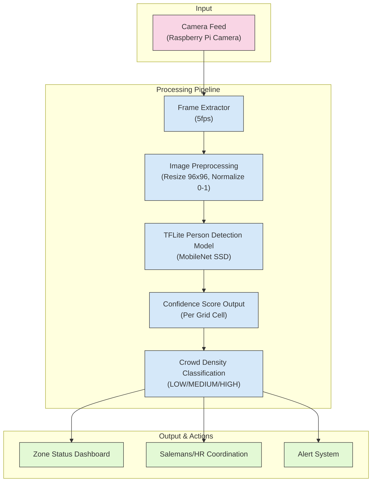
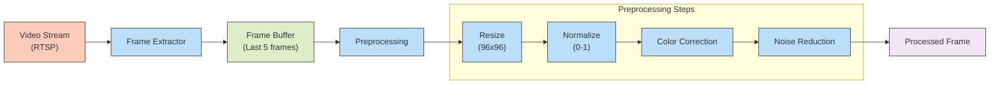
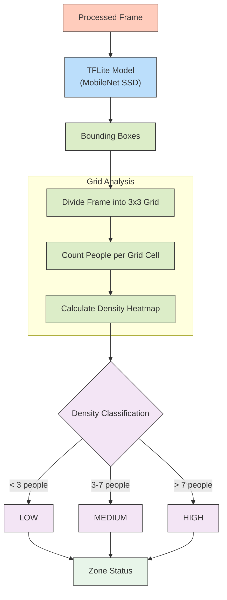
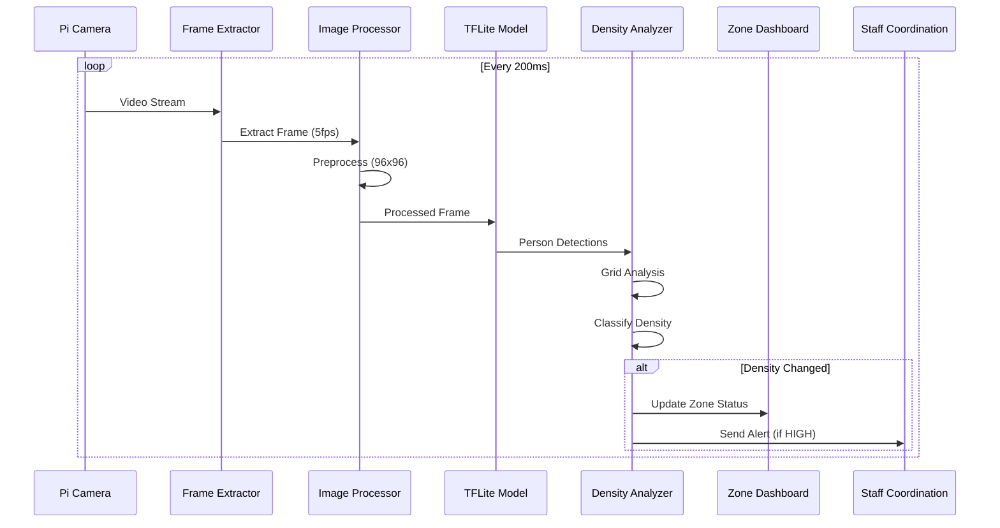
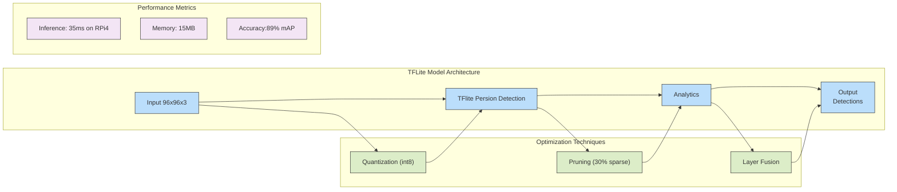
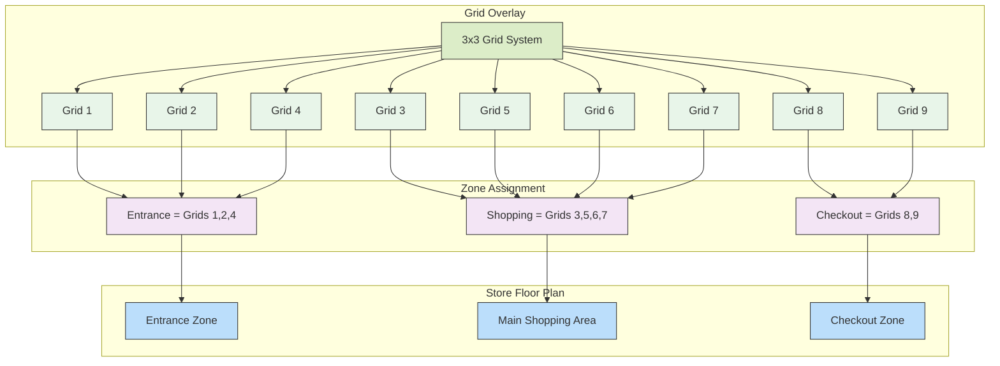
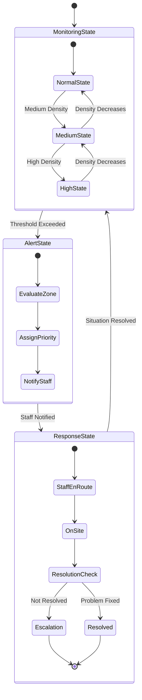
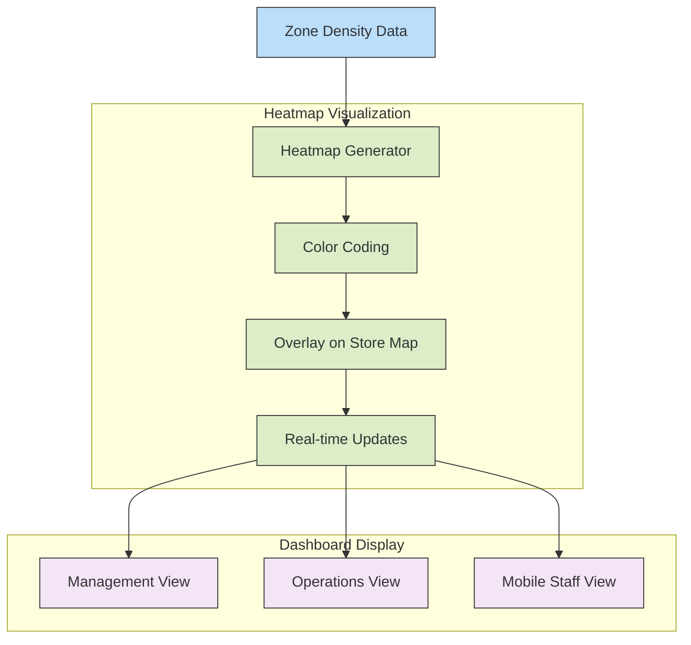

# Feature: Crowd Density Detection

## 1. Tổng quan Tính năng

Tính năng **Crowd Density Detection** khai thác sức mạnh của xử lý hình ảnh tiên tiến và các mô hình AI để phân tích tức thì mật độ đám đông tại mọi khu vực trong siêu thị, mang đến cái nhìn toàn diện chưa từng có. Với dữ liệu thời gian thực sắc bén, hệ thống mở ra khả năng điều phối nhân viên một cách tối ưu, định hình lại luồng khách hàng với độ chính xác tuyệt đối, và biến trải nghiệm mua sắm của khách hàng thành một hành trình liền mạch, đẳng cấp vượt trội.

## 2. Kiến trúc Tổng thể

Tổng quan Hệ thống

Hệ thống Crowd Density Detection khai thác sức mạnh của xử lý hình ảnh tiên tiến và các mô hình AI để phân tích luồng hình ảnh từ camera, xác định mật độ đám đông và phân loại thành các mức độ (Low/Medium/High). Dữ liệu này được sử dụng để hỗ trợ ra quyết định thông qua các hành động như hiển thị trạng thái, điều phối nhân sự và kích hoạt cảnh báo. Quy trình bao gồm ba thành phần chính:

Input: Thu nhận dữ liệu từ camera feed (Raspberry Pi Camera).

Processing Pipeline: Xử lý hình ảnh và phân tích mật độ đám đông.

Output & Actions: Cung cấp thông tin và thực hiện các hành động hỗ trợ vận hành.

Mô tả Hệ thống

3.1. Input: Camera Feed (Raspberry Pi Camera)

Nguồn dữ liệu:

Hệ thống sử dụng camera feed từ Raspberry Pi Camera để thu nhận hình ảnh theo thời gian thực.

Raspberry Pi Camera là một thiết bị phần cứng nhỏ gọn, thường được sử dụng trong các hệ thống IoT, có khả năng cung cấp luồng video hoặc hình ảnh tĩnh.

Thông số kỹ thuật:

Độ phân giải: Hỗ trợ từ 720p (1280x720) đến 1080p (1920x1080), đảm bảo chất lượng hình ảnh đủ để xử lý.

Tần số: Camera feed cung cấp dữ liệu với tần số 30 FPS (frames per second), nhưng hệ thống chỉ trích xuất một phần frame để giảm tải tính toán.

Góc nhìn: Tùy thuộc vào ống kính camera, góc nhìn (field of view) có thể dao động từ 60° đến 120°, phù hợp để bao phủ các khu vực cần giám sát.

Vai trò: Camera feed là nguồn dữ liệu đầu vào chính, cung cấp hình ảnh thô (raw image) để hệ thống phân tích mật độ đám đông.

3.2. Processing Pipeline

Quá trình xử lý (processing pipeline) bao gồm các bước tuần tự để biến đổi dữ liệu hình ảnh thô thành thông tin mật độ đám đông. Các bước được mô tả chi tiết như sau:

Frame Extractor (5fps):

Chức năng: Trích xuất các frame từ camera feed với tần số 5 FPS (5 khung hình mỗi giây).

Raspberry Pi có tài nguyên phần cứng hạn chế (CPU, RAM), việc giảm tần số frame giúp giảm độ trễ (latency) và tối ưu hóa hiệu suất xử lý.

Kết quả: Mỗi frame được trích xuất là một hình ảnh tĩnh (still image), sẵn sàng cho bước tiền xử lý tiếp theo.

Image Pre-processing (Resize, Normalize 0-1):

Chức năng: Chuẩn bị hình ảnh để phù hợp với yêu cầu đầu vào của mô hình AI.

Resize: Hình ảnh được thay đổi kích thước về độ phân giải cố định, thường là 224x224 hoặc 416x416 (tùy thuộc vào yêu cầu của mô hình).

Mục đích: Đảm bảo tính đồng nhất trong dữ liệu đầu vào, giảm tải tính toán và tăng tốc độ suy luận (inference).

Normalize 0-1: Giá trị pixel của hình ảnh được chuẩn hóa về khoảng [0, 1].

Công thức: pixel_normalized = pixel / 255.

Chuẩn hóa giúp mô hình AI hoạt động ổn định, giảm ảnh hưởng của sự khác biệt về độ sáng hoặc độ tương phản.

Các bước bổ sung (tùy chọn):

Chuyển đổi không gian màu (color space conversion) từ RGB sang grayscale nếu mô hình yêu cầu.

Áp dụng các bộ lọc như Gaussian blur để loại bỏ nhiễu (noise reduction).

Image pre-processing đảm bảo dữ liệu đầu vào sạch và đồng nhất, cải thiện hiệu suất của mô hình AI.

TFLite Person Detection Model (MobileNet SSD):

Chức năng: Sử dụng mô hình TFLite Person Detection Model dựa trên MobileNet SSD để phát hiện người trong hình ảnh.

Chi tiết kỹ thuật:

TFLite (TensorFlow Lite): Phiên bản nhẹ của TensorFlow, được tối ưu hóa cho các thiết bị nhúng như Raspberry Pi. TFLite giảm yêu cầu tài nguyên và thời gian suy luận (inference time).

MobileNet SSD:

MobileNet: Kiến trúc mạng nơ-ron sâu (deep neural network) nhẹ, sử dụng depthwise separable convolution để giảm số lượng tham số và phép tính.

SSD (Single Shot MultiBox Detector): Thuật toán phát hiện đối tượng nhanh, chia hình ảnh thành grid cell và dự đoán bounding box cùng confidence score cho từng đối tượng.

Person Detection:

Mô hình được huấn luyện để phát hiện người (person), trả về các bounding box bao quanh mỗi người cùng confidence score (độ tin cậy).

Hiệu suất: Trên Raspberry Pi, MobileNet SSD trên TFLite có thời gian suy luận khoảng 50-100ms mỗi frame, phù hợp cho xử lý theo thời gian thực.

Vai trò: Xác định vị trí và số lượng người trong frame, cung cấp dữ liệu thô để phân tích mật độ.

Confidence Score (Per Grid Cell):

Chức năng: Đánh giá độ tin cậy của việc phát hiện người trong từng grid cell của hình ảnh.

Chi tiết kỹ thuật:

Grid Cell: Hình ảnh được chia thành lưới (grid), ví dụ: 19x19 cell (tùy thuộc vào cấu hình SSD). Mỗi cell được mô hình dự đoán xem có người hay không.

Confidence Score: Giá trị từ 0 đến 1, với giá trị cao (ví dụ: >0.5) biểu thị khả năng cao có người trong cell đó.

Thresholding: Áp dụng ngưỡng (threshold) để lọc các cell có confidence score thấp (ví dụ: chỉ giữ các cell có score >0.6), giảm nhiễu và tăng độ chính xác.

Vai trò: Confidence score là cơ sở để xác định chính xác các khu vực có người, hỗ trợ tính toán mật độ đám đông.

Crowd Density Classification (Low/Medium/High):

Chức năng: Phân loại mật độ đám đông thành ba mức: Low, Medium, High.


Phương pháp phân loại:

Dựa trên số lượng người (đếm số bounding box) và mật độ trên diện tích (số người trên mỗi đơn vị diện tích).

Ngưỡng phân loại (ví dụ):

Low: Mật độ thấp, số lượng người ít.

Medium: Mật độ trung bình.

High: Mật độ cao, có khả năng gây ùn tắc.

Thuật toán: Có thể sử dụng rule-based classification hoặc một mô hình AI bổ sung (như logistic regression) để phân loại dựa trên số liệu đầu vào.

Vai trò: Crowd density classification cung cấp thông tin trực quan và dễ hiểu về mức độ đông đúc, làm cơ sở cho các hành động vận hành.

3.3. Output & Actions

Hệ thống tạo ra các đầu ra và kích hoạt các hành động để hỗ trợ vận hành:

Zone Status Dashboard:

Chức năng: Hiển thị trạng thái mật độ (density status) của các khu vực trên một dashboard trực quan.

Công nghệ: Dashboard được triển khai dưới dạng giao diện web, sử dụng HTML/CSS/JavaScript hoặc framework như React.

Hiển thị: Mỗi khu vực được biểu thị bằng màu sắc (xanh cho Low, vàng cho Medium, đỏ cho High) cùng số liệu cụ thể (số người, mật độ).

Cập nhật: Dashboard nhận dữ liệu qua API hoặc WebSocket để hiển thị thông tin theo thời gian thực.

Vai trò: Cung cấp cái nhìn tổng quan, hỗ trợ người quản lý theo dõi và ra quyết định.

Salesman/HR Coordination:

Chức năng: Sử dụng dữ liệu mật độ để điều phối nhân sự (salesman/HR).

Hành động: Khi một khu vực được phân loại là High, hệ thống gửi thông báo đến bộ phận HR hoặc salesman để điều động nhân sự.

Phương thức: Thông báo được gửi qua email, ứng dụng nội bộ, hoặc tích hợp với hệ thống quản lý nhân sự (HR management system).

Tự động hóa: Có thể tích hợp với workflow automation tools (như Zapier) để tự động hóa quá trình điều phối.

Vai trò: Đảm bảo phân bổ nhân sự hiệu quả, giảm tình trạng quá tải ở các khu vực đông đúc.

Alert System:

Chức năng: Kích hoạt cảnh báo khi mật độ đạt mức High hoặc xảy ra tình huống bất thường.

Loại cảnh báo:
Cảnh báo qua email hoặc SMS nếu mật độ vượt ngưỡng High trong thời gian dài.

Cảnh báo trực quan trên dashboard (nhấp nháy màu đỏ).

Tích hợp: Alert System có thể tích hợp với các hệ thống bên ngoài như hệ thống an ninh (security system).

Tần số: Cảnh báo được gửi ngay lập tức, với cơ chế chống spam (throttle) để tránh gửi quá nhiều thông báo.

Vai trò: Đảm bảo các tình huống nguy cơ được phát hiện và xử lý kịp thời.



## 3. Chi tiết Các Bước Xử lý

### 3.1. Frame Extraction và Preprocessing



### 3.2. Person Detection & Density Classification



## 4. Sequence Diagram: Luồng Xử lý Đầy đủ



## 5. Mô hình TFLite Optimized



## 6. Grid-based Zone Analysis



## 7. Staff Coordination System



## 8. Heatmap Visualization



## 9. Implementation Details

### 9.1 TFLite Model Configuration

```python
# Load optimized TFLite model
interpreter = tf.lite.Interpreter(model_path="crowd_detection_model.tflite")
interpreter.allocate_tensors()

# Define input and output tensors
input_details = interpreter.get_input_details()
output_details = interpreter.get_output_details()

def detect_crowd(image):
    # Preprocess image
    input_image = cv2.resize(image, (96, 96))
    input_image = input_image / 255.0
    input_image = np.expand_dims(input_image, axis=0).astype(np.float32)
    
    # Set input tensor
    interpreter.set_tensor(input_details[0]['index'], input_image)
    
    # Run inference
    interpreter.invoke()
    
    # Get detection results
    boxes = interpreter.get_tensor(output_details[0]['index'])
    classes = interpreter.get_tensor(output_details[1]['index'])
    scores = interpreter.get_tensor(output_details[2]['index'])
    
    # Process detections
    valid_detections = [i for i in range(len(scores[0])) if scores[0][i] > 0.5]
    person_count = len([i for i in valid_detections if classes[0][i] == 0])
    
    return person_count, boxes[0]
```

### 9.2 Grid Analysis

```python
def analyze_grid(image, detections):
    # Define grid
    h, w, _ = image.shape
    grid_size = 3
    cell_h, cell_w = h // grid_size, w // grid_size
    
    # Create grid
    grid = np.zeros((grid_size, grid_size), dtype=int)
    
    # Count people in each cell
    for box in detections:
        y1, x1, y2, x2 = box
        center_x, center_y = (x1 + x2) / 2, (y1 + y2) / 2
        
        grid_x = min(int(center_x * grid_size), grid_size - 1)
        grid_y = min(int(center_y * grid_size), grid_size - 1)
        
        grid[grid_y, grid_x] += 1
    
    # Determine density levels
    density_levels = np.zeros((grid_size, grid_size), dtype=str)
    for i in range(grid_size):
        for j in range(grid_size):
            count = grid[i, j]
            if count < 3:
                density_levels[i, j] = "LOW"
            elif count < 8:
                density_levels[i, j] = "MEDIUM"
            else:
                density_levels[i, j] = "HIGH"
    
    return grid, density_levels
```

### 9.3 Staff Alert Generation

```python
def generate_staff_alerts(density_grid):
    # Define zones
    zones = {
        "entrance": [(0, 0), (0, 1), (1, 0)],
        "shopping": [(0, 2), (1, 1), (1, 2), (2, 0)],
        "checkout": [(2, 1), (2, 2)]
    }
    
    alerts = []
    
    # Check each zone
    for zone_name, cells in zones.items():
        high_count = 0
        medium_count = 0
        
        for i, j in cells:
            if density_grid[i, j] == "HIGH":
                high_count += 1
            elif density_grid[i, j] == "MEDIUM":
                medium_count += 1
        
        # Generate alerts based on threshold
        if high_count >= len(cells) / 2:
            alerts.append({
                "zone": zone_name,
                "level": "HIGH",
                "message": f"Critical crowd density in {zone_name} zone! Immediate staff assistance required."
            })
        elif high_count > 0 or medium_count >= len(cells) / 2:
            alerts.append({
                "zone": zone_name,
                "level": "MEDIUM",
                "message": f"Increasing crowd density in {zone_name} zone. Additional staff may be needed."
            })
    
    return alerts
```
