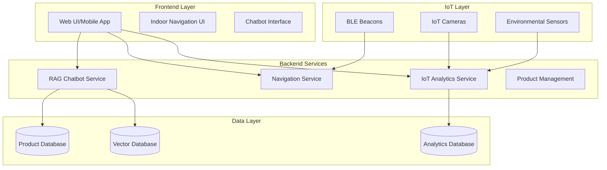
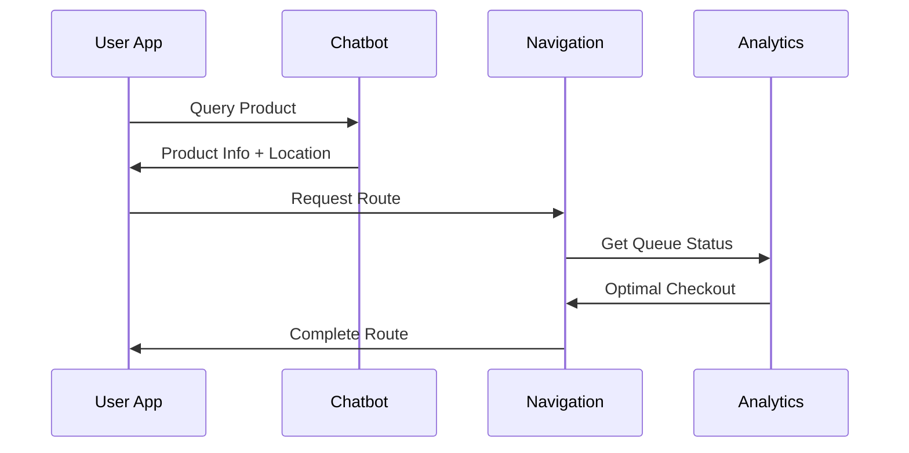
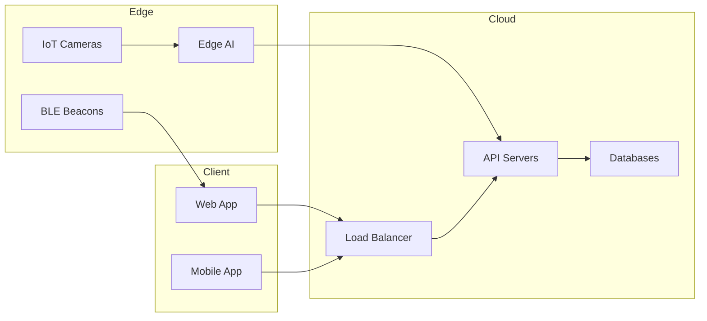

# Hệ thống Siêu thị Thông minh: IoT-AI Retail Assistant

## 1. Tổng quan Hệ thống

Hệ thống bao gồm 3 module chính tích hợp chặt chẽ với nhau:

1. **RAG Chatbot Tư vấn Thông minh**
2. **Hệ thống Định vị và Dẫn đường Trong nhà**
3. **Hệ thống Phân tích Luồng Khách hàng**

### 1.1 Kiến trúc Tổng thể



## 2. Chi tiết Từng Module

### 2.1 RAG Chatbot Module

#### 2.1.1 Kiến trúc

- **Frontend**: Web Interface
- **Backend**: Flask API + MongoDB
- **AI Models**:
  - Embedding: SentenceTransformer (paraphrase-multilingual-MiniLM-L12-v2)
  - LLM: Google Gemini Pro
  - Vector DB: MongoDB Atlas Vector Search

#### 2.1.2 Tính năng

1. **Tư vấn Sản phẩm**
   - Tìm kiếm ngữ nghĩa thông minh
   - So sánh sản phẩm
   - Đề xuất sản phẩm tương tự

2. **Phân tích & Thống kê**
   - Biểu đồ xu hướng mua sắm
   - Báo cáo doanh số
   - Phân tích hành vi người dùng

3. **Tích hợp Navigation**
   - Liên kết với hệ thống dẫn đường
   - Chỉ dẫn đến sản phẩm
   - Tối ưu lộ trình mua sắm

### 2.2 Indoor Navigation Module

#### 2.2.1 Kiến trúc

- **Frontend**: PWA với Web Bluetooth API
- **Positioning**: BLE Beacon Trilateration
- **Maps**: Mapbox GL JS / Custom Indoor Maps
- **Hardware**: BG220-EK BLE Beacons

#### 2.2.2 Công nghệ Core

1. **Định vị**
   ```javascript
   // Trilateration từ RSSI của 3 beacon gần nhất
   function computePosition(beaconData) {
     const distances = beaconData.map(b => rssiToDistance(b.rssi));
     const coordinates = trilaterate(distances);
     return kalmanFilter.update(coordinates);
   }
   ```

2. **Thuật toán Đường đi**
   - A* Pathfinding
   - Dynamic rerouting
   - Obstacle avoidance

3. **UI/UX**
   - Interactive indoor maps
   - Real-time position updates
   - Turn-by-turn navigation

### 2.3 IoT Analytics Module

#### 2.3.1 Kiến trúc

- **Sensors**: IoT Cameras + Computer Vision
- **Edge Computing**: Raspberry Pi 4
- **Analytics**: Real-time Stream Processing

#### 2.3.2 Tính năng

1. **Phân tích Luồng Người**
   ```python
   class QueueAnalytics:
       def analyze_queue(self, camera_feed):
           # Detect people using YOLOv5
           detections = self.model(camera_feed)
           # Count people in queue
           queue_length = len(detections)
           # Estimate waiting time
           wait_time = self.estimate_wait_time(queue_length)
           return QueueStatus(length=queue_length, wait_time=wait_time)
   ```

2. **Tối ưu hóa Quầy thu ngân**
   - Load balancing tự động
   - Dự đoán peak hours
   - Cảnh báo quá tải

3. **Dashboard Thời gian thực**
   - Heatmap khu vực đông đúc
   - Số liệu thống kê quầy thu ngân
   - Metrics hiệu suất

## 3. Tích hợp & Luồng dữ liệu

### 3.1 Luồng tương tác người dùng điển hình

1. **Khách hàng tìm kiếm sản phẩm**
   - Tương tác với chatbot
   - Nhận đề xuất sản phẩm
   - Xem thống kê & đánh giá

2. **Điều hướng đến sản phẩm**
   - Chatbot chuyển thông tin vị trí
   - Navigation system tính toán đường đi
   - Turn-by-turn guidance

3. **Tối ưu hóa thanh toán**
   - IoT Analytics xác định quầy ít người
   - Navigation điều hướng đến quầy optimal
   - Real-time updates về thời gian chờ

### 3.2 API Integration



## 4. Yêu cầu Phần cứng & Triển khai

### 4.1 Hardware Requirements

1. **Available Hardware**
   - XG26-DK2608A (2 units) - Multi-purpose IoT Gateway & Environmental Sensors
   - XG24-EK2703A (1 unit) - Motion & Presence Detection
   - BG220-EK (3 units) - BLE Beacons & Positioning
   - EFR32MG21 Series 2 (2 units) - Mesh Network Nodes
   - Raspberry Pi 4 model B (1 unit) - Edge Computing & Camera Processing

2. **Server Infrastructure**
   - Cloud: AWS/GCP
   - Edge computing (Raspberry Pi)
   - Load balancing services

### 4.1.1 Device Assignment & Architecture

1. **Navigation System**
   - BG220-EK (2 units)
     - Strategic placement at key intersections
     - Coverage optimization through careful positioning
   - EFR32MG21 (1 unit) - Mesh network coordination

2. **Queue Management**
   - Raspberry Pi 4 (1 unit, shared)
     - Camera processing
     - Edge computing
     - Central data aggregation
   - XG26-DK2608A (1 unit) - Queue monitoring

3. **Environmental Monitoring**
   - XG26-DK2608A (1 unit)
     - Temperature, humidity monitoring
     - Air quality sensors
   - XG24-EK2703A (1 unit)
     - Motion detection
     - Occupancy monitoring
   - BG220-EK (1 unit)
     - Customer flow tracking
   - EFR32MG21 (1 unit)
     - Sensor data mesh network

### 4.2 Deployment Architecture



## 5. Bảo mật & Quyền riêng tư

### 5.1 Data Security

- End-to-end encryption
- Secure WebSocket connections
- Token-based authentication

### 5.2 Privacy Measures

- Anonymized analytics
- GDPR compliance
- Data retention policies

## 6. Kế hoạch Mở rộng

### 6.1 Future Features

1. **AI Enhancements**
   - Advanced product recommendations
   - Predictive analytics
   - Voice navigation

2. **IoT Integration**
   - Smart shelf monitoring
   - Inventory tracking
   - Environmental controls

3. **User Experience**
   - AR navigation
   - Personalized shopping lists
   - Social features

### 6.2 Scaling Strategy

- Microservices architecture
- Containerization (Docker/K8s)
- Geographic distribution

## 7. Monitoring & Maintenance

### 7.1 System Health

- Real-time monitoring
- Automated alerts
- Performance metrics

### 7.2 Updates & Maintenance

- Rolling updates
- Backup strategies
- Disaster recovery
