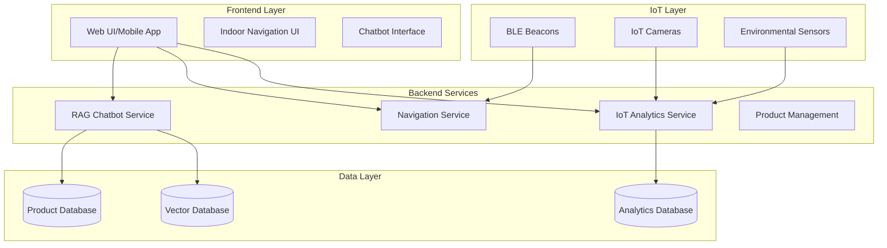
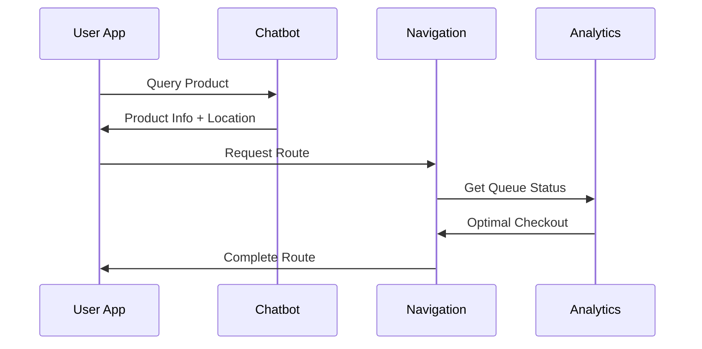
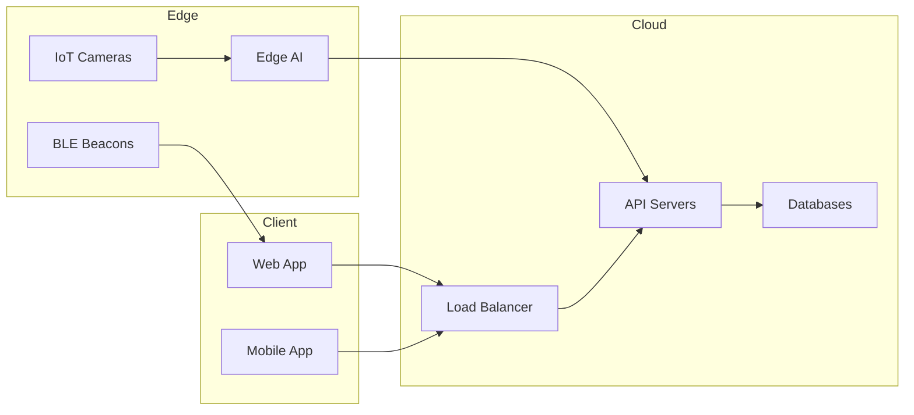
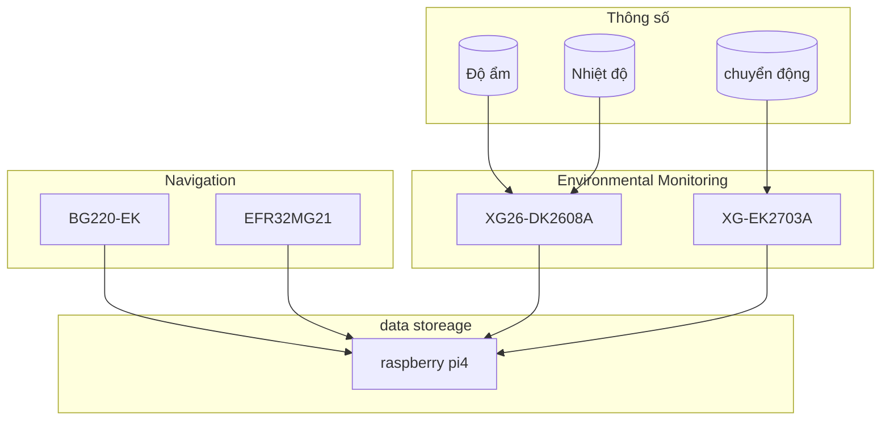

# Hệ thống Siêu thị Thông minh: IoT-AI Retail Assistant

## 1. Tổng quan Hệ thống

Hệ thống bao gồm 3 module chính tích hợp chặt chẽ với nhau:

1. **RAG Chatbot Tư vấn Thông minh**
2. **Hệ thống Định vị và Dẫn đường Trong nhà**
3. **Hệ thống Phân tích Luồng Khách hàng**

### 1.1 Kiến trúc Tổng thể



## 2. Chi tiết Từng Module

### 2.1 RAG Chatbot Module

#### 2.1.1 Kiến trúc

- **Frontend**: Web Interface
- **Backend**: Flask API + MongoDB
- **AI Models**:
  - Embedding: SentenceTransformer (paraphrase-multilingual-MiniLM-L12-v2)
  - LLM: Google Gemini Pro
  - Vector DB: MongoDB Atlas Vector Search

#### 2.1.2 Tính năng

1. **Tư vấn Sản phẩm**
   - Tìm kiếm ngữ nghĩa thông minh
   - So sánh sản phẩm
   - Đề xuất sản phẩm tương tự

2. **Phân tích & Thống kê**
   - Biểu đồ xu hướng mua sắm
   - Báo cáo doanh số
   - Phân tích hành vi người dùng

3. **Tích hợp Navigation**
   - Liên kết với hệ thống dẫn đường
   - Chỉ dẫn đến sản phẩm
   - Tối ưu lộ trình mua sắm

### 2.2 Indoor Navigation Module

#### 2.2.1 Kiến trúc

- **Frontend**: PWA với Web Bluetooth API
- **Positioning**: BLE Beacon Trilateration
- **Maps**: Mapbox GL JS / Custom Indoor Maps
- **Hardware**: BG220-EK BLE Beacons

#### 2.2.2 Công nghệ Core

1. **Định vị**
   ```javascript
   // Trilateration từ RSSI của 3 beacon gần nhất
   function computePosition(beaconData) {
     const distances = beaconData.map(b => rssiToDistance(b.rssi));
     const coordinates = trilaterate(distances);
     return kalmanFilter.update(coordinates);
   }
   ```

2. **Thuật toán Đường đi**
   - A* Pathfinding
   - Dynamic rerouting
   - Obstacle avoidance

3. **UI/UX**
   - Interactive indoor maps
   - Real-time position updates
   - Turn-by-turn navigation

### 2.3 IoT Analytics Module

#### 2.3.1 Kiến trúc

- **Sensors**: IoT Cameras + Computer Vision
- **Edge Computing**: Raspberry Pi 4
- **Analytics**: Real-time Stream Processing

#### 2.3.2 Tính năng

1. **Phân tích Luồng Người**
   ```python
   class QueueAnalytics:
       def analyze_queue(self, camera_feed):
           # Detect people using YOLOv5
           detections = self.model(camera_feed)
           # Count people in queue
           queue_length = len(detections)
           # Estimate waiting time
           wait_time = self.estimate_wait_time(queue_length)
           return QueueStatus(length=queue_length, wait_time=wait_time)
   ```

2. **Tối ưu hóa Quầy thu ngân**
   - Load balancing tự động
   - Dự đoán peak hours
   - Cảnh báo quá tải

3. **Dashboard Thời gian thực**
   - Heatmap khu vực đông đúc
   - Số liệu thống kê quầy thu ngân
   - Metrics hiệu suất

## 3. Tích hợp & Luồng dữ liệu

### 3.1 Luồng tương tác người dùng điển hình

1. **Khách hàng tìm kiếm sản phẩm**
   - Tương tác với chatbot
   - Nhận đề xuất sản phẩm
   - Xem thống kê & đánh giá

2. **Điều hướng đến sản phẩm**
   - Chatbot chuyển thông tin vị trí
   - Navigation system tính toán đường đi
   - Turn-by-turn guidance

3. **Tối ưu hóa thanh toán**
   - IoT Analytics xác định quầy ít người
   - Navigation điều hướng đến quầy optimal
   - Real-time updates về thời gian chờ

### 3.2 API Integration



## 4 Phân Bổ Thiết Bị & Kiến Trúc Triển Khai

### 4.1.1 Hệ thống Điều Hướng (Navigation System)

- **BG220-EK (2 thiết bị)**
  - Đặt tại các giao điểm chiến lược
  - Tối ưu vùng phủ bằng cách bố trí hợp lý
- **EFR32MG21 (1 thiết bị)**
  - Điều phối mạng mesh nội bộ

### 4.1.2 Quản lý Hàng chờ (Queue Management)

- **Raspberry Pi 4 (1 thiết bị, dùng chung)**
  - Xử lý hình ảnh từ camera
  - Điện toán biên (edge computing)
  - Tổng hợp dữ liệu trung tâm
- **XG26-DK2608A (1 thiết bị)**
  - Theo dõi trạng thái hàng chờ

### 4.1.3 Giám sát Môi trường (Environmental Monitoring)

- **XG26-DK2608A (1 thiết bị)**
  - Theo dõi nhiệt độ, độ ẩm
  - Cảm biến chất lượng không khí
- **XG24-EK2703A (1 thiết bị)**
  - Phát hiện chuyển động
  - Giám sát mức độ sử dụng không gian
- **BG220-EK (1 thiết bị)**
  - Theo dõi lưu lượng khách hàng
- **EFR32MG21 (1 thiết bị)**
  - Điều phối mạng mesh thu thập dữ liệu từ cảm biến

## 🗺️ 4.2 Kiến Trúc Triển Khai (Deployment Architecture)

> Hệ thống hoạt động theo kiến trúc phân tán gồm 3 phân vùng chức năng: Điều hướng, Quản lý hàng chờ và Giám sát môi trường. Các thiết bị giao tiếp qua mạng mesh sử dụng Zigbee/Thread, điều phối bởi EFR32MG21. Raspberry Pi đảm nhiệm vai trò xử lý biên và tổng hợp dữ liệu trung tâm.


## 5. Chức năng và sơ đồ của phần cứng
### XG24-EK2703A (EFR32xG24 Explorer Kit)
SoC sử dụng: EFR32MG24

- Tính năng nổi bật

mikroBUS socket và Qwiic connector cho phép mở rộng phần cứng
Debugger J-Link tích hợp

Giao diện USB, nút nhấn và đèn LED​
Silicon Labs
+5
digikey.se
+5
DigiKey
+5
Manuals+
+5
Silicon Labs
+5
Silicon Labs
+5
Manuals+
+1
Silicon Labs
+1
Silicon Labs

- Chức năng chân (pin):

mikroBUS Socket:

AN: PB00 – Analog input (IADC0)

RST: PC08 – Reset

CS: PC00 – Chip Select (SPI)

SCK: PC01 – SPI Clock

MISO: PC02 – SPI MISO

MOSI: PC03 – SPI MOSI

PWM: PB01 – PWM output

INT: PC09 – Interrupt

TX: PA05 – UART TX

RX: PA06 – UART RX​
Manuals+
+2
Silicon Labs
+2
Silicon Labs
+2

### XG26-DK2608A (EFR32xG26 Dev Kit)
SoC sử dụng: EFR32MG26

- Tính năng nổi bật:

5 cảm biến môi trường tích hợp

Microphone stereo I2S

Kết nối Qwiic và 20 chân breakout hỗ trợ I²C, SPI, UART, GPIO

Hỗ trợ cập nhật firmware qua OTA với bộ nhớ flash 32 Mbit​
Manuals+
+8
Manuals+
+8
DigiKey
+8
Silicon Labs
+6
Mouser Electronics
+6
Manuals+
+6
Zephyr Project Documentation
+22
Manuals+
+22
Silicon Labs
+22

- Chức năng chân (pin):

Qwiic Connector:

GND

3.3V (VMCU)

SDA: PC05

SCL: PC04​
Silicon Labs
+3
Silicon Labs
+3
Silicon Labs
+3
Zephyr Project Documentation
+3
Silicon Labs
+3
Silicon Labs
+3

Mini Simplicity Connector (10-pin):

Hỗ trợ debug và phân tích năng lượng​

20 chân breakout:

Cung cấp truy cập đến các giao diện như I²C, SPI, UART, GPIO từ EFR32MG26

### BG220-EK (BGM220 Explorer Kit)
SoC sử dụng: EFR32BG22

- Tính năng nổi bật:

Hỗ trợ Bluetooth 5.2

Công suất phát lên đến +6 dBm

Tiêu thụ năng lượng thấp, phù hợp cho thiết bị IoT​
Zephyr Project Documentation
+12
Silicon Labs
+12
Mouser Electronics
+12
radiolocman.com

- Chức năng chân (pin):

GPIO: Có thể cấu hình cho các chức năng như UART, SPI, I²C, PWM

Chân nguồn: VDD, GND

Chân RF: TX/RX cho ăng-ten

Chân debug: SWDIO, SWCLK

### EFR32MG21 (SoC)
Vi điều khiển: ARM Cortex-M33 @ 80 MHz

Bộ nhớ: Lên đến 1 MB Flash và 96 KB RAM

- Tính năng nổi bật:

Hỗ trợ đa giao thức: Zigbee, Thread, Bluetooth Low Energy (BLE)

Bộ xử lý bảo mật phần cứng tích hợp

Bộ thu phát RF 2.4 GHz với công suất phát lên đến +20 dBm​
Silicon Labs
+3
Farnell
+3
GitHub
+3

- Chức năng chân (pin):

GPIO: Đa chức năng, có thể cấu hình cho các giao thức như UART, SPI, I²C

Chân nguồn: VDD, GND

Chân RF: TX/RX cho ăng-ten

Chân debug: SWDIO, SWCLK

### SƠ ĐỒ KHỐI HỆ THỐNG



## 6. Bảo mật & Quyền riêng tư

### 6.1 Data Security

- End-to-end encryption
- Secure WebSocket connections
- Token-based authentication
  


### 6.2 Privacy Measures

- Anonymized analytics
- GDPR compliance
- Data retention policies

## 7. Kế hoạch Mở rộng

### 7.1 Future Features

1. **AI Enhancements**
   - Advanced product recommendations
   - Predictive analytics
   - Voice navigation

2. **IoT Integration**
   - Smart shelf monitoring
   - Inventory tracking
   - Environmental controls

3. **User Experience**
   - AR navigation
   - Personalized shopping lists
   - Social features

### 7.2 Scaling Strategy

- Microservices architecture
- Containerization (Docker/K8s)
- Geographic distribution

## 8. Monitoring & Maintenance

### 8.1 System Health

- Real-time monitoring
- Automated alerts
- Performance metrics

### 8.2 Updates & Maintenance

- Rolling updates
- Backup strategies
- Disaster recovery
