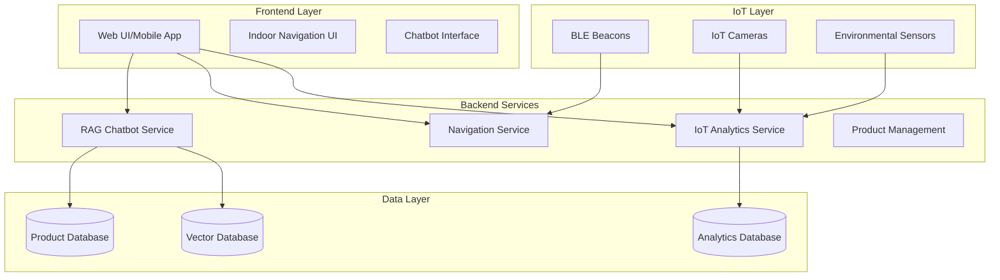
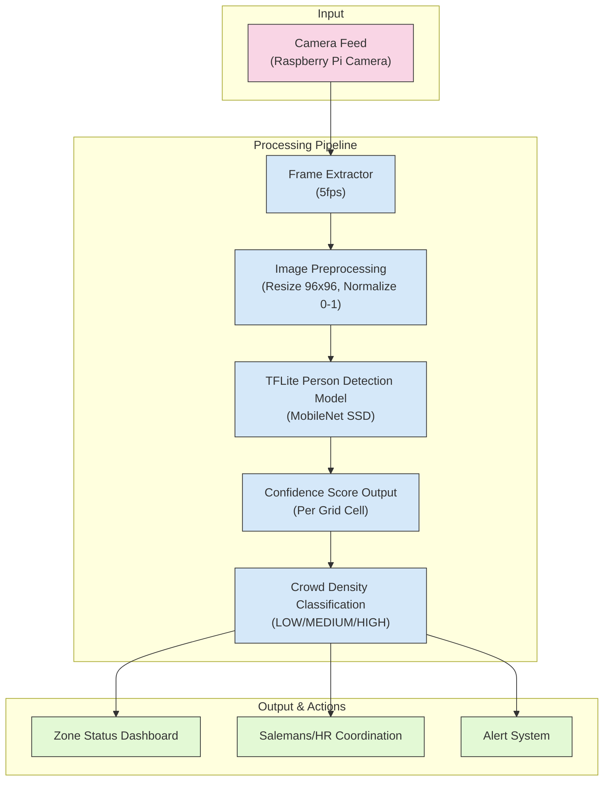
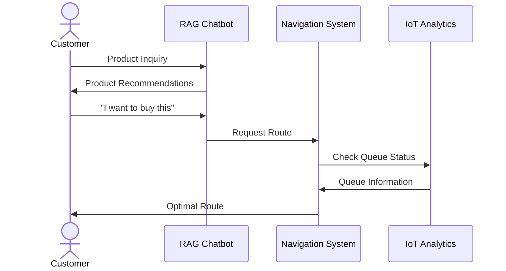

# Tài liệu Dự án IoT-AI Retail Assistant

Dự án IoT-AI Retail Assistant kết hợp 3 module chính để cung cấp giải pháp toàn diện cho hệ thống bán lẻ thông minh.

## Cấu trúc Tài liệu

1. [Tổng quan Hệ thống](document/1_overview.md)
2. [RAG Chatbot](document/2_chatbot.md)
3. [Indoor Navigation](document/3_navigation.md)
4. [IoT Analytics](document/4_analytics.md)
5. [Kế hoạch Thực hiện](document/5_implementation_plan.md)
6. [Kiến trúc Module](document/6_module_architecture.md)
7. [Crowd Density Detection](document/7_crowd_detection.md)

## Kiến trúc Tổng thể

## Hệ thống Phân tích Mật độ Đám đông

## Tương tác Người dùng

