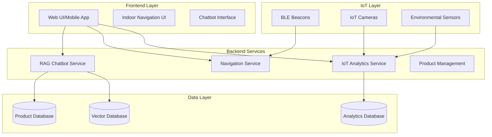
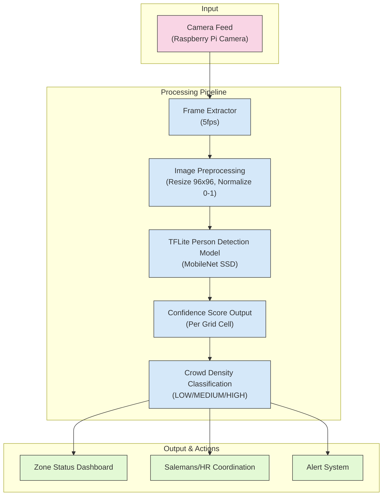
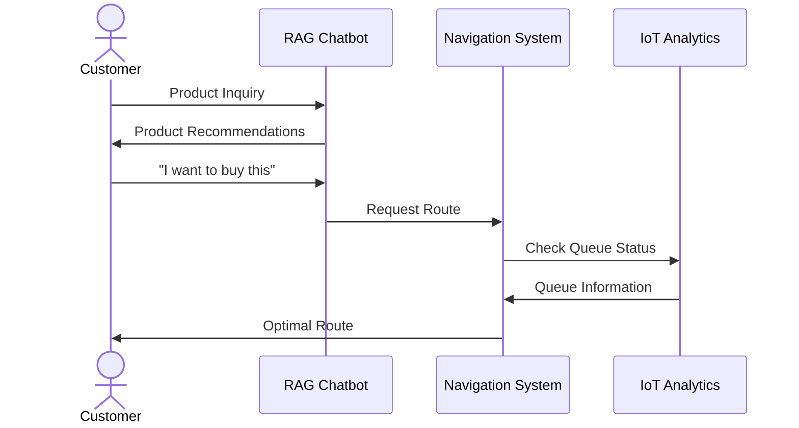

# Tài liệu Dự án IoT-AI Retail Assistant

Dự án IoT-AI Retail Assistant kết hợp 3 module chính để cung cấp giải pháp toàn diện cho hệ thống bán lẻ thông minh.

## Cấu trúc Tài liệu

1. [Tổng quan Hệ thống](document/1_overview.md)
2. [RAG Chatbot](document/2_chatbot.md)
3. [Indoor Navigation](document/3_navigation.md)
4. [IoT Analytics](document/4_analytics.md)
5. [Kế hoạch Thực hiện](document/5_implementation_plan.md)
6. [Kiến trúc Module](document/6_module_architecture.md)
7. [Crowd Density Detection](document/7_crowd_detection.md)
8. [Cashier Queue Counting](document/8_cashier_queue.md)

## Kiến trúc Tổng thể

Giới thiệu

Việc tối ưu trải nghiệm người dùng trong các trung tâm thương mại, sân bay hoặc nhà máy hiện đại đòi hỏi sự tích hợp giữa hệ thống định vị, dữ liệu thời gian thực và tương tác thông minh. Đề tài này trình bày kiến trúc một hệ thống đa lớp bao gồm chatbot AI RAG, điều hướng trong nhà, và cảm biến IoT nhằm mang lại khả năng tương tác, hỗ trợ và giám sát thông minh cho người dùng và nhà quản lý.

 Cấu trúc hệ thống tổng thể
 
Hệ thống chia thành 4 lớp chính:

a. Frontend Layer

Web UI/Mobile App: Giao diện chính để người dùng truy cập hệ thống

Indoor Navigation UI: Giao diện điều hướng trong nhà

Chatbot Interface: Giao diện tương tác với chatbot

b. IoT Layer

BLE Beacons: Thiết bị định vị giúp xác định vị trí người dùng trong nhà

IoT Cameras: Camera giám sát gửi dữ liệu phân tích

Environmental Sensors: Cảm biến môi trường cung cấp dữ liệu nhiệt độ, độ ẩm...

c. Backend Services

RAG Chatbot Service: Hệ thống truy hồi kết hợp mô hình sinh (Retrieval-Augmented Generation) để trả lời truy vấn người dùng

Navigation Service: Xử lý điều hướng trong nhà từ dữ liệu vị trí và beacons

IoT Analytics Service: Thu thập và phân tích dữ liệu từ camera và cảm biến

Product Management: Quản lý thông tin sản phẩm, trạng thái...

d. Data Layer

Product Database: Lưu trữ thông tin sản phẩm

Vector Database: Lưu embedding của tài liệu dùng cho RAG

Analytics Database: Lưu dữ liệu phân tích từ hệ thống IoT

Luồng hoạt động chính

Người dùng tương tác qua ứng dụng hoặc chatbot → Chatbot gọi dữ liệu từ vector database và product database

Dữ liệu định vị từ BLE beacons gửi đến Navigation Service

Dữ liệu từ camera và cảm biến được xử lý bởi IoT Analytics Service → Lưu xuống Analytics Database

Product Management đồng bộ dữ liệu IoT với dữ liệu sản phẩm

## Hệ thống Phân tích Mật độ Đám đông

Giới thiệu

Trong bối cảnh cần tối ưu hóa an ninh và quản lý nguồn lực tại các khu vực công cộng hoặc cửa hàng bán lẻ, việc giám sát mật độ đám đông trở nên cần thiết. Đề tài này trình bày một giải pháp sử dụng camera Raspberry Pi tích hợp mô hình học sâu để phát hiện người và phân loại mật độ theo vùng. Hệ thống được thiết kế nhẹ, chạy trên thiết bị nhúng với tốc độ xử lý theo thời gian thực (~5fps).

Dữ liệu đầu vào
   
Nguồn: Camera Raspberry Pi

Tốc độ trích xuất khung hình: 5fps (khung hình mỗi giây)

3.2. Quy trình xử lý

Hệ thống xử lý đầu vào theo chuỗi các bước:

Trích xuất khung hình (Frame Extractor)
Lấy ảnh từ camera với tần suất 5fps.

Tiền xử lý ảnh (Image Preprocessing)

Thay đổi kích thước ảnh thành 96×96 pixel

Chuẩn hóa ảnh về khoảng giá trị [0, 1]

Phát hiện người (Person Detection)

Sử dụng mô hình TFLite MobileNet SSD để phát hiện người trong ảnh.

SSD (Single Shot Detector) là một kiến trúc CNN cho phép phát hiện vật thể nhanh chóng và hiệu quả trên thiết bị giới hạn tài nguyên.

Tính toán điểm tin cậy (Confidence Score)

Mỗi đối tượng được phát hiện đi kèm với xác suất tin cậy.

Các vùng lưới (grid cell) trong ảnh sẽ nhận tổng điểm tin cậy của các phát hiện nằm trong vùng đó.

Phân loại mật độ đám đông (Crowd Density Classification)

Dựa trên tổng số người và vị trí trong vùng, hệ thống phân loại mật độ theo 3 mức:
LOW, MEDIUM, HIGH

Đầu ra
Thông tin đầu ra được tích hợp vào các hệ thống khác:

Zone Status Dashboard: Bảng điều khiển thể hiện tình trạng vùng theo thời gian thực

Salesman/HR Coordination: Điều phối nhân sự đến vùng đông người

Alert System: Gửi cảnh báo khi mật độ vượt ngưỡng

## Tương tác Người dùng

1. Tổng Quan Hệ Thống
2. 
Hệ thống bao gồm các thành phần chính sau:

Customer (Khách hàng): Người sử dụng hệ thống để nhận hỗ trợ trong việc tìm kiếm sản phẩm hoặc định tuyến.

RAG Chatbot: Một chatbot sử dụng công nghệ Retrieval-Augmented Generation (RAG) để xử lý yêu cầu và đưa ra gợi ý sản phẩm.

Navigation System (Hệ thống Định tuyến): Hệ thống chịu trách nhiệm tính toán và cung cấp đường đi tối ưu dựa trên thông tin trạng thái hàng đợi.

IoT Analytics (Phân tích IoT): Hệ thống thu thập và phân tích dữ liệu từ các thiết bị IoT để cung cấp thông tin về trạng thái hàng đợi và mật độ đám đông.

Các thành phần này tương tác với nhau thông qua các luồng dữ liệu rõ ràng, nhằm đáp ứng nhu cầu của khách hàng trong việc tìm kiếm sản phẩm và di chuyển hiệu quả. Hệ thống hoạt động theo thời gian thực, đảm bảo khách hàng nhận được phản hồi nhanh chóng và chính xác.

 Luồng 1: Product Inquiry/Product Recommendations (Tìm kiếm và Gợi ý Sản phẩm)
 
Luồng này mô tả cách khách hàng tương tác với RAG Chatbot để nhận gợi ý sản phẩm. Tôi sẽ giải thích từng bước chi tiết.

Bước 1: Khách hàng gửi Product Inquiry (Yêu cầu về sản phẩm)

Khách hàng bắt đầu bằng cách gửi một yêu cầu về sản phẩm đến RAG Chatbot.

Giao diện tương tác:

Khách hàng sử dụng một giao diện chatbot trên ứng dụng di động, website, hoặc thiết bị tại chỗ để gửi yêu cầu.

Yêu cầu có thể ở dạng văn bản hoặc giọng nói, và nếu là giọng nói, hệ thống sẽ sử dụng công nghệ speech-to-text để chuyển đổi thành văn bản.

Định dạng dữ liệu:

Yêu cầu được gửi dưới dạng chuỗi văn bản, chứa thông tin về nhu cầu tìm kiếm sản phẩm của khách hàng.

Nếu giao tiếp qua API, yêu cầu được đóng gói trong định dạng dữ liệu phù hợp, chẳng hạn như một payload chứa thông tin về khách hàng, yêu cầu, và thời gian gửi.

Công nghệ truyền tải:

Hệ thống sử dụng giao thức HTTP/HTTPS qua REST API hoặc WebSocket để gửi yêu cầu từ giao diện người dùng đến RAG Chatbot.

WebSocket được ưu tiên cho tương tác thời gian thực, vì nó cho phép giao tiếp hai chiều nhanh chóng giữa khách hàng và chatbot.

Vai trò của bước này: Đây là điểm khởi đầu của luồng, nơi khách hàng bày tỏ nhu cầu tìm kiếm hoặc gợi ý sản phẩm, khởi động quá trình xử lý của chatbot.

Bước 2: RAG Chatbot xử lý yêu cầu và trả về Product Recommendations (Gợi ý sản phẩm)

Sau khi nhận được yêu cầu, RAG Chatbot xử lý và trả về các gợi ý sản phẩm phù hợp. Đây là bước quan trọng nhất trong luồng, và tôi sẽ giải thích chi tiết cách chatbot hoạt động.

Công nghệ RAG (Retrieval-Augmented Generation):

RAG Chatbot kết hợp hai thành phần chính: Retrieval (Truy xuất) và Generation (Tạo văn bản).

Retrieval Component (Truy xuất):

Chatbot truy xuất thông tin từ cơ sở dữ liệu hoặc tài liệu nội bộ (knowledge base) để tìm kiếm các sản phẩm phù hợp với yêu cầu của khách hàng.

Công nghệ truy xuất sử dụng các thuật toán tìm kiếm như vector search, dựa trên embedding của câu hỏi, để xác định thông tin liên quan.

Generation Component (Tạo văn bản):

Sau khi truy xuất thông tin, chatbot sử dụng mô hình ngôn ngữ tự nhiên (NLP) để tạo câu trả lời tự nhiên và dễ hiểu.

Mô hình NLP thường là các mô hình Transformer hoặc các biến thể nhẹ hơn để tối ưu hóa hiệu suất.

Quy trình xử lý:

Intent Recognition (Nhận diện ý định): Chatbot phân tích câu hỏi để xác định ý định của khách hàng, chẳng hạn như ý định mua hàng.

Entity Extraction (Trích xuất thực thể): Chatbot trích xuất các thông tin cụ thể từ câu hỏi, như loại sản phẩm, thương hiệu, hoặc giá cả, dựa trên ngữ cảnh hoặc lịch sử tương tác.

Recommendation Engine (Công cụ gợi ý): Chatbot sử dụng thuật toán gợi ý:

Collaborative Filtering: Gợi ý dựa trên hành vi của những khách hàng khác có đặc điểm tương tự.

Content-based Filtering: Gợi ý dựa trên đặc điểm của sản phẩm phù hợp với yêu cầu.

Tạo phản hồi: Chatbot kết hợp thông tin truy xuất được với mô hình ngôn ngữ để tạo câu trả lời tự nhiên, chứa danh sách các sản phẩm gợi ý.

Hiệu suất:

Thời gian xử lý: Dưới 1 giây để đảm bảo trải nghiệm.

Độ chính xác: Phụ thuộc vào chất lượng cơ sở dữ liệu và khả năng hiểu ngữ cảnh của mô hình NLP.

Triển khai:

RAG Chatbot có thể được triển khai trên đám mây hoặc tại chỗ, tùy thuộc vào yêu cầu bảo mật và hiệu suất.

Công nghệ hỗ trợ bao gồm các framework xử lý ngôn ngữ tự nhiên và mô hình AI để xây dựng và triển khai chatbot.

Vai trò của bước này: RAG Chatbot cung cấp gợi ý sản phẩm nhanh chóng và chính xác, giúp khách hàng dễ dàng tìm thấy sản phẩm phù hợp mà không cần tìm kiếm thủ công.

Bước 3: Khách hàng nhận Product Recommendations

Khách hàng nhận được gợi ý sản phẩm từ RAG Chatbot và sử dụng thông tin này để tiếp tục hành trình của mình.

Định dạng phản hồi:

Gợi ý bao gồm danh sách sản phẩm, có thể kèm theo thông tin bổ sung như giá cả, hình ảnh, hoặc vị trí, nếu tích hợp với các hệ thống khác.

Phương thức hiển thị:

Phản hồi được hiển thị trên giao diện chatbot, có thể bao gồm các yếu tố trực quan như hình ảnh hoặc liên kết để xem chi tiết.

Nếu tích hợp với ứng dụng di động, phản hồi có thể bao gồm nút để chuyển sang luồng định tuyến.

Tương tác tiếp theo:

Khách hàng có thể yêu cầu thêm thông tin hoặc chuyển sang yêu cầu định tuyến để đến khu vực sản phẩm.

Vai trò của bước này: Product Recommendations giúp khách hàng tiết kiệm thời gian, cung cấp thông tin cần thiết để ra quyết định.

Luồng 2: Optimal Route (Cung cấp Đường đi Tối ưu)

Luồng này mô tả cách khách hàng nhận đường đi tối ưu từ Navigation System, với sự hỗ trợ từ IoT Analytics để tránh các khu vực đông đúc. Tôi sẽ giải thích từng bước chi tiết.

Bước 1: Khách hàng yêu cầu Optimal Route (Đường đi tối ưu)

Khách hàng gửi yêu cầu đường đi tối ưu đến RAG Chatbot hoặc trực tiếp đến Navigation System.

Giao diện tương tác:

Yêu cầu có thể được gửi qua chatbot, tích hợp với RAG Chatbot, hoặc qua một ứng dụng định vị.

Yêu cầu có thể ở dạng văn bản, giọng nói, hoặc thao tác trực tiếp, như chọn điểm đến trên giao diện bản đồ.

Dữ liệu cần thiết:

Vị trí hiện tại của khách hàng, nếu hệ thống hỗ trợ định vị.

Điểm đến mà khách hàng muốn đến.

Yêu cầu bổ sung, như tránh khu vực đông đúc.

Vai trò của bước này: Đây là điểm khởi đầu để khách hàng yêu cầu hỗ trợ di chuyển, kích hoạt luồng định tuyến.

Bước 2: RAG Chatbot gửi Request Route đến Navigation System

Nếu yêu cầu được gửi qua chatbot, RAG Chatbot sẽ chuyển tiếp yêu cầu định tuyến (Request Route) đến Navigation System.

Quá trình xử lý trong RAG Chatbot:

Chatbot phân tích yêu cầu của khách hàng để xác định ý định là định tuyến.

Trích xuất thông tin cần thiết, như điểm đến của khách hàng.

Chuyển yêu cầu sang Navigation System dưới dạng một lệnh.

Tích hợp:

RAG Chatbot giao tiếp với Navigation System thông qua API, thường là REST API hoặc GraphQL.

Dữ liệu được đóng gói trong định dạng chuẩn, bao gồm thông tin về vị trí hiện tại, điểm đến, và các yêu cầu bổ sung.

Công nghệ truyền tải:

Sử dụng HTTP/HTTPS để gửi yêu cầu qua API.

Nếu cần xử lý thời gian thực, có thể sử dụng WebSocket để giao tiếp nhanh hơn.

Vai trò của bước này: RAG Chatbot đóng vai trò trung gian, đảm bảo yêu cầu của khách hàng được chuyển đến Navigation System một cách chính xác.

Bước 3: Navigation System gửi Check Queue Status đến IoT Analytics

Để tính toán đường đi tối ưu, Navigation System cần thông tin về trạng thái hàng đợi và mật độ đám đông tại các khu vực, vì vậy nó gửi yêu cầu Check Queue Status đến IoT Analytics.

Quá trình trong Navigation System:

Navigation System xác định các khu vực liên quan đến đường đi, từ điểm xuất phát đến điểm đích.

Gửi yêu cầu đến IoT Analytics để kiểm tra trạng thái của các khu vực này.

Tích hợp:

Giao tiếp giữa Navigation System và IoT Analytics thường thông qua API hoặc message queue, như MQTT hoặc RabbitMQ.

Message queue được sử dụng để xử lý dữ liệu thời gian thực với độ trễ thấp.

Yêu cầu bao gồm danh sách các khu vực cần kiểm tra.

IoT Analytics:

Hệ thống này thu thập dữ liệu từ các thiết bị IoT, như camera hoặc cảm biến, để phân tích trạng thái hàng đợi và mật độ đám đông.

Dữ liệu được xử lý để xác định các thông số như số lượng người, thời gian chờ, và mức độ đông đúc tại từng khu vực.

Hiệu suất:

IoT Analytics cần phản hồi trong khoảng thời gian rất ngắn, thường dưới vài trăm mili giây, để đảm bảo tính thời gian thực.

Dữ liệu phải được cập nhật liên tục để phản ánh chính xác trạng thái hiện tại.

Vai trò của bước này: Check Queue Status cung cấp thông tin quan trọng về tình trạng các khu vực, giúp Navigation System đưa ra quyết định định tuyến chính xác.

Bước 4: IoT Analytics trả về Queue Information

IoT Analytics xử lý yêu cầu và trả về thông tin trạng thái hàng đợi (Queue Information) cho Navigation System.

Dữ liệu trả về:

Thông tin bao gồm trạng thái mật độ, độ dài hàng đợi, và thời gian chờ tại từng khu vực.

Nguồn dữ liệu:

Dữ liệu được tổng hợp từ các thiết bị IoT, như camera hoặc cảm biến, hoặc từ các hệ thống phân tích mật độ đám đông sử dụng AI.

Dữ liệu có thể được lưu trữ tạm thời để giảm thời gian truy vấn, thường sử dụng hệ thống lưu trữ nhanh như bộ nhớ đệm.

Xử lý dữ liệu:

IoT Analytics sử dụng các thuật toán phân tích dữ liệu hoặc mô hình AI để xử lý và dự đoán xu hướng mật độ dựa trên dữ liệu thời gian thực và lịch sử.

Vai trò của bước này: Queue Information cung cấp dữ liệu cần thiết để Navigation System tính toán đường đi tối ưu, tránh các khu vực đông đúc.

Bước 5: Navigation System tính toán và trả về Optimal Route

Dựa trên thông tin từ IoT Analytics, Navigation System tính toán và trả về đường đi tối ưu (Optimal Route) cho khách hàng.

Quá trình tính toán:

Navigation System sử dụng thuật toán định tuyến để tìm đường đi:

Các thuật toán như Dijkstra hoặc A* được sử dụng để tìm đường đi ngắn nhất dựa trên khoảng cách giữa các khu vực.

A* thường được ưu tiên vì sử dụng heuristic để giảm thời gian tính toán.

Tích hợp Queue Information:

Hệ thống điều chỉnh trọng số của các khu vực dựa trên mật độ:

Khu vực có mật độ cao được gán trọng số cao, khiến đường đi qua khu vực này ít được ưu tiên.

Khu vực có mật độ thấp được gán trọng số thấp, ưu tiên chọn đường đi qua khu vực này.

Kết quả: Đường đi tối ưu bao gồm danh sách các điểm đi qua và hướng dẫn chi tiết.

Hiệu suất:

Thời gian tính toán: Dưới vài giây để đảm bảo tính thời gian thực.

Độ chính xác: Phụ thuộc vào dữ liệu từ IoT Analytics và dữ liệu bản đồ khu vực.

Triển khai:

Navigation System có thể được triển khai trên máy chủ đám mây hoặc tại chỗ, sử dụng các công nghệ xử lý đồ thị hoặc framework định tuyến.

Vai trò của bước này: Optimal Route cung cấp đường đi hiệu quả, giúp khách hàng di chuyển nhanh chóng và tránh các khu vực đông đúc.

Bước 6: Khách hàng nhận Optimal Route

Khách hàng nhận đường đi tối ưu từ Navigation System, thông qua RAG Chatbot hoặc trực tiếp qua ứng dụng định vị.

Hiển thị:

Đường đi được hiển thị trên ứng dụng di động hoặc thiết bị tại chỗ dưới dạng bản đồ hoặc hướng dẫn bằng văn bản/giọng nói.

Tương tác tiếp theo:

Khách hàng có thể yêu cầu định tuyến lại nếu tình hình thay đổi.

Hệ thống có thể tự động cập nhật đường đi nếu tích hợp với dữ liệu thời gian thực từ IoT Analytics.

Vai trò của bước này: Optimal Route giúp khách hàng di chuyển hiệu quả, tiết kiệm thời gian và cải thiện trải nghiệm tổng thể.

4. Tích hợp và Tương tác giữa các Thành phần

RAG Chatbot ↔ Navigation System:

RAG Chatbot đóng vai trò trung gian, nhận yêu cầu từ khách hàng và chuyển tiếp đến Navigation System.

Tích hợp qua API (REST API hoặc GraphQL) để đảm bảo giao tiếp nhanh chóng.

Chatbot nhận lại đường đi tối ưu từ Navigation System và hiển thị cho khách hàng dưới dạng phản hồi tự nhiên.

Navigation System ↔ IoT Analytics

Navigation System phụ thuộc vào IoT Analytics để nhận thông tin thời gian thực về trạng thái hàng đợi.

Tích hợp qua API hoặc message queue để xử lý dữ liệu với độ trễ thấp.

Navigation System gửi yêu cầu kiểm tra trạng thái hàng đợi và nhận lại thông tin để tính toán đường đi

Customer ↔ Hệ thống:

Khách hàng tương tác với hệ thống thông qua giao diện người dùng, có thể là chatbot, ứng dụng di động, hoặc thiết bị tại chỗ.

Hệ thống đảm bảo trải nghiệm mượt mà với độ trễ thấp:

RAG Chatbot: Phản hồi nhanh chóng, dưới 1 giây.

Navigation System: Cung cấp đường đi trong vòng vài giây.

6. Công nghệ và Hiệu suất

RAG Chatbot:

Công nghệ: Sử dụng mô hình RAG với các thành phần NLP (Natural Language Processing).

Retrieval: Vector search để truy xuất thông tin.

Generation: Mô hình Transformer-based để tạo phản hồi tự nhiên.

Hiệu suất:

Thời gian phản hồi: Dưới 1 giây.

Độ chính xác: Phụ thuộc vào chất lượng cơ sở dữ liệu và mô hình NLP.

Triển khai: Có thể chạy trên đám mây hoặc tại chỗ, tùy thuộc vào yêu cầu.

Navigation System:

Công nghệ:

Thuật toán định tuyến: Dijkstra, A*.

Dữ liệu bản đồ: Lưu trữ dưới dạng đồ thị với các node và edge.

Hiệu suất:

Thời gian tính toán: Dưới vài giây.

Độ chính xác: Phụ thuộc vào dữ liệu từ IoT Analytics và bản đồ khu vực.

Triển khai: Sử dụng các công nghệ xử lý đồ thị hoặc framework định tuyến.

IoT Analytics:

Công nghệ:

Thu thập dữ liệu từ camera và cảm biến IoT.

Phân tích dữ liệu: Sử dụng các thuật toán phân tích hoặc mô hình AI để xử lý mật độ đám đông.

Hiệu suất:

Thời gian phản hồi: Dưới vài trăm mili giây.

Cập nhật dữ liệu: Liên tục để đảm bảo tính thời gian thực.

Triển khai: Sử dụng hệ thống xử lý dữ liệu thời gian thực và bộ nhớ đệm để tối ưu hóa hiệu suất.

