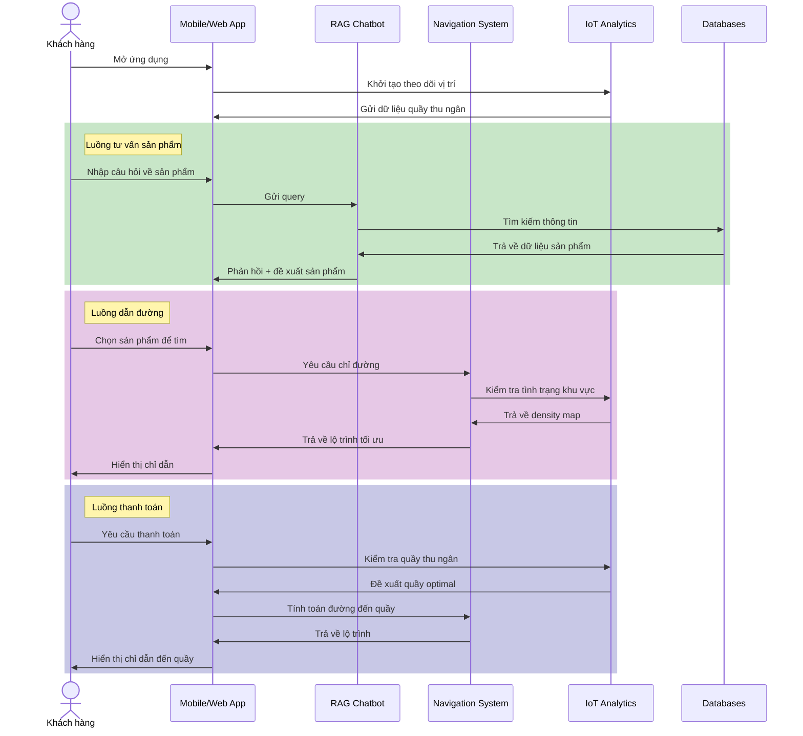
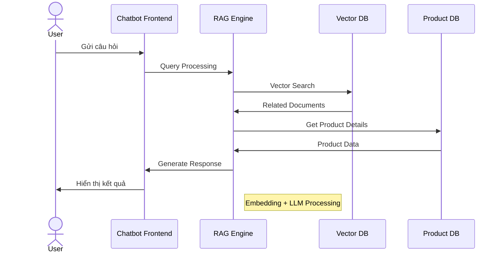
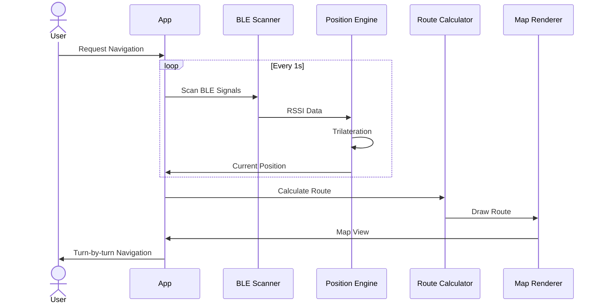
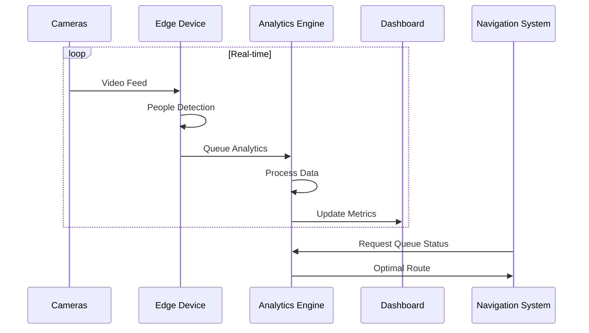
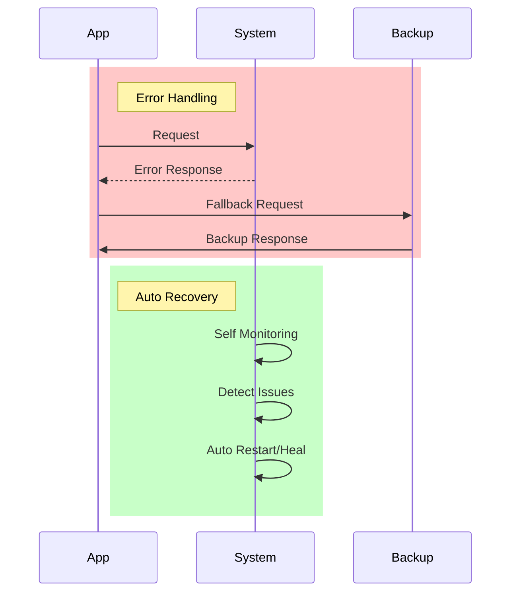
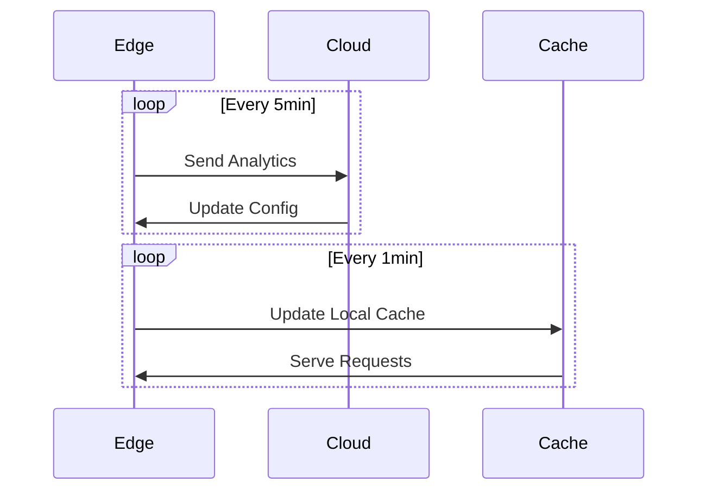

# Sequence Diagram cho Hệ thống IoT-AI Retail Assistant

## 1. Luồng Chính (Main Flow)

## 2. Luồng RAG Chatbot Detail

## 3. Luồng Indoor Navigation Detail

## 4. Luồng IoT Analytics Detail

## 5. Xử lý Lỗi và Recovery

## 6. Data Synchronization

Các sequence diagram trên mô tả:
1. Luồng chính của hệ thống
2. Chi tiết xử lý của RAG Chatbot
3. Chi tiết hoạt động của Indoor Navigation
4. Chi tiết phân tích IoT Analytics
5. Xử lý lỗi và recovery
6. Đồng bộ hóa dữ liệu

Mỗi module có thể hoạt động độc lập nhưng vẫn tích hợp chặt chẽ với nhau thông qua các API và event system. Việc này đảm bảo tính modular và khả năng scale của hệ thống.
