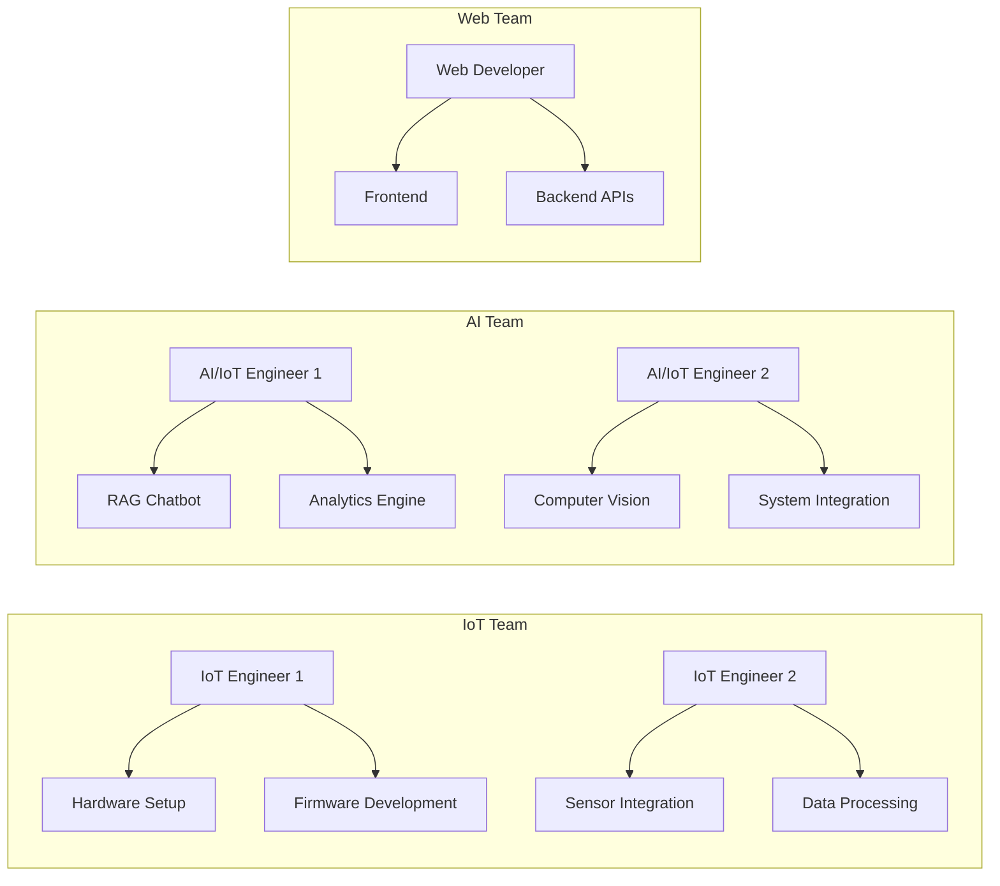
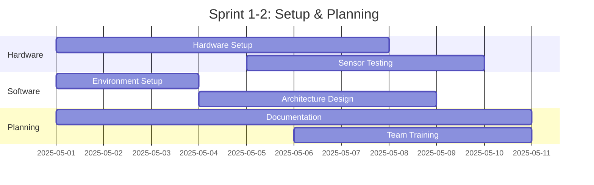
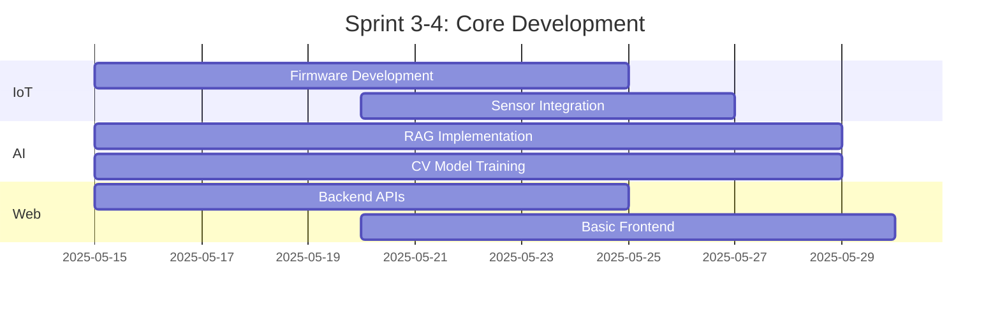
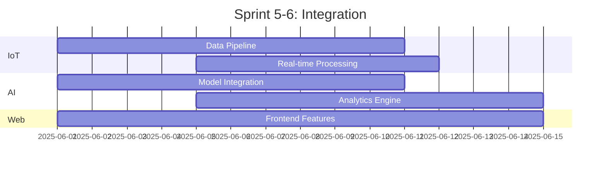
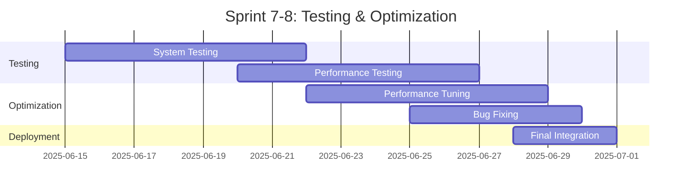
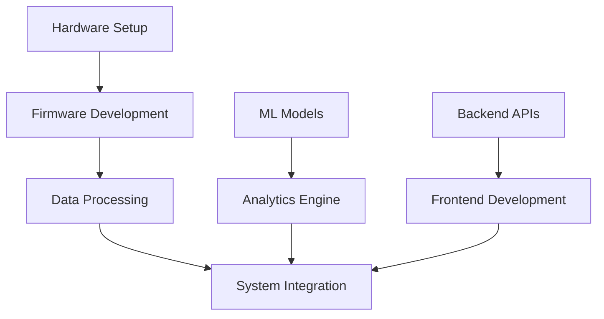

# IoT-AI Retail Assistant Project Implementation Plan

## 1. Team Information

### 1.1 Members and Expertise
- **IoT Engineer 1**: Hardware and firmware development
- **IoT Engineer 2**: Sensor integration and data processing
- **AI/IoT Engineer 1**: ML/DL and IoT data processing
- **AI/IoT Engineer 2**: Computer Vision and system integration
- **Web Developer**: Frontend and Backend development

### 1.2 Module Allocation

## 2. Timeline and Milestones

### Week 1-2: Setup andand Planning

### Week 3-4: Core Development

### Week 5-6: Integration

### Week 7-8: Testing và Optimization

## 3. Detailed Assignments 

### 3.1 IoT Engineer 1
#### Week 1-2
- Install and configure BG220-EK beacons
- Set up EFR32MG21 mesh network
- Write basic firmware for devices

#### Week 3-4
- Develop full firmware
- Optimize power management
- Configure mesh networking

#### Week 5-6
- Integrate with the backend system
- Build data pipeline
- Monitoring system

#### Week 7-8
- Testing and debugging
- Performance optimization
- Documentation

### 3.2 IoT Engineer 2
#### Week 1-2
- Set up XG26-DK2608A and XG24-EK2703A
- Configure Raspberry Pi
- Set up development environment

#### Week 3-4
- Integrate sensors
- Build a data processing pipeline
- Set up real-time monitoring

#### Week 5-6
- Stream processing implementation
- Sensor data aggregation
- System monitoring

#### Week 7-8
- Integration testing
- System optimization
- Technical documentation

### 3.3 AI/IoT Engineer 1
#### Week 1-2
- Set up ML environment
- Design RAG architecture
- Data preparation

#### Week 3-4
- Implement RAG model
- Vector search system
- Response generation

#### Week 5-6
- Model optimization
- Analytics engine
- Performance monitoring

#### Week 7-8
- System testing
- Model fine-tuning
- Documentation

### 3.4 AI/IoT Engineer 2
#### Week 1-2
- Set up computer vision environment
- Design a CV pipeline
- Test camera systems

#### Week 3-4
- Implement people detection
- Queue analysis system
- Movement tracking

#### Week 5-6
- Real-time processing
- System integration
- Performance optimization

#### Week 7-8
- End-to-end testing
- System optimization
- Technical documentation

### 3.5 Web Developer
#### Week 1-2
- Set up development environment
- Design system architecture
- API planning

#### Week 3-4
- Implement core APIs
- Basic frontend
- Authentication system

#### Week 5-6
- Advanced frontend features
- Real-time updates
- Dashboard implementation

#### Week 7-8
- UI/UX optimization
- Performance tuning
- Documentation

## 4. Dependencies và Risks

### 4.1 Dependencies

### 4.2 Risk Management

| Risk | Impact | Mitigation |
|------|--------|------------|
| Hardware Delays | High | Early ordering, backup suppliers |
| Integration Issues | Medium | Regular integration tests, modular design |
| Performance Problems | Medium | Continuous monitoring, early optimization |
| Technical Debt | Low | Code review, documentation |

## 5. Weekly Meetings

### Sprint Planning (Monday)
- Review last week's progress
- Set goals for current week
- Discuss blockers
- Assign tasks

### Technical Sync (Wednesday)
- Technical discussion
- Problem solving
- Code review
- Architecture decisions

### Sprint Review (Friday)
- Demo progress
- Review metrics
- Plan adjustments
- Documentation update

## 6. Delivery Checklist

### Phase 1 (Week 1-2)
- [ ] Hardware setup complete
- [ ] Development environment ready
- [ ] Architecture documented
- [ ] Team trained on tools

### Phase 2 (Week 3-4)
- [ ] Core features implemented
- [ ] Basic integration working
- [ ] Initial testing complete
- [ ] Documentation started

### Phase 3 (Week 5-6)
- [ ] All features integrated
- [ ] Real-time processing working
- [ ] Performance metrics established
- [ ] User documentation draft

### Phase 4 (Week 7-8)
- [ ] All tests passing
- [ ] Performance optimized
- [ ] Documentation complete
- [ ] System deployed

## 7. Success Metrics

### Technical Metrics
- Response time < 500ms
- System uptime > 99.9%
- ML model accuracy > 90%
- Real-time processing delay < 100ms

### Business Metrics
- Queue wait time reduction > 30%
- Customer satisfaction > 90%
- System adoption rate > 80%

## 8. Tools and Resources

### Development Tools
- Git for version control
- JIRA for task tracking
- Slack for communication
- VS Code for development

### Testing Tools
- PyTest for Python testing
- Jest for JavaScript testing
- JMeter for load testing
- Postman for API testing

### Monitoring Tools
- Prometheus for metrics
- Grafana for dashboards
- ELK Stack for logs
