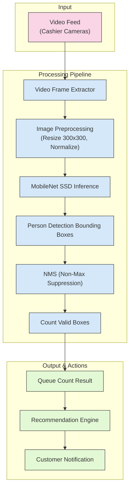
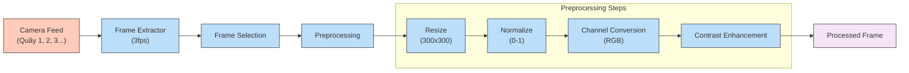
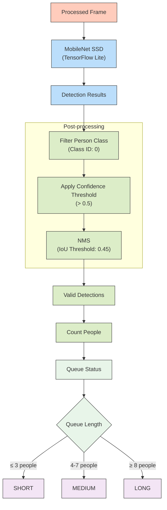
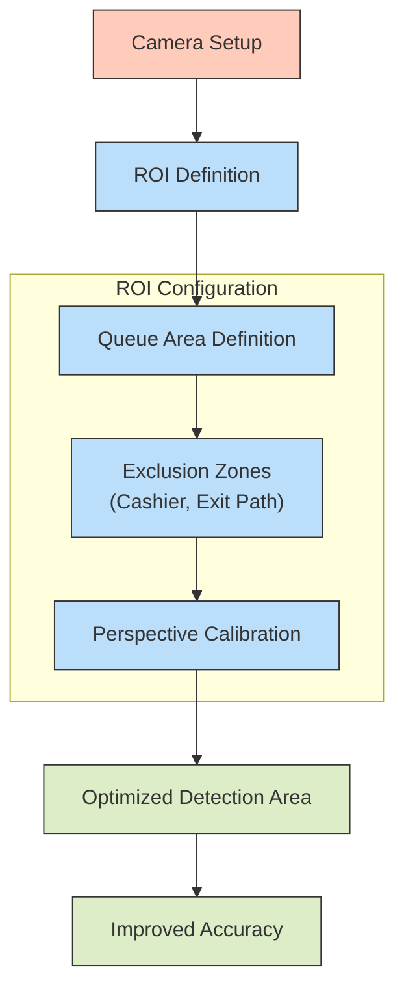
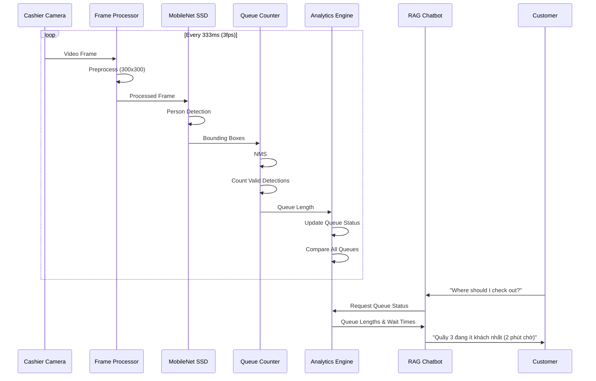
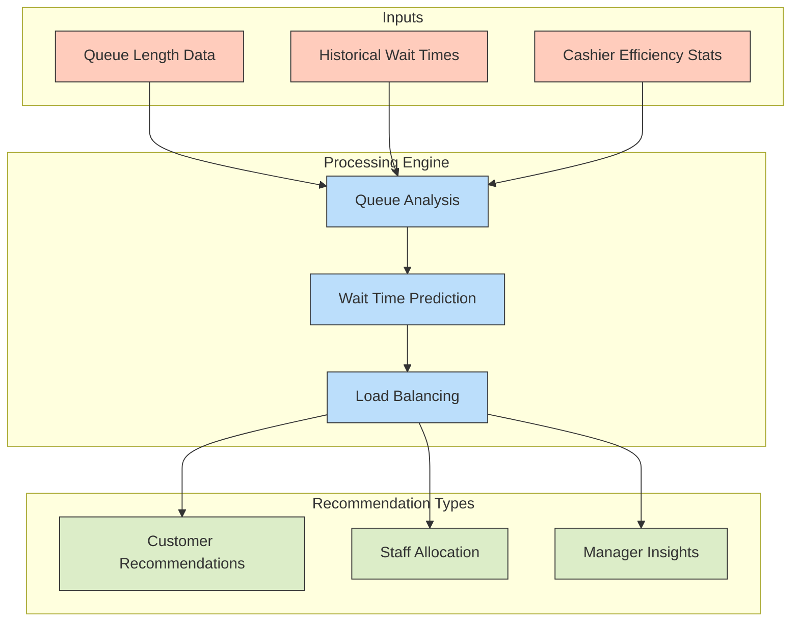
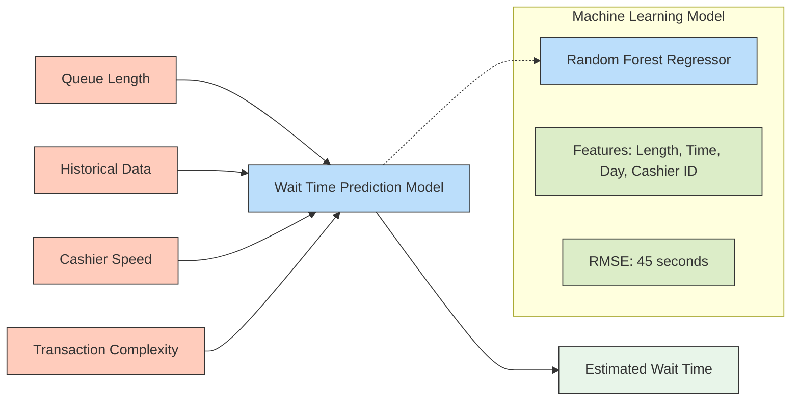
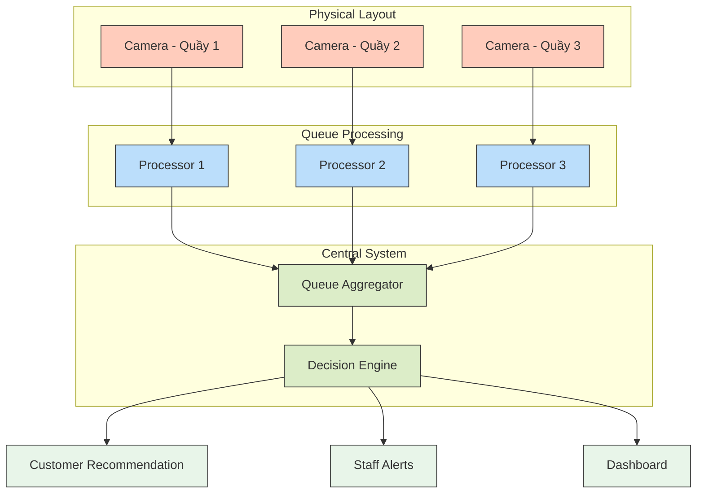

# Feature: Cashier Queue Estimation

## 1. Feature Overview
This section provides a high-level description of the Cashier Queue Counting feature. It explains the core functionality, which involves using computer vision to automatically count the number of people waiting in line at each checkout counter. This feature aims to optimize customer flow by providing insights into queue lengths, enabling efficient customer direction, and potentially reducing waiting times, ultimately improving customer satisfaction.

## 2. Overall Architecture
This diagram illustrates the end-to-end data flow of the Cashier Queue Counting system. It starts with the video input from the cashier cameras, goes through a processing pipeline involving frame extraction, preprocessing, object detection, and post-processing, and finally outputs the queue count, which a recommendation engine can then use to notify customers.



## 3. Processing Steps Details
This section breaks down the core processing pipeline into more granular steps, detailing how the video feed is analyzed to arrive at the queue count.

### 3.1. Video Frame Extraction and Preprocessing

This flowchart outlines the initial steps involved in preparing the video frames for object detection. It describes how frames are extracted from the camera feed at a specific rate (3fps), selected for processing, and then undergo several preprocessing steps to ensure optimal performance of the detection model.


### 3.2. Person Detection và Queue Counting

This flowchart details the process of detecting people in the processed frames and determining the queue length. It involves using a MobileNet SSD model for object detection, followed by post-processing steps to filter detections based on class and confidence, apply Non-Max Suppression (NMS) to remove redundant bounding boxes, and finally count the number of valid person detections to determine the queue status (Short, Medium, or Long).



### 3.3. Region of Interest (ROI) Configuration

This flowchart illustrates the importance of configuring a Region of Interest (ROI) within the camera's view. By defining the specific area where queues are expected and excluding irrelevant zones, the accuracy of person detection and queue counting can be significantly improved. It also mentions perspective calibration to further refine the detection area.



## 4. Sequence Diagram: Full Processing Flow
This sequence diagram provides a chronological view of how different components of the system interact to process video frames and provide queue information to the customer. It shows the continuous loop of frame processing, person detection, queue counting, and the interaction with the analytics engine and the RAG Chatbot when a customer requests queue information.



## 5. Recommendation Engine

This flowchart outlines the inputs, processing logic, and outputs of the Recommendation Engine. This component uses the real-time queue length data, historical wait times, and cashier efficiency statistics to analyze queue conditions, predict future wait times, and generate recommendations for both customers (which checkout line to choose) and staff (potential need for more cashiers). It also provides insights for managers to optimize staffing.



## 6. Wait Time Prediction Model




## 7. Multi-Camera Integration



## 8. Implementation Details

### 8.1 TFLite Model Configuration

```python
class QueueDetector:
    def __init__(self, model_path="cashier_queue_model.tflite"):
        # Load TFLite model
        self.interpreter = tf.lite.Interpreter(model_path=model_path)
        self.interpreter.allocate_tensors()
        
        # Get input and output tensors
        self.input_details = self.interpreter.get_input_details()
        self.output_details = self.interpreter.get_output_details()
        
        # Set confidence threshold
        self.threshold = 0.5
        # Set NMS threshold
        self.nms_threshold = 0.45
    
    def preprocess_image(self, image):
        # Resize to 300x300
        resized = cv2.resize(image, (300, 300))
        # Normalize
        normalized = resized / 255.0
        # Add batch dimension
        input_tensor = np.expand_dims(normalized, axis=0).astype(np.float32)
        return input_tensor
    
    def detect_people(self, image):
        # Preprocess image
        input_tensor = self.preprocess_image(image)
        
        # Set input tensor
        self.interpreter.set_tensor(
            self.input_details[0]['index'], input_tensor
        )
        
        # Run inference
        self.interpreter.invoke()
        
        # Get outputs
        boxes = self.interpreter.get_tensor(self.output_details[0]['index'])[0]
        classes = self.interpreter.get_tensor(self.output_details[1]['index'])[0]
        scores = self.interpreter.get_tensor(self.output_details[2]['index'])[0]
        
        # Filter detections
        person_indices = [i for i in range(len(classes)) 
                         if classes[i] == 0 and scores[i] >= self.threshold]
        
        person_boxes = boxes[person_indices]
        person_scores = scores[person_indices]
        
        # Apply NMS
        selected_indices = tf.image.non_max_suppression(
            person_boxes, person_scores, 
            max_output_size=100, 
            iou_threshold=self.nms_threshold
        )
        
        selected_boxes = person_boxes[selected_indices]
        
        # Count valid detections
        count = len(selected_boxes)
        
        return count, selected_boxes
```

### 8.2 Region of Interest (ROI) Processing

```python
class ROIProcessor:
    def __init__(self, roi_config):
        # ROI configuration with polygon coordinates
        self.roi = np.array(roi_config["polygon"], dtype=np.int32)
        # Mask for the ROI
        self.mask = None
        self.create_mask(roi_config["frame_size"])
    
    def create_mask(self, frame_size):
        # Create mask using the polygon
        self.mask = np.zeros((frame_size[0], frame_size[1]), dtype=np.uint8)
        cv2.fillPoly(self.mask, [self.roi], 255)
    
    def apply_roi(self, frame):
        # Apply mask to the frame
        masked_frame = cv2.bitwise_and(
            frame, frame, mask=self.mask
        )
        return masked_frame
        
    def is_in_roi(self, box):
        # Check if detection is inside ROI
        # box format: [y1, x1, y2, x2]
        y1, x1, y2, x2 = box
        center_x = (x1 + x2) / 2
        center_y = (y1 + y2) / 2
        
        # Check if center point is in ROI
        return cv2.pointPolygonTest(self.roi, (center_x, center_y), False) >= 0
```

### 8.3 Wait Time Prediction

```python
class WaitTimePredictor:
    def __init__(self):
        # Load trained model
        self.model = joblib.load('wait_time_model.joblib')
    
    def predict_wait_time(self, queue_length, cashier_id, time_of_day, day_of_week):
        # Prepare features
        features = np.array([
            [queue_length, time_of_day, day_of_week, cashier_id]
        ])
        
        # Make prediction
        wait_time = self.model.predict(features)[0]
        
        # Round to nearest 30 seconds
        wait_time = round(wait_time / 30) * 30
        
        return wait_time
        
    def classify_queue(self, queue_length):
        if queue_length <= 3:
            return "SHORT", "green"
        elif queue_length <= 7:
            return "MEDIUM", "yellow"
        else:
            return "LONG", "red"
```

### 8.4 Customer Recommendation

```python
class QueueRecommendation:
    def __init__(self, queue_detectors, wait_time_predictor):
        self.queue_detectors = queue_detectors
        self.wait_time_predictor = wait_time_predictor
        self.cashier_stats = {
            1: {"avg_speed": 45},  # seconds per customer
            2: {"avg_speed": 50},
            3: {"avg_speed": 40}
        }
    
    def get_best_queue(self):
        queue_status = []
        
        # Get status for each queue
        for cashier_id, detector in self.queue_detectors.items():
            count = detector.get_current_count()
            
            # Calculate wait time
            current_time = datetime.now()
            time_of_day = current_time.hour + current_time.minute / 60
            day_of_week = current_time.weekday()
            
            wait_time = self.wait_time_predictor.predict_wait_time(
                count, cashier_id, time_of_day, day_of_week
            )
            
            status, color = self.wait_time_predictor.classify_queue(count)
            
            queue_status.append({
                "cashier_id": cashier_id,
                "count": count,
                "wait_time": wait_time,
                "status": status,
                "color": color
            })
        
        # Find queue with minimum wait time
        best_queue = min(queue_status, key=lambda x: x["wait_time"])
        
        return best_queue, queue_status
    
    def get_recommendation_message(self):
        best_queue, all_queues = self.get_best_queue()
        
        # Format wait time for display
        wait_mins = best_queue["wait_time"] // 60
        wait_secs = best_queue["wait_time"] % 60
        
        message = f"Quầy {best_queue['cashier_id']} đang ít khách nhất "
        message += f"({wait_mins} phút {wait_secs} giây chờ)"
        
        return message, best_queue, all_queues
```
