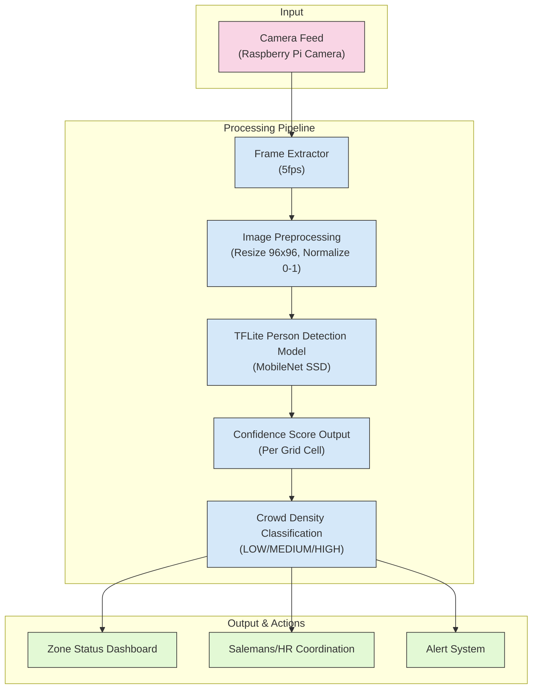
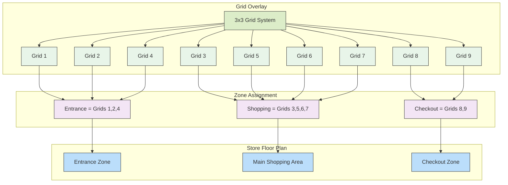
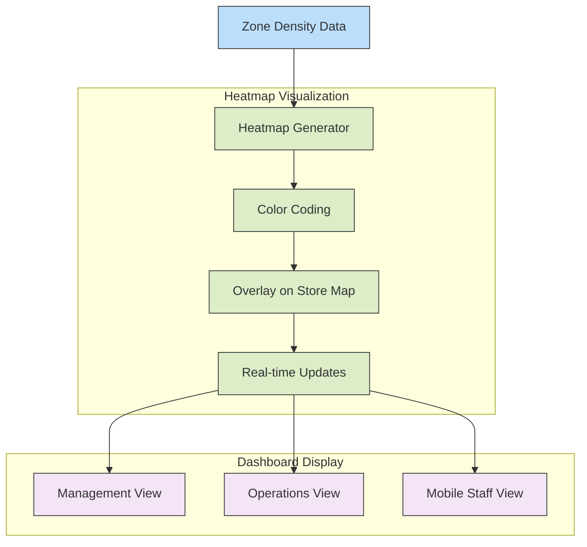
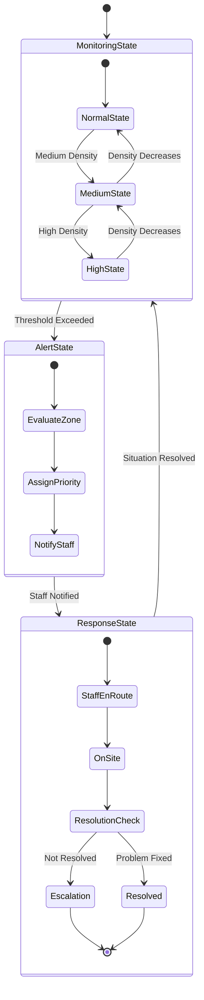
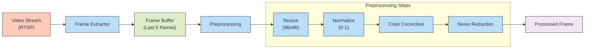
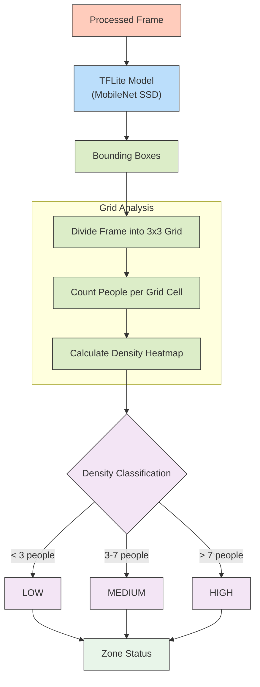
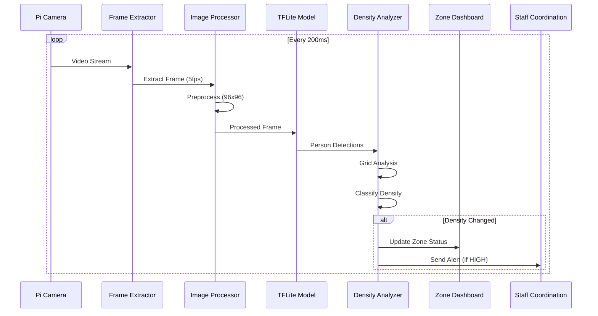
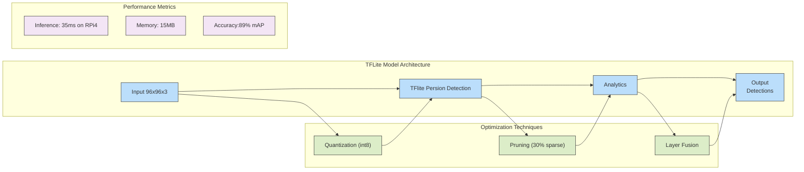

# Feature: Crowd Density Detection

## 1. Problem Definition: 

In large-scale retail environments such as shopping malls and supermarkets, uncontrolled crowd density in specific areas can lead to inefficient operations, reduced customer experience, and increased risk of security incidents. Traditional manual monitoring is limited by human latency and coverage distance, making it inadequate for real-time response.

The Crowd Density Detection module uses edge-deployed computer vision models as an optimization solution to address this problem. The system can automatically identify areas with high human presence, enabling timely coordination of salesmen by providing actionable alerts, enhancing service responsiveness, and controlling situations.


## 2. System Overview
### 2.1. Position in the AIoT Architecture
The crowd detection for sales and security coordination is a core sub-module within the AI Layer of the overall AIoT system. It interfaces directly with the Vision Sensing Layer (camera inputs), the Real-time Analytics Layer (for zone-based decision logic), and the Alert & Integration Layer (to coordinate actions with staff or mall systems). It operates alongside other modules such as warehouse monitoring and cashier guidance, but focuses specifically on spatial human density analysis to trigger real-time operational responses.


### 2.2. Processing Pipeline

**1. Input:**

Live video feeds from overhead or wide-angle surveillance cameras are streamed to an edge device positioned in key shopping zones (e.g., aisles, entrances, promotional booths).

**2. AI inference:**

Each video frame is passed through a TensorFlow Lite Person Detection Model running on the edge device. This lightweight CNN-based model detects the presence of humans per frame and outputs bounding boxes with confidence scores.

**3. Decisions Logic:**

A zone-mapping module associates each detection with predefined zones. A time-based aggregation function estimates human density trends using a rolling window. When a zone exceeds a preconfigured crowd threshold (e.g., more than 10 detected persons over 15 seconds), the system flags the area as congested.

**4. Alert/Action:**

Upon crowd detection, the decision engine triggers:

- Security Coordination Alert to mall security systems via API.
- Sales Staff: Dispatch Request to the human resource scheduling system. The alerts are sent through the MQTT or HTTPS protocol and visualized on a central dashboard with zone highlights.

This real-time edge processing reduces latency and network load, ensuring rapid response and seamless integration into operational workflows.

## 3. Why use TensorFlow

The system leverages the **TensorFlow Lite Person Detection** model, a pre-trained lightweight convolutional neural network (CNN) designed for binary classification (person vs. background). It is deployed on edge devices (e.g., Raspberry Pi 4) to perform on-device inference from live camera streams. The model processes input frames in real-time and outputs bounding boxes around detected human figures, along with confidence scores.

### 3.1. Model Selection Rationale
The TensorFlow Lite Person Detection model was selected due to its strong balance between computational efficiency and functional adequacy for density estimation:

- Lightweight Architecture: The model uses a streamlined CNN architecture specifically optimized for mobile and embedded environments, enabling deployment without GPU acceleration.
- Low Latency: Benchmark tests show inference times of less than 30 ms per frame on Raspberry Pi 4, supporting real-time processing even at 15–30 FPS input.
- Purpose-Fit Classification: Since the feature requires only binary person detection rather than multi-class object recognition, the simplicity of the model aligns well with the system's functional goals (zone-based crowd estimation).

### 3.2. Alternative Model Comparison

| Model                | Accuracy   | Latency on Edge | Complexity | Suitability |
|----------------------|------------|------------------|------------|-------------|
| TFLite Person Detection | Moderate   | <30ms            | Low        | High        |
| YOLOv5 (Nano)        | High       | ~80–120ms        | Medium     | Medium      |
| MobileNet SSD        | High       | ~60–90ms         | Medium     | Medium      |
| YOLOv8 (Small)       | Very High  | ~100–150ms       | High       | Low         |

While YOLO and SSD variants offer improved precision and multi-class detection, they introduce significantly higher inference latency, and their capabilities are not strictly necessary for this binary classification task. Thus, TensorFlow Lite Person Detection presents the best trade-off for the deployment context — real-time, edge-constrained, and crowd-specific.

## 4. 4. Inference Pipeline and Density Classification Logic
### 4.1. Preprocessing Steps

Incoming video streams from surveillance cameras are sampled at a configurable frame rate (typically 1–3 FPS) to balance real-time responsiveness and computational load. Each frame is resized to the model’s expected input dimensions (e.g., 96x96 for TensorFlow Lite's person detection model), optionally converted to grayscale, and pixel values are normalized to the 0,1 range. These steps ensure compatibility and optimal performance for inference on edge devices.

```python 
def preprocess_frame(frame, input_size=(96, 96)):
    # Resize frame to match model input
    resized = cv2.resize(frame, input_size)
    
    # Convert to grayscale if model expects 1 channel
    grayscale = cv2.cvtColor(resized, cv2.COLOR_BGR2GRAY)
    
    # Normalize pixel values to [0, 1]
    normalized = grayscale.astype(np.float32) / 255.0
    
    # Add batch and channel dimensions
    input_tensor = np.expand_dims(normalized, axis=(0, -1))
    
    return input_tensor
```

### 4.2. Person Detection Inference
Each preprocessed frame is passed through the TensorFlow Lite person detection model, a quantized, lightweight CNN designed for real-time performance on edge devices such as the Raspberry Pi 4. The model returns a list of bounding boxes and corresponding confidence scores indicating the likelihood of a person being present in each region of the frame.

To ensure detection reliability, a confidence threshold (typically ≥ 0.5) is applied to filter out false positives or uncertain predictions. Only bounding boxes exceeding this threshold are considered valid detections.

```python
def run_inference(interpreter, input_tensor, threshold=0.5):
    input_details = interpreter.get_input_details()
    output_details = interpreter.get_output_details()

    interpreter.set_tensor(input_details[0]['index'], input_tensor)
    interpreter.invoke()

    boxes = None
    classes = None
    scores = None

    for output in output_details:
        if 'detection_boxes' in output['name']:
            boxes = interpreter.get_tensor(output['index'])[0]
        elif 'detection_classes' in output['name']:
            classes = interpreter.get_tensor(output['index'])[0]
        elif 'detection_scores' in output['name']:
            scores = interpreter.get_tensor(output['index'])[0]

    if boxes is None or classes is None or scores is None:
        print("Error: The required output tensors were not found!")
        return []

    results = []
    for i in range(len(scores)):
        if scores[i] >= threshold and int(classes[i]) == 1:  
            results.append(boxes[i])

    return results
```
### 4.3. Spatial Mapping and Density Scoring
Detected bounding boxes are projected onto a predefined zone grid that spatially segments the monitored environment (e.g., 3x3 or 5x5 grid). Each bounding box is assigned to the corresponding zone based on its centroid position. The system then calculates the number of persons detected per zone over a defined time window (e.g., 10 seconds) and classifies crowd density levels based on tunable thresholds:

- Low: 0–2 persons
- Medium: 3–5 persons
- High: ≥6 persons

This zonal scoring mechanism provides localized crowding estimates that support both visualization and decision-making logic.

**Grid-based Zone Analysis**

### 4.4. Rule-Based Trigger System
To initiate operational responses, a rule engine continuously monitors zonal density scores and applies temporal logic conditions. For example:

**Rule Format:**
If ≥6 persons are detected in Zone A1 for more than 10 consecutive seconds, → Trigger staff dispatch alert.

Rules are configurable per zone and time range, enabling granular control over alert frequency and action thresholds. This logic ensures that transient detections do not cause false alarms, while persistent crowding conditions reliably generate actionable alerts.

**Heatmap Visualization**


## 5. Alert and Visualization System
### 5.1. Alert Channels
To ensure effective response coordination and incident awareness, the system supports multiple alert delivery channels tailored to operational roles:

**Push Notifications to HR System:**
Alerts are directly transmitted via secured internal APIs to the human resources department’s task coordination platform. These notifications can initiate workflows such as dispatching floor staff to high-density zones.

### 5.2. Alert Triggers and Conditions
The alert system is governed by a set of rule-based triggers that analyze model outputs in real-time. These rules are configurable to align with operational and safety policies.

- Basic Density Rule: 
Alerts are triggered when the number of persons detected in a specific grid zone exceeds a predefined threshold within a time window.
```python
if (zone A detections >= 10) in last 15 seconds → TRIGGER alert_level: high
```

- Custom Rule Sets: Administrators may configure alert sensitivity based on contextual factors:

   - Time of Day: Higher thresholds during peak hours.
   - Day of Week: Weekend configurations for higher traffic.
   - Specific Zone Configurations: Different trigger rules for the entrance, food court, and electronics area.

```python
if zone B detections >= 15 between 5PM–8PM → alert_level: normal
```

**Staff Coordination System**



   


### 3.1. Frame Extraction và Preprocessing




### 3.2. Person Detection & Density Classification



## 4. Sequence Diagram: Luồng Xử lý Đầy đủ



## 5. Mô hình TFLite Optimized



## 6. Grid-based Zone Analysis


## 7. Staff Coordination System


## 8. Heatmap Visualization


## 9. Implementation Details

### 9.1 TFLite Model Configuration

```python
# Load optimized TFLite model
interpreter = tf.lite.Interpreter(model_path="crowd_detection_model.tflite")
interpreter.allocate_tensors()

# Define input and output tensors
input_details = interpreter.get_input_details()
output_details = interpreter.get_output_details()

def detect_crowd(image):
    # Preprocess image
    input_image = cv2.resize(image, (96, 96))
    input_image = input_image / 255.0
    input_image = np.expand_dims(input_image, axis=0).astype(np.float32)
    
    # Set input tensor
    interpreter.set_tensor(input_details[0]['index'], input_image)
    
    # Run inference
    interpreter.invoke()
    
    # Get detection results
    boxes = interpreter.get_tensor(output_details[0]['index'])
    classes = interpreter.get_tensor(output_details[1]['index'])
    scores = interpreter.get_tensor(output_details[2]['index'])
    
    # Process detections
    valid_detections = [i for i in range(len(scores[0])) if scores[0][i] > 0.5]
    person_count = len([i for i in valid_detections if classes[0][i] == 0])
    
    return person_count, boxes[0]
```

### 9.2 Grid Analysis

```python
def analyze_grid(image, detections):
    # Define grid
    h, w, _ = image.shape
    grid_size = 3
    cell_h, cell_w = h // grid_size, w // grid_size
    
    # Create grid
    grid = np.zeros((grid_size, grid_size), dtype=int)
    
    # Count people in each cell
    for box in detections:
        y1, x1, y2, x2 = box
        center_x, center_y = (x1 + x2) / 2, (y1 + y2) / 2
        
        grid_x = min(int(center_x * grid_size), grid_size - 1)
        grid_y = min(int(center_y * grid_size), grid_size - 1)
        
        grid[grid_y, grid_x] += 1
    
    # Determine density levels
    density_levels = np.zeros((grid_size, grid_size), dtype=str)
    for i in range(grid_size):
        for j in range(grid_size):
            count = grid[i, j]
            if count < 3:
                density_levels[i, j] = "LOW"
            elif count < 8:
                density_levels[i, j] = "MEDIUM"
            else:
                density_levels[i, j] = "HIGH"
    
    return grid, density_levels
```

### 9.3 Staff Alert Generation

```python
def generate_staff_alerts(density_grid):
    # Define zones
    zones = {
        "entrance": [(0, 0), (0, 1), (1, 0)],
        "shopping": [(0, 2), (1, 1), (1, 2), (2, 0)],
        "checkout": [(2, 1), (2, 2)]
    }
    
    alerts = []
    
    # Check each zone
    for zone_name, cells in zones.items():
        high_count = 0
        medium_count = 0
        
        for i, j in cells:
            if density_grid[i, j] == "HIGH":
                high_count += 1
            elif density_grid[i, j] == "MEDIUM":
                medium_count += 1
        
        # Generate alerts based on threshold
        if high_count >= len(cells) / 2:
            alerts.append({
                "zone": zone_name,
                "level": "HIGH",
                "message": f"Critical crowd density in {zone_name} zone! Immediate staff assistance required."
            })
        elif high_count > 0 or medium_count >= len(cells) / 2:
            alerts.append({
                "zone": zone_name,
                "level": "MEDIUM",
                "message": f"Increasing crowd density in {zone_name} zone. Additional staff may be needed."
            })
    
    return alerts
```
